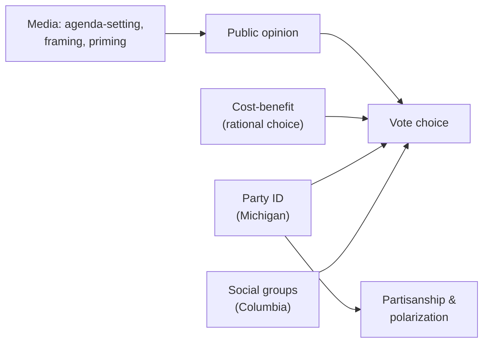

# Political Behavior and Participation

Where [democracy-and-elections.md](democracy-and-elections.md) treats democracy's institutions and
[comparative-politics.md](comparative-politics.md) compares systems, **political behavior** studies
politics at the level of the *individual and the group*: how people form opinions, decide whether and
how to participate, vote, join parties and interest groups, and respond to media. It is the most
avowedly **empirical and quantitative** part of the discipline — the branch most transformed by the
"behavioral revolution" of the mid-twentieth century, which pushed political science toward systematic
measurement, survey data, and statistical inference rather than institutional and legal description
alone.

## Voting behavior

Why do people vote the way they do? Several enduring models compete and complement one another:

- **Sociological (Columbia) model:** vote choice reflects social group membership — class, religion,
  region, ethnicity. "A person thinks, politically, as he is, socially."
- **Social-psychological (Michigan) model:** the durable, often inherited attachment of **party
  identification** anchors perception and choice, acting as a perceptual "lens" through which
  candidates and issues are judged.
- **Rational-choice model:** voters weigh expected benefits against costs. This model also generates
  the **paradox of voting** — since any single vote is vanishingly unlikely to be decisive, the
  narrowly instrumental payoff cannot easily explain why so many people turn out, pointing to the role
  of civic duty, expressive benefits, and social norms.

A related puzzle is **turnout**: participation is unequal across income, education, and age, raising
questions about whose preferences elections actually register — a link back to representation in
[democracy-and-elections.md](democracy-and-elections.md).

## Public opinion and polling

**Public opinion** — the distribution of attitudes across a population — is measured chiefly through
**survey research**. Sound polling rests on the logic of **random sampling**: a well-drawn probability
sample lets analysts infer population attitudes within a quantifiable **margin of error**. The core
threats are familiar from statistics generally: **sampling error** (chance variation, shrinking with
sample size), **coverage and nonresponse bias** (who is reachable and who agrees to answer), and
**question-wording and framing effects** (how a question is posed shifts the answer). Survey
experiments — randomly varying wording or framing across respondents — apply experimental logic to
opinion research; the inference machinery is the same as in
[../statistics/experimental-design-and-ab-testing.md](../statistics/experimental-design-and-ab-testing.md).
The classic caution is the 1936 *Literary Digest* poll, a huge but unrepresentative sample that
badly mispredicted the U.S. election — a reminder that sample *quality* dominates sample *size*.

## Parties, interest groups, and media

- **Political parties** organize competition, structure choice for voters, recruit candidates, and
  coordinate governing. Their number and shape are strongly conditioned by electoral rules
  (Duverger's law; see [democracy-and-elections.md](democracy-and-elections.md)).
- **Interest groups** aggregate and advocate narrower demands. A central problem, from Mancur Olson,
  is **collective action**: because the benefits of group success are often shared regardless of
  contribution, rational individuals may **free-ride**, so small, concentrated groups frequently
  out-organize large, diffuse publics. This overlaps with the study of
  [../sociology/social-movements-and-collective-behavior.md](../sociology/social-movements-and-collective-behavior.md).
- **Media effects** research asks how information environments shape opinion — through **agenda-setting**
  (what issues seem important), **framing** (how issues are interpreted), and **priming** (which
  criteria people use to judge leaders), and more recently through selective exposure, algorithmic
  curation, and misinformation.

## Partisanship and polarization

**Partisanship** — identification with a party — is one of the most stable and consequential
individual-level attitudes. Scholars distinguish **ideological polarization** (parties/voters moving
apart on policy) from **affective polarization** (growing dislike and distrust of the *other side* as
a social group, somewhat independent of policy distance). Debates concern how much *mass* publics have
polarized versus *elites*, whether "sorting" (partisan and ideological identities lining up) is the
better description, and what mechanisms — media, geography, identity — drive the trends. Because
partisanship is partly a social identity, this field borders social psychology's work on group
identity, motivated reasoning, and intergroup bias; see
[../psychology/social-psychology.md](../psychology/social-psychology.md).

## Related notes

- [democracy-and-elections.md](democracy-and-elections.md) — the institutional stage on which behavior plays out.
- [comparative-politics.md](comparative-politics.md) — behavior compared across systems.
- [../statistics/experimental-design-and-ab-testing.md](../statistics/experimental-design-and-ab-testing.md) — the inference behind polls and survey experiments.
- [../psychology/social-psychology.md](../psychology/social-psychology.md) — identity, bias, and motivated reasoning.
- [../sociology/social-movements-and-collective-behavior.md](../sociology/social-movements-and-collective-behavior.md) — collective action and mobilization.

## References

This is a synthesized `Concept` note drawing on the political-science canon rather than a single
source. Related canonical works are catalogued in the field folder's `index.md`.
