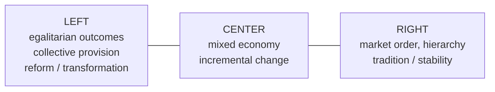

# Political Theory and Ideologies

**Political theory** is the branch of political science that asks normative and
conceptual questions — what is justice, who should rule, what the state owes its
members, how liberty and equality relate — rather than describing how politics
empirically works. It shades into [political philosophy](../philosophy/political-philosophy.md)
and draws on [ethics](../philosophy/ethics.md). An **ideology** is a structured set of
beliefs about how society *ought* to be arranged and how to get there: a diagnosis of the
present, a vision of the good order, and a program of action. Studying ideologies
academically means describing their internal logic even-handedly, not endorsing any of
them.

## The organizing tensions

Most ideological disagreement can be read as different answers to a few recurring
questions. Two axes are especially common in the scholarship:

- **Liberty vs. equality** — how much should the state constrain individual freedom to
  produce more equal outcomes? All ideologies claim to value both; they differ on the
  trade-off and on what each word means (freedom *from* interference vs. freedom *to*
  achieve).
- **Individual vs. collective** — is the primary unit of moral concern the person, or
  some larger whole (class, nation, community, tradition)?

### The left–right spectrum

The familiar **left–right** line originated in the seating of the 1789 French National
Assembly. As a rough heuristic it tracks attitudes toward *equality* and *change*:

The single line is a simplification. Scholars often add a second axis —
**authoritarian vs. libertarian** (how much the state may direct personal life) — because
economic position and social-freedom position do not always align. A person can favor
free markets and personal-liberty maximalism, or state economic planning alongside social
conservatism.

## The major ideologies

Described by their **core claims**, not ranked.

| Ideology | Core value | View of the state | View of change |
|---|---|---|---|
| **Liberalism** | Individual liberty, rights, equal standing | Limited, neutral, rule-bound guarantor of rights | Reform through institutions |
| **Conservatism** | Order, tradition, tested institutions | Legitimate but modest; preserves inherited order | Gradual, skeptical of grand schemes |
| **Socialism** | Substantive equality, collective welfare | Active; steers or owns key economic power | Structural, toward shared ownership |
| **Libertarianism** | Non-coercion, property, self-ownership | Minimal ("night-watchman") or none | Roll back state power |
| **Nationalism** | Loyalty to and self-rule of the nation | Instrument of the national community | Contingent on the national project |
| **Anarchism** | Freedom from illegitimate hierarchy | Illegitimate; to be abolished | Bottom-up, non-state association |

**Liberalism** treats the individual as the basic unit and rights as prior to the state;
its lineage runs through [Locke](locke-two-treatises-of-government.md) (consent, natural
rights) and later thinkers on tolerance and limited government. *Classical* liberalism
emphasizes economic freedom; *social* (or *modern*) liberalism accepts state action to
secure fair opportunity, a distinction echoed in [Rawls](rawls-theory-of-justice.md).

**Conservatism**, associated with Edmund Burke, is less a fixed program than a
*disposition*: distrust of abstract blueprints, respect for institutions that have
survived, and preference for reform that preserves continuity. It holds that society is a
partnership across generations, not a design to be rebuilt.

**Socialism** locates injustice in the ownership of productive resources and seeks
collective control to serve the whole, drawing on
[Marx](../sociology/marx-communist-manifesto.md). It ranges from *revolutionary* variants
to *social-democratic* ones that pursue redistribution within a market economy and liberal
democracy.

**Libertarianism** makes non-coercion the master value: the state's only warranted role
(if any) is protecting person and property. It overlaps economically with classical
liberalism but pushes further toward the minimal state.

**Nationalism** takes the nation — a people sharing culture, history, or language — as the
unit that deserves political self-determination, tying it to
[the state and sovereignty](the-state-and-sovereignty.md).

**Anarchism** denies that any coercive [authority](power-authority-and-legitimacy.md) is
legitimate and envisions voluntary, self-governing association.

**Fascism** is studied as an object of analysis, not a live option: an ultranationalist,
anti-liberal, anti-socialist movement ideology built on a mythic national rebirth, a
cult of leadership, glorification of struggle, and subordination of the individual to the
state. Scholars examine its historical rise, its rejection of both liberal pluralism and
Marxist internationalism, and the conditions that produce such movements.

## Why the map matters

Ideologies shape which [forms of government](forms-of-government.md) actors prefer, how
they read [power and legitimacy](power-authority-and-legitimacy.md), and what they count
as a just distribution — the empirical study of how these beliefs move real politics is
the domain of [political behavior and participation](political-behavior-and-participation.md).

## References

- Locke, *Two Treatises of Government* — [locke-two-treatises-of-government.md](locke-two-treatises-of-government.md)
- Marx & Engels, *The Communist Manifesto* — [../sociology/marx-communist-manifesto.md](../sociology/marx-communist-manifesto.md)
- Rawls, *A Theory of Justice* — [rawls-theory-of-justice.md](rawls-theory-of-justice.md)
- Related: [political-philosophy.md](../philosophy/political-philosophy.md)
