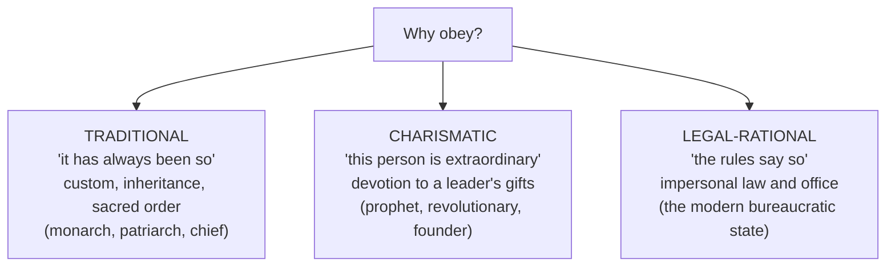

# Power, Authority, and Legitimacy

Power is the core currency of politics — the study of who can get others to act, and on
what basis they accept it. Three tightly linked concepts organize the analysis: **power**
(the capacity to shape outcomes), **authority** (the *recognized right* to exercise power),
and **legitimacy** (the belief that this right is rightful). A ruler with power but no
legitimacy governs by force alone; a ruler with legitimacy commands willing obedience.

## Power: capacity and its faces

Robert Dahl's baseline definition: **A has power over B to the extent A can get B to do
something B would not otherwise do.** Scholars refined this into several "faces":

- **First face** — winning open conflicts over concrete decisions (who prevails in the
  vote or the bargain).
- **Second face** — *agenda control*: keeping issues off the table so no decision is ever
  contested (Bachrach and Baratz).
- **Third face** — *shaping preferences* so B does not even perceive a conflict of interest
  (Steven Lukes) — the most invisible and most debated form.

This last face connects to how social structures condition what actors can want and do, a
theme in [social structure and agency](../sociology/social-structure-and-agency.md).

## Authority: legitimate power

Where raw power is mere capacity, **authority** is power others accept as rightful. The
foundational typology is Max Weber's **three pure types of legitimate authority** — the
grounds on which people believe a command *ought* to be obeyed:

- **Traditional** authority rests on the sanctity of long-standing custom and inherited
  status. Its weakness is rigidity.
- **Charismatic** authority rests on personal devotion to an exceptional individual. It is
  potent but unstable — it must, in Weber's phrase, become **routinized** into traditional
  or legal-rational forms to outlive the leader.
- **Legal-rational** authority rests on belief in the legality of enacted rules and the
  right of those in office to issue commands *within* those rules. It is the basis of the
  modern state and of [organizations and bureaucracy](../sociology/organizations-and-bureaucracy.md),
  and it underwrites the [state's monopoly on legitimate force](the-state-and-sovereignty.md).

Real regimes blend all three; the types are analytical ideals, not exclusive boxes.

## Legitimacy: the belief that sustains authority

**Legitimacy** is the belief among the governed that an authority has the right to rule and
that its commands deserve compliance. It is what turns power into durable authority: a
legitimate order can rely on voluntary obedience and reserve force for the exceptions.
Legitimacy can be grounded in *procedure* (power was acquired by accepted rules — free
elections, lawful succession) or in *performance* (the regime delivers order, prosperity,
or justice). When legitimacy collapses, rulers must lean ever harder on coercion, which is
costly and brittle — a recurring theme in the study of [forms of government](forms-of-government.md)
and regime breakdown.

## The realist counterpoint: power without illusion

[Machiavelli](machiavelli-the-prince.md) offers the classic realist reading. He brackets
what rulers *ought* to do and analyzes what actually secures and holds power: a prince must
be "both feared and loved" but, forced to choose, should prefer being feared, because fear
depends on the ruler while love depends on the fickle ruled. The lasting insight is that
legitimacy and the *appearance* of legitimacy are themselves instruments of power — a bridge
to modern soft-power analysis. His work sits alongside normative treatments in
[ethics](../philosophy/ethics.md) and [political theory](political-theory-and-ideologies.md).

## Coercion vs. consent; hard vs. soft power

Two related distinctions run through the field:

| | **Coercion / hard power** | **Consent / soft power** |
|---|---|---|
| Mechanism | Force, threats, economic pressure | Attraction, legitimacy, shared values |
| Basis of compliance | Fear of cost | Belief the order is right or appealing |
| Cost to wielder | High, ongoing | Low once established |

Joseph Nye's **soft power** — the ability to get what you want through *attraction* rather
than coercion or payment — extends this from domestic authority to international influence,
where a state's culture, ideals, and institutions can be assets. This carries the concept
into [international relations](international-relations.md) and
[geopolitics and security](geopolitics-and-security.md). The interplay of coercion and
consent is, ultimately, the same question Weber posed about the state: how a small number of
people get the rest to comply, and why the rest go along.

## References

- Machiavelli, *The Prince* — [machiavelli-the-prince.md](machiavelli-the-prince.md)
- Weber on legitimate authority and the state — [the-state-and-sovereignty.md](the-state-and-sovereignty.md)
- Related: [../sociology/social-structure-and-agency.md](../sociology/social-structure-and-agency.md), [../sociology/organizations-and-bureaucracy.md](../sociology/organizations-and-bureaucracy.md)
