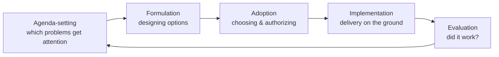

# Public Policy and Governance

Public policy is the study of what governments choose to do (or not do) about collective
problems, and *how* those choices are made, implemented, and revised. **Governance** is a
broader concept than **government**: government refers to the formal institutions of the
state, while governance refers to the whole set of processes — including markets, networks,
and private and civil-society actors — through which societies are steered. The shift in
vocabulary from "government" to "governance" reflects a recognition that public problems are
increasingly addressed through partnerships, regulation, and coordination rather than by
direct state command alone.

## The policy cycle

Analysts often organize policymaking as a **cycle** of stages. The stages are an idealized
heuristic — real policymaking is messier, iterative, and rarely so linear — but the model
usefully separates distinct activities.

- **Agenda-setting** — how a condition becomes a "problem" that deserves government action.
  Kingdon's *multiple streams* model describes a policy "window" opening when problems,
  ready-made solutions, and political will align, often pushed by a *policy entrepreneur*.
- **Formulation** — designing and comparing options, weighing costs, benefits, and
  feasibility. Ideally informed by evidence (see below).
- **Adoption** — the authoritative choice: legislation, regulation, or executive decision.
  This is where the [constitutions-and-rule-of-law](constitutions-and-rule-of-law.md)
  framework and legislative bargaining bite.
- **Implementation** — turning a decision into services and enforcement. The classic finding
  (Pressman & Wildavsky) is that implementation is where policies most often fail, because
  authority is dispersed across many actors who each must cooperate.
- **Evaluation** — assessing outcomes and feeding lessons back into the agenda, closing the
  loop (or ending the policy).

## Bureaucracy: the delivery machinery

Most policy is executed by **bureaucracy** — the permanent administrative apparatus of the
state. Max Weber described the ideal-type bureaucracy as rule-bound, hierarchical,
merit-based, and impersonal, which makes it capable and predictable but also rigid; this is
developed further in [organizations and
bureaucracy](../sociology/organizations-and-bureaucracy.md). Two enduring tensions recur:

- **Principal–agent problems** — elected principals cannot perfectly observe or control the
  bureaucratic agents who implement policy, giving agencies discretion (and room for drift).
- **Street-level bureaucracy** (Lipsky) — front-line workers (police, caseworkers, teachers)
  effectively *make* policy through the countless discretionary choices they take under
  time and resource pressure. What is decided at the top is not always what is delivered.

## Governance, regulation, and instruments

Governments choose among policy **instruments**: direct provision, taxes and subsidies,
regulation (rules backed by sanction), information and "nudges," and market-based tools
(tradable permits). Regulation is the workhorse of the modern state, but it carries risks —
*regulatory capture*, compliance costs, unintended effects — that connect to the
rent-seeking analysis in [political-economy](political-economy.md). Governance networks
increasingly involve co-regulation and self-regulation, where standards are set jointly
with the regulated industry.

## Evidence-based policy

*Evidence-based policy* aspires to ground decisions in rigorous causal evidence — randomized
trials, quasi-experiments, program evaluation — rather than ideology or anecdote. Its promise
is more effective spending; its limits are that evidence is often contested, context-bound,
and arrives after decisions must be made, and that policy questions embed value choices that
no evidence can settle. It complements rather than replaces democratic deliberation
(see [democracy-and-elections](democracy-and-elections.md)).

## The emerging politics of AI regulation

Artificial intelligence is now a live and instructive case for policy and governance. It
displays the classic difficulties in sharp form: fast-moving technology outpacing slow
legislative cycles; deep information asymmetry between regulators and developers; and a
**pacing problem** where rules risk being obsolete on arrival. Governments are experimenting
with a range of instruments — risk-tiered regulation, mandatory disclosure and auditing,
standards bodies, and voluntary commitments — and with governance across borders, since AI
capabilities and harms do not respect national lines (linking to
[geopolitics-and-security](geopolitics-and-security.md) and
[international-relations](international-relations.md)). HAL treats the substance of these
regimes in [ai-regulation](../ai-governance/ai-regulation.md) and the broader field in
[ai-governance](../ai-governance/index.md); the political-science lens here is on *how such
rules get made, by whom, and why they succeed or fail* — that is, the policy cycle and the
governance-versus-government distinction applied to a novel technology.

## Comparative and normative dimensions

How policy is made varies enormously across systems — see
[comparative-politics](comparative-politics.md) for the institutional variation, and
[forms-of-government](forms-of-government.md) for how regime type shapes the process. The
field is analytic, not prescriptive: it describes how decisions get made and what tends to
make them effective or legitimate, leaving the underlying value trade-offs to democratic
choice and to [ethics](../philosophy/ethics.md).

## Related notes

- [comparative-politics](comparative-politics.md) — variation in policymaking institutions
- [political-economy](political-economy.md) — the interests and market failures behind policy
- [democracy-and-elections](democracy-and-elections.md) — the accountability link to policy
- [constitutions-and-rule-of-law](constitutions-and-rule-of-law.md) — the legal frame for adoption
- [ai-regulation](../ai-governance/ai-regulation.md) — the AI case in detail
- [ai-governance](../ai-governance/index.md) — the companion field
- [organizations and bureaucracy](../sociology/organizations-and-bureaucracy.md) — the sociology of the delivery machinery

## References

This is a synthesized Concept note drawing on the shared body of knowledge in public policy
and governance rather than a single source.
