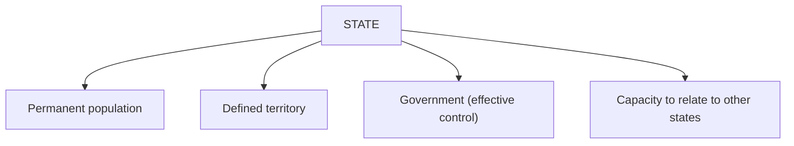

# The State and Sovereignty

The **state** is the central object of political science: the durable set of institutions
that govern a defined population within a defined territory. The most cited definition
comes from Max Weber, who characterized the modern state as the human community that
successfully claims a **monopoly on the legitimate use of physical force** within a
territory. The word "legitimate" does the heavy lifting — many actors can use force, but
only the state claims the *recognized right* to do so, which ties the concept to
[power, authority, and legitimacy](power-authority-and-legitimacy.md).

## The elements of a state

Under the influential Montevideo formulation, a state has four features:

The Weberian addition — the legitimate monopoly on force, exercised through a standing
administrative apparatus — links the state to the study of
[organizations and bureaucracy](../sociology/organizations-and-bureaucracy.md): a modern
state governs through impersonal offices, rules, and records, not the ruler's household.

## Sovereignty

**Sovereignty** is the claim to *supreme authority* within a territory and *independence*
from outside authority. It has two faces:

- **Internal sovereignty** — the state is the highest authority over everyone inside its
  borders; no domestic body outranks it.
- **External sovereignty** — no outside power has rightful authority over the state; it is
  a formal equal among states.

The modern system of mutually recognizing sovereign states is conventionally dated to the
**Peace of Westphalia (1648)**, giving rise to the shorthand "Westphalian sovereignty."
[Hobbes](hobbes-leviathan.md) gave the concept its sharpest theoretical form: to escape a
lawless "state of nature," individuals authorize a single sovereign whose undivided power
is the price of order and peace. Later theorists — including
[Locke](locke-two-treatises-of-government.md) — relocated ultimate sovereignty in the
*people*, who delegate but do not surrender it, seeding the idea of **popular
sovereignty** that underwrites [democracy](democracy-and-elections.md).

## Nation vs. state

The terms are routinely conflated but denote different things:

| Term | Refers to |
|---|---|
| **State** | A sovereign political-legal institution over a territory |
| **Nation** | A community bound by shared identity — culture, language, history, ancestry |
| **Nation-state** | The ideal (rarely exact) alignment of one nation with one state |

Most real states are **multinational** (several nations under one state) or a single
nation is spread across several states. The tension between the two feeds nationalism (see
[political theory and ideologies](political-theory-and-ideologies.md)) and many secession
and self-determination conflicts studied in
[geopolitics and security](geopolitics-and-security.md).

## State formation

Scholars explain how states arose and consolidated in several ways. A prominent
**bellicist** account (Charles Tilly's "war made the state, and the state made war") holds
that the pressure of organizing for war drove rulers to build taxation, bureaucracy, and
borders — "extraction and coercion" producing the modern administrative state. Other
accounts stress economic development, the spread of legal-rational norms, and the diffusion
of the state model across the globe through colonialism and decolonization.

## Challenges to sovereignty

Classic Westphalian sovereignty is increasingly qualified in practice:

- **Globalization** — cross-border flows of capital, goods, information, and people limit
  what any single state can control on its own; see [political economy](political-economy.md).
- **Supranational bodies** — the EU, WTO, and international courts exercise authority that
  member states have pooled or ceded, complicating "supreme and independent."
- **International norms** — doctrines like the Responsibility to Protect assert limits on
  what a sovereign may do to its own population, weighed in
  [international relations](international-relations.md).
- **Non-state and transnational actors** — corporations, NGOs, and armed groups can rival
  weak states' effective control.

Whether these amount to the *erosion* of sovereignty or merely its *reconfiguration* is a
live scholarly debate.

## References

- Hobbes, *Leviathan* — [hobbes-leviathan.md](hobbes-leviathan.md)
- Locke, *Two Treatises of Government* — [locke-two-treatises-of-government.md](locke-two-treatises-of-government.md)
- Weber on the state and legitimate force — [power-authority-and-legitimacy.md](power-authority-and-legitimacy.md)
- Related: [../sociology/organizations-and-bureaucracy.md](../sociology/organizations-and-bureaucracy.md)
