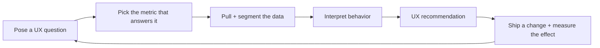
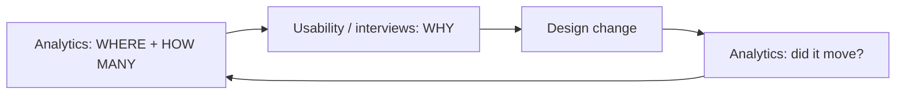

# Practical Web Analytics for User Experience

Michael Beasley's book (Morgan Kaufmann / Elsevier) makes a single argument: web
analytics is not a marketing scoreboard, it is a **user-research instrument**. The same
clickstream data that fuels vanity dashboards can, when asked the right questions, tell
you *what users actually do* on a site at a scale no lab study can reach. The book is
aimed at UX practitioners and treats analytics as a complement to — not a replacement
for — qualitative methods.

## The core stance: quantitative behavior, not vanity metrics

A dashboard full of totals (visits, pageviews, "engagement") answers no design
question. Beasley reframes analytics around **a model of analysis**: start from a
question about users, decide which metric would answer it, pull and segment the data,
interpret it, and turn the reading into a design recommendation. Numbers that don't map
back to a decision are noise.

This is the analytics counterpart to the "self-evident design" ethic in
[Don't Make Me Think](dont-make-me-think.md): Krug tells you a page should not force
users to think; analytics tells you *where they are being forced to think* — the pages
they abandon, the searches they resort to, the paths they never complete.

## What the metrics actually reveal about behavior

The book's middle section is a tour of behavioral signals and the user story behind
each:

- **Bounce rate** — visitors who leave from the same page they entered without
  interacting. High bounce is not automatically bad (a correct answer on a single page
  can be a success); it is a *flag* to investigate whether the page met the intent that
  brought the user there.
- **Exit pages** — where sessions end. An exit on a confirmation page is fine; a
  cluster of exits mid-task points at a broken or confusing step.
- **Funnels / conversion paths** — a defined sequence toward a goal (checkout, signup).
  The drop-off between steps localizes friction to a specific screen, turning "our
  checkout is bad" into "62% abandon at the shipping-address step."
- **Click-path analysis** — the actual routes users take through the site, which rarely
  match the navigation designers imagined. Reveals whether the information architecture
  matches real intent.
- **Content analysis** — which pages get used, in what order, and how long they hold
  attention, so effort goes to the content that carries the experience.
- **Internal search terms** — arguably the highest-signal, lowest-effort data source:
  users literally typing what they want and can't find. A recurring query is a gap in
  navigation, labeling, or content.
- **Traffic sources** — how users arrived (search, referral, direct, campaign), because
  intent and expectations differ sharply by entry point.

## Segmentation: averages lie

A site-wide average blends new and returning users, mobile and desktop, buyers and
browsers into a number that describes nobody. **Segmentation** — slicing the data by
source, device, behavior, or user type — is where analytics becomes diagnostic. A
"fine" overall conversion rate can hide a mobile funnel that is quietly failing. The
book treats segmentation as the default posture, not an advanced trick.

## Pairing analytics with qualitative research

Analytics is strong on **what** and **how many**, and silent on **why**. It shows that
users abandon a step; it cannot say whether the field is confusing, the copy is
alarming, or the price is wrong. Beasley's central methodological move is to run
analytics and qualitative methods (usability testing, interviews, surveys) as a loop:
analytics finds *where* to look and quantifies the problem's size, qualitative research
explains the cause, and analytics later measures whether the fix worked. Neither is
sufficient alone.

## Measuring the effect of changes

Because a design change should be justified by its effect, the book closes the loop with
before/after comparison and controlled testing (A/B and multivariate). The discipline is
to state the expected behavioral change *before* shipping, then check the metric that
would confirm or refute it — the same falsifiable posture as any experiment.

## How the book is organized

- **Part 1 — Introduction to Web Analytics:** what analytics is, how tracking works
  (with Google Analytics as the worked example), and how to define goals.
- **Part 2 — Learning About Users:** the behavioral chapters — traffic analysis,
  content use, click-path analysis, segmentation, pairing with UX methods, and measuring
  the effect of changes.
- **Part 3 — Advanced Topics:** in-page behavior measurement and beyond.

## Takeaway

Treat every metric as the answer to a user question you asked first. Use analytics to
find and size problems and to verify fixes; use qualitative research to understand
causes; segment before you conclude; and never mistake a full dashboard for
understanding your users.

## References

- [Practical Web Analytics for User Experience — Elsevier](https://www.elsevier.com/books/practical-web-analytics-for-user-experience/beasley/978-0-12-404619-1)
