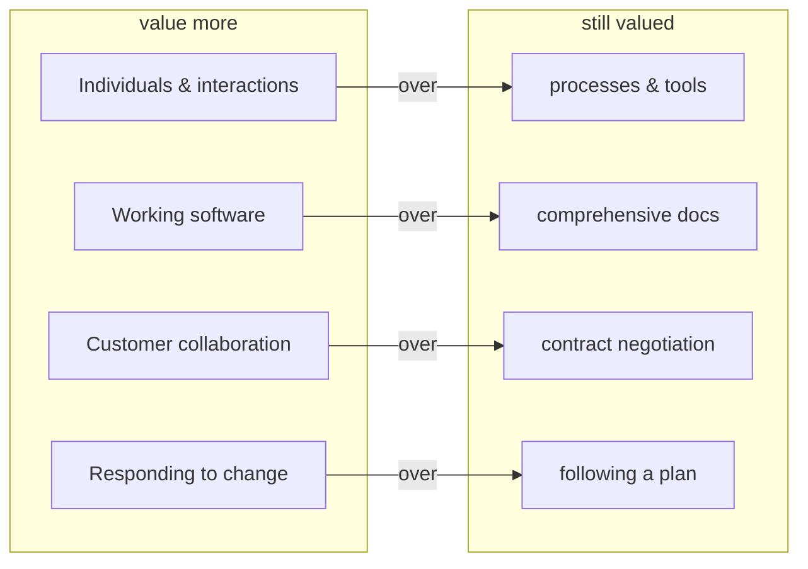

# Manifesto for Agile Software Development

Written in February 2001 by seventeen practitioners — Kent Beck, Martin Fowler, Robert
C. Martin, Ken Schwaber, Jeff Sutherland, Ward Cunningham, Alistair Cockburn, and others
— meeting at Snowbird, Utah. They came from rival lightweight methods (Extreme
Programming, Scrum, Crystal, DSDM, Feature-Driven Development) and were looking for common
ground against the heavyweight, plan-driven processes then dominant. The result is a
one-page statement of shared belief plus twelve supporting principles. It is deliberately
short and non-prescriptive: it names *values*, not practices, and it launched "agile" as
the umbrella term for the whole family of approaches. See the concept note on
[agile-and-the-agile-manifesto.md](agile-and-the-agile-manifesto.md).

## The four values

Each value is a comparison, not a rejection. The manifesto's own phrasing is crucial:
"while there is value in the items on the right, we value the items on the left more."
The right-hand items still matter — they are simply subordinate when the two conflict.

1. **Individuals and interactions** over processes and tools
2. **Working software** over comprehensive documentation
3. **Customer collaboration** over contract negotiation
4. **Responding to change** over following a plan

## The twelve principles

The principles unpack the values into working commitments:

1. Satisfy the customer through **early and continuous delivery** of valuable software.
2. **Welcome changing requirements**, even late — change is a competitive advantage.
3. **Deliver working software frequently**, on a cadence of weeks not months.
4. **Business and developers work together daily** throughout the project.
5. Build projects around **motivated individuals**; give them support and trust them.
6. **Face-to-face conversation** is the most effective way to convey information.
7. **Working software is the primary measure of progress.**
8. Promote **sustainable development** — a pace all can maintain indefinitely.
9. Continuous attention to **technical excellence and good design** enhances agility.
10. **Simplicity** — maximizing the work *not* done — is essential.
11. The best architectures and designs **emerge from self-organizing teams.**
12. At regular intervals the team **reflects and tunes its behavior** (retrospection).

## Scope and influence

The manifesto is the canonical charter that every agile method descends from or answers
to. [Scrum](scrum.md) supplies an empirical process framework for principles 3, 7, and 12;
[Kanban and flow](kanban-and-flow.md) operationalize frequent delivery and sustainable
pace through work-in-progress limits; [lean software development](lean-software-development.md)
shares the "maximize work not done" and fast-feedback lineage. Principle 1 (deliver value
early and continuously) and principle 2 (welcome change) are the seed of modern
[product discovery and delivery](product-discovery-and-delivery.md) and the shift toward
[outcomes over output](outcomes-over-output.md). The framing recurs throughout
[product management](../business/product-management.md).

## References

- [Manifesto for Agile Software Development](https://agilemanifesto.org/)
- [Principles behind the Agile Manifesto](https://agilemanifesto.org/principles.html)
