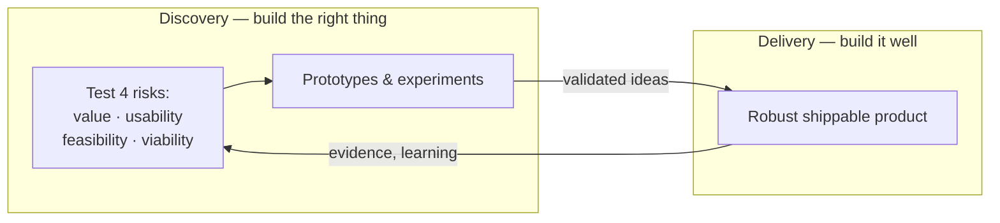

# Inspired: How to Create Tech Products Customers Love

Marty Cagan's book (first edition 2008; substantially rewritten second edition 2017),
published through the Silicon Valley Product Group (SVPG). Drawing on Cagan's years leading
product at eBay, AOL, Netscape, and HP, it distills how the strongest tech companies —
Amazon, Google, Netflix, Apple — actually build products, and contrasts that with the
feature-factory model most companies default to. It is the modern canonical text on product
management and the source that most directly anchors the concept notes on
[product discovery and delivery](product-discovery-and-delivery.md) and
[product management](../business/product-management.md).

## Central ideas

**Empowered product teams, not feature teams.** The core distinction is between teams
*told what to build* (feature teams that ship a roadmap of outputs) and teams *given
problems to solve* (empowered teams held accountable for [outcomes](outcomes-over-output.md)).
Empowered teams are durable, cross-functional (product, design, engineering), and own a
customer or business problem end to end.

**The product manager's real job.** Not project management and not backlog administration:
the PM is accountable for discovering a product that is **valuable** (customers will buy or
use it), **usable**, **feasible** (engineering can build it), and **viable** for the
business. Deep knowledge of the customer, the data, the business, and the market is the
job's foundation.

**Discovery and delivery are two distinct tracks, run in parallel.** *Discovery* answers
"are we building the right thing?" — rapidly, cheaply testing ideas against the four big
risks (value, usability, feasibility, business viability) *before* committing engineering
to build them. *Delivery* answers "can we build it well?" — shipping robust, scalable
software. Ideas are validated with prototypes and experiments, not opinion or authority.

**Product vision and strategy over roadmaps.** A compelling vision aligns empowered teams;
strategy focuses them on the few objectives that matter, typically expressed as measurable
outcomes (an OKR-style framing) rather than a dated list of features.

## Scope and influence

*Inspired* is the bridge between the engineering-process canon and business strategy in
HAL. It presupposes an agile delivery engine — the discovery track feeds work into a
[Scrum](scrum.md) or [Kanban](anderson-kanban.md) delivery loop — and it fulfills the
[agile manifesto](agile-manifesto.md)'s first principle (continuously deliver *valuable*
software) by making "valuable" the explicit thing to prove. Its "build the right thing"
stance is the [lean software development](lean-software-development.md) idea of amplifying
learning and deciding late, applied to product bets. Above all it is the definitive
argument for [outcomes over output](outcomes-over-output.md) and the reference model for
modern [product management](../business/product-management.md). Cagan's later books
(*Empowered*, *Transformed*) extend it into leadership and the "product operating model."

## References

- [Inspired: How to Create Tech Products Customers Love — SVPG](https://www.svpg.com/books/inspired-how-to-create-tech-products-customers-love/)
