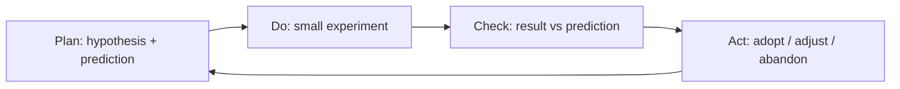

# Continuous Improvement and Retrospectives

Continuous improvement is the discipline of getting a little better on purpose, over and
over, rather than waiting for a crisis or a reorg to force change. Its premise is modest
but powerful: no process is ever finished, the people doing the work know most about how
it actually flows, and a steady cadence of small corrections compounds into large gains.
The retrospective is the ritual that makes this concrete — a recurring, protected moment
where a team stops shipping long enough to ask how the shipping is going.

## Kaizen and the improvement kata

The intellectual root is **kaizen** — the Japanese lean idea of continuous, incremental
improvement driven by the people closest to the work, not imposed from above. Its most
disciplined modern articulation is the improvement kata from [Toyota Kata](toyota-kata.md):
understand the long-term direction, grasp the current condition with facts, set a concrete
near-term target condition, then run rapid experiments toward it. The **coaching kata**
pairs each learner with a manager who asks the same five questions repeatedly, developing
the *habit* of scientific thinking rather than solving the problem for them. The point
that most teams miss: kaizen is a behavioral routine practiced daily, not an event on the
calendar. Improvement that happens only in the retrospective is improvement that mostly
doesn't happen.

## The PDCA loop

The engine underneath is **Plan-Do-Check-Act** (Deming/Shewhart): form a hypothesis,
try it on a small scale, compare the result against what you predicted, and adopt, adjust,
or abandon based on the gap. PDCA reframes a process change as an experiment with a
falsifiable prediction — which is what separates real learning from opinion-swapping. The
loop is a [feedback loop](../systems-thinking/feedback-loops.md) applied to the team's own
way of working, and it is the same experiment-driven cadence that
[loop engineering](../harness-engineering/loop-engineering.md) applies to the
build-test-verify cycle and that [Accelerate](../devops-sre/accelerate.md) found separates
high performers: fast feedback, small batches, learn, repeat.

## Retrospectives: formats and making them actionable

A retrospective is PDCA scoped to the team's process, run on a fixed cadence (end of an
iteration, after a release, or on a schedule). A durable structure — from *Agile
Retrospectives* — is: set the stage, gather data, generate insight, decide what to do,
close. Common formats include *What went well / What didn't / What to try*, *Start–Stop–
Continue*, *Mad–Sad–Glad*, timeline retrospectives for tracing how an event unfolded, and
the *sailboat* (wind, anchors, rocks). The format matters far less than two things:

- **Actionability.** A retro that generates a list of grievances and no owned, dated
  experiments is theater. Leave with a *small* number of concrete changes — ideally one or
  two — each with an owner and a way to tell next time whether it helped. Trying to fix
  ten things at once fixes none.
- **Follow-through.** Review the previous retro's actions at the start of the next one. If
  actions never get revisited, the team learns that the retro is decoration and
  participation quietly dies.

## Blameless learning

Improvement requires honest data about what went wrong, and honesty requires safety.
**Blameless learning** treats incidents and mistakes as properties of the system, not the
person — the assumption being that people acted reasonably given what they knew at the
time, so the useful question is *what made the wrong action look right?* rather than *who
messed up?* This is the stance of [blameless post-mortems](../devops-sre/blameless-post-mortems.md)
and it depends directly on
[psychological safety](team-dynamics-and-psychological-safety.md): a team that fears blame
hides the very information continuous improvement runs on. Blame optimizes for looking
safe; blamelessness optimizes for being safe.

## When it fits, and failure modes

Continuous improvement fits any team doing repeated, evolving work — which is almost all
knowledge work. It is less useful for genuinely one-off efforts with no next iteration to
carry the lesson into. The common failure modes:

- **Retro theater** — the ceremony runs, complaints are aired, nothing changes, and
  cynicism sets in. The cure is fewer, owned, followed-up actions.
- **Improvement without direction** — experiments that optimize local metrics with no
  challenge or target condition to aim at, so the team gets busier rather than better.
- **Big-bang change** — swapping the whole process at once, which is unfalsifiable (you
  can't tell what helped) and destabilizing. Kaizen is deliberately small.
- **Blame leakage** — a "blameless" retro that still hunts for a culprit, which teaches
  people to stop surfacing problems.

## Why it matters

The compounding math is the whole argument: a team that removes one small drag on its flow
each iteration pulls steadily ahead of one that waits for permission to change. Continuous
improvement is how the general standards elsewhere in this wiki actually take hold — it is
the mechanism by which a team's practice, not just its intentions, gets better. It sits at
the intersection of [lean software development](lean-software-development.md), the
feedback-loop thinking of [systems thinking](../systems-thinking/feedback-loops.md), and
the psychological conditions in
[team dynamics and psychological safety](team-dynamics-and-psychological-safety.md).

## References

- [Toyota Kata](toyota-kata.md)
- [Blameless Post-Mortems](../devops-sre/blameless-post-mortems.md)
- [Feedback Loops](../systems-thinking/feedback-loops.md)
- [Loop Engineering](../harness-engineering/loop-engineering.md)
