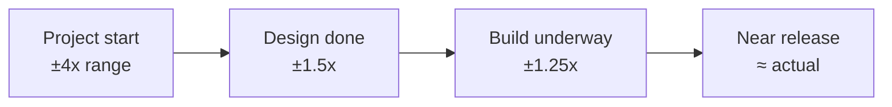

# Estimation and Planning

Software estimation exists to answer a business question — *when will it be done, and can
we afford it?* — about work that is, by definition, novel. If the work had been done
before, you would reuse it rather than estimate it. This is the central tension:
estimation is a forecast about the genuinely uncertain, and treating a forecast as a
promise is where most of the damage comes from. Planning done well serves
[outcomes over output](outcomes-over-output.md); done badly it becomes a ritual that
measures busyness.

## Story points vs time

Agile teams often size work in **story points** — a relative measure of size,
complexity, and uncertainty — rather than in hours or days. The motivation is real: humans
are poor at estimating absolute duration but comparatively good at relative judgment ("this
is about twice as big as that"), and points decouple the estimate from any one person's
speed. Points are turned into a schedule through **velocity** (points completed per
iteration) — see [Scrum](scrum.md) and [User Stories Applied](user-stories-applied.md).

The catch is that points are frequently just hours in disguise, and the relative-sizing
benefit evaporates once the team maps "1 point = half a day." Then you have all the
overhead of an abstraction with none of its protection.

## Planning poker

**Planning poker** is the common technique for producing point estimates: each team
member privately picks an estimate (usually from a Fibonacci-like scale — 1, 2, 3, 5, 8,
13 — whose widening gaps encode growing uncertainty), all reveal at once, and divergence
triggers discussion. The value is less the number than the *conversation* the divergence
forces: a 2-vs-13 split means two people understand the work differently, and surfacing
that is the point. Simultaneous reveal guards against anchoring on the loudest voice.

## Velocity and Goodhart's law

Velocity is a useful *forecasting* input and a corrosive *target*. The moment velocity
becomes a goal — a number managers push up or compare across teams — it stops measuring
anything real. This is **Goodhart's law**: *when a measure becomes a target, it ceases to
be a good measure.* Teams inflate estimates, split stories to pad the count, or cut
corners on quality to make the number rise. Velocity is a property of a single team's
scale, not a productivity score, and it cannot be compared between teams. The abuse is the
metrics analog of the [feature factory](outcomes-over-output.md): optimizing the proxy
instead of the value.

## The cone of uncertainty

Estimates made early are made with the least information and are therefore the least
accurate. The **cone of uncertainty** captures this: at project start an estimate may be
off by a factor of four in either direction, and the range narrows only as real work
resolves real unknowns. The mistake is committing to an early point estimate as if the
cone were already narrow; honest planning quotes a *range* and re-forecasts as the cone
closes.

## Probabilistic forecasting and #NoEstimates

A different school skips per-item estimation and forecasts from **throughput** — the
count of items a team actually finishes per unit time. Because that historical
distribution already bakes in the team's real variability, you can run a Monte Carlo
simulation to answer "how many items can we finish by date X, and with what confidence?"
This yields a probabilistic answer ("85% chance by the 14th") rather than a single
misleading date, and it depends on stable flow — the domain of
[kanban and flow](kanban-and-flow.md). It also echoes [The Goal](the-goal.md): system
output is governed by the constraint and by variability, not by how hard any individual
estimate is pushed.

The **#NoEstimates** movement takes this further, arguing that per-story estimation is
often pure waste: if stories are sliced small and roughly uniform, *counting* them
forecasts as well as *estimating* them, for a fraction of the effort. The claim is not
"never plan" but "stop paying for detailed estimates that add no forecasting accuracy."

## When each fits

- **Point estimation + planning poker** — helpful for a newer team that needs the shared
  conversation to build a common understanding of the work.
- **Throughput forecasting** — better once a team has a stable flow history and wants
  honest, low-overhead probabilistic dates.
- **Detailed up-front estimates** — justified only when a real commitment (a contract, a
  regulatory deadline) requires them, and even then quote the cone's range.

## Failure modes

- **Estimate-as-promise** — a hedged forecast is repeated back as a fixed deadline, and
  the team is punished for the uncertainty inherent in the work.
- **Velocity as a target** — Goodhart's law in action; the number goes up while nothing
  real improves.
- **False precision** — quoting "37.5 days" from a cone that is honestly ±100%.
- **Estimation as substitute for slicing** — endless estimation of large, vague stories
  when the cure is to break them smaller so uncertainty shrinks.

## Why it matters

The business needs *good enough* forecasts to make funding and sequencing decisions —
which is a value question, not a bookkeeping one. The goal of estimation and planning is
never precision for its own sake; it is enough foresight to steer toward the right
outcomes, honestly labeled with the uncertainty it actually carries.

## References

- Concept note on estimation and planning; see [Scrum](scrum.md),
  [kanban and flow](kanban-and-flow.md), and [The Goal](the-goal.md) for the practices
  and systems thinking it draws on.
