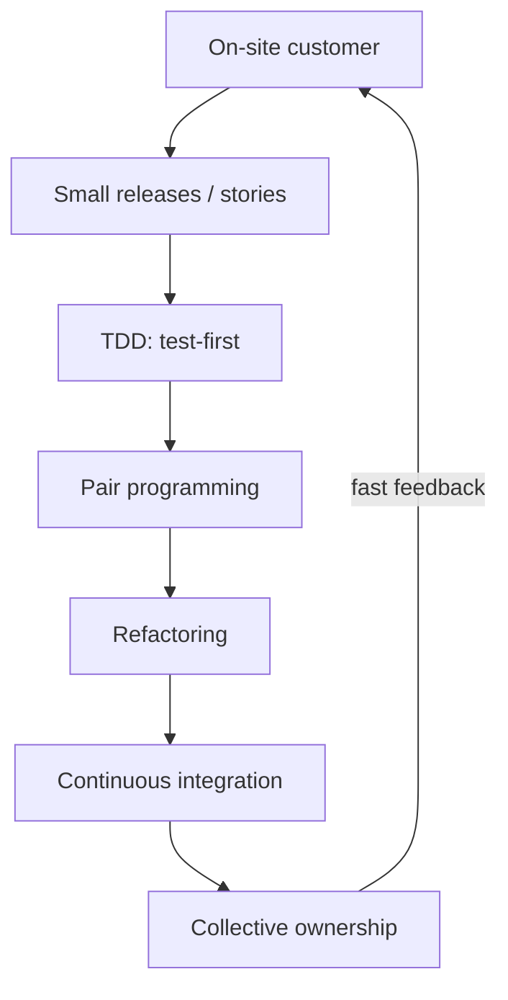

# Extreme Programming (XP)

**Extreme Programming (XP)** is the [agile](agile-and-the-agile-manifesto.md) method that
supplies the *engineering* discipline the movement is often missing. Kent Beck's insight
was that a set of proven software practices — testing, code review, integration, short
releases, simple design — work so well that you should turn each one "to eleven": do it
continuously rather than occasionally. If code review is good, review *all the time* by
pairing; if testing is good, test *first and always*; if integration is good, integrate
*many times a day*. XP is what makes the [Scrum](scrum.md)-style project shell actually
produce releasable software each cycle. Its full articulation lives in
[Extreme Programming Explained](extreme-programming-explained.md).

## Why practices, not just process

Most agile frameworks describe *how a team organizes work* (backlogs, iterations,
standups) but stay silent on *how the code gets written*. That gap is where change stays
expensive: a team can run flawless sprints and still ship an unmaintainable system that
resists every change. XP fills the gap. Its practices exist to **flatten the cost-of-change
curve** — to make the code so continuously safe to modify that responding to change (the
fourth Manifesto value) is actually cheap, not just aspirational.

## The core engineering practices

- **Test-Driven Development (TDD)** — write a failing test, make it pass, refactor. Tests
  are written *first*, so design is driven by usage and the suite becomes a safety net for
  every later change. See [../software-engineering/tdd-five-practices.md](../software-engineering/tdd-five-practices.md)
  for what actually distinguishes TDD from testing-after. XP's testing culture also feeds
  the acceptance-test styles in [atdd-by-example](atdd-by-example.md) and
  [specification-by-example](specification-by-example.md).
- **Pair programming** — two people at one workstation. Continuous, real-time code review
  plus knowledge sharing plus design discussion, folded into the act of writing code.
- **Continuous integration** — every developer integrates into the shared mainline many
  times a day, each integration verified by an automated build and test run. This keeps the
  system always working and is the practice that
  [../devops-sre/continuous-delivery.md](../devops-sre/continuous-delivery.md) later
  industrialized into full deployment pipelines.
- **Small releases** — ship working software in the smallest useful increments, on a short
  cadence, so feedback from real use arrives fast and batch size (and therefore risk) stays
  low.
- **Refactoring** — continuously improve the design of existing code without changing its
  behavior, relying on the test suite to keep it safe. Refactoring is what lets design be
  *incremental* instead of fixed up front.
- **Collective code ownership** — anyone may improve any part of the code; no module has a
  single gatekeeper. Combined with pairing and CI, this spreads knowledge and removes
  bottlenecks.
- **On-site customer** — a real customer/domain expert is continuously available to the
  team to answer questions and set priorities. This makes "customer collaboration over
  contract negotiation" concrete: the feedback loop to the business is measured in minutes.
- **Simple design, coding standard, sustainable pace ("40-hour week")** — do the simplest
  thing that could work; write code a uniform way; and don't burn the team out
  ([peopleware](peopleware.md)).

The practices reinforce each other. TDD gives refactoring its safety net; refactoring keeps
simple design achievable; pairing spreads the knowledge that collective ownership requires;
CI catches the integration errors that frequent change would otherwise cause. Adopt them
piecemeal and you lose much of the compounding effect.

## XP as the engineering backbone under agile

A useful way to see the landscape: [Scrum](scrum.md) and [Kanban](kanban-and-flow.md)
answer *what to build next and how to manage the flow of work*; XP answers *how to build it
so that answer can keep changing cheaply*. Teams that adopt Scrum's mechanics but skip XP's
practices are the classic source of "agile that doesn't work" — the ceremonies run, but the
code calcifies (see [agile-at-scale-and-critiques](agile-at-scale-and-critiques.md)). This
is why so much of DevOps and [continuous delivery](../devops-sre/continuous-delivery.md)
traces straight back to XP: CI, small batches, and test automation were XP practices before
they were an industry movement.

## When it fits

XP fits **co-located or well-connected teams building evolving software** where quality and
changeability matter and the customer is reachable. It asks a lot: discipline, a testing
culture, and management that tolerates pairing and refactoring time. It is harder to apply
where the "customer" is genuinely unavailable, where the codebase or domain makes
test-first impractical, or where the organization treats pairing as "two people doing one
job." Even then, teams typically adopt the highest-leverage subset — TDD, CI, refactoring —
without the full method.

## Common failure modes

- **Cherry-picking the comfortable practices** — taking small releases and standups while
  dropping TDD and refactoring, which removes exactly the practices that keep change cheap.
- **Pairing without buy-in** — imposed pairing without training or trust reads as
  surveillance and produces resentment rather than review.
- **"Simple design" as an excuse for no design** — XP's simplicity means *the simplest
  thing that could work and is easy to change*, not skipping the thinking.
- **TDD as test-after** — writing tests once the code is done misses the design pressure
  that makes TDD valuable.

## References

- [Extreme Programming Explained: Embrace Change](extreme-programming-explained.md) —
  Beck's anchoring statement of the method.
- [Agile and the Agile Manifesto](agile-and-the-agile-manifesto.md) — the movement XP
  helped launch.
- [The Five Practices That Set TDD Apart](../software-engineering/tdd-five-practices.md) —
  the core testing discipline.
- [Continuous Delivery](../devops-sre/continuous-delivery.md) — CI/small-batches
  industrialized.
