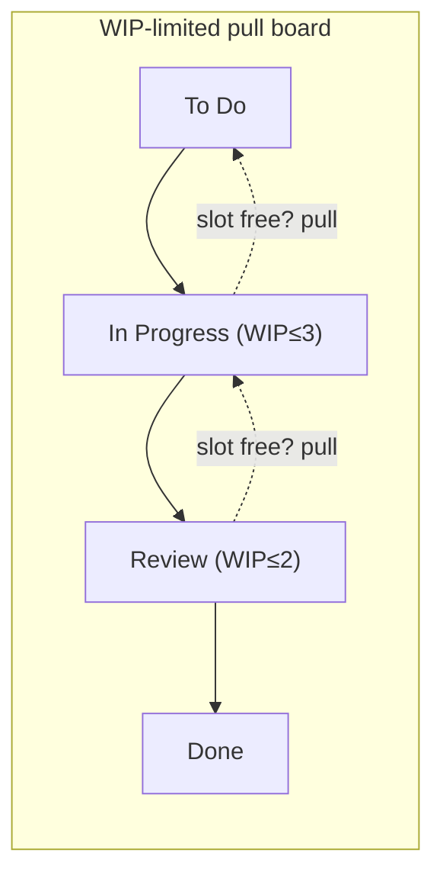

# Kanban and Flow

**Kanban** (Japanese for "signal card") is a method for managing knowledge work as a
**flow** of items through a system, borrowed from the Toyota Production System and adapted
for software by David J. Anderson. Unlike [Scrum](scrum.md), it prescribes no roles, no
iterations, and no estimates. It is an **evolutionary change** method: you start with your
process exactly as it is today, make it visible, and improve it incrementally under a set
of explicit rules — rather than imposing a new framework on day one. That low-disruption
posture is Kanban's defining contrast with Scrum's up-front prescription.

## The core practices

1. **Visualize the work.** Model the workflow as columns on a board (e.g. *To Do → In
   Progress → Review → Done*) and represent each work item as a card. Making the invisible
   visible is the precondition for everything else.
2. **Limit work in progress (WIP).** Put an explicit numeric cap on each column. This is
   the heart of Kanban and the practice teams find hardest to accept.
3. **Manage flow.** Watch how items move; attack the bottlenecks, blockers, and queues
   that slow them ([the-goal](the-goal.md)'s theory of constraints applied to a board).
4. **Make policies explicit.** Write down what "ready" and "done" mean for each column, so
   the rules can be inspected and improved.
5. **Implement feedback loops.** Cadences (standups, replenishment, delivery, retro-style
   reviews) at the right frequency.
6. **Improve collaboratively, evolve experimentally** — small, data-driven changes, akin
   to [toyota-kata](toyota-kata.md)'s improvement kata.

## Pull vs push

A **push** system assigns work as soon as capacity is nominally free, regardless of
downstream congestion; queues pile up and items sit half-done. A **pull** system lets a
stage take new work *only* when it has freed a WIP slot — work is pulled from upstream on
demand. WIP limits are what make a board a pull system: when a column is full, the only way
to start something new is to finish (or unblock) something already in flight. This is why
"stop starting, start finishing" is the Kanban mantra.

## The measurements: cycle time, throughput, Little's Law

Kanban's metrics describe flow directly, not effort:

- **Cycle time** — how long an item takes from start to finish. The number the customer
  actually feels.
- **Throughput** — items completed per unit time.
- **Work in progress (WIP)** — items in flight at once.

These three are tied together by **Little's Law**, a result from queueing theory:

> **average WIP = throughput × average cycle time**

The practical consequence is stark: holding throughput roughly constant, **cutting WIP
cuts cycle time proportionally**. Overloading a team with parallel work does not make it
finish faster — it lengthens every item's cycle time and worsens predictability. This is
the queueing-theory justification for WIP limits, and it echoes the empirical finding in
[../devops-sre/accelerate.md](../devops-sre/accelerate.md) that limiting WIP and reducing
batch size drive delivery performance. The same law governs any queueing system, including
the request queues studied in [../distributed-systems/index.md](../distributed-systems/index.md).

## Class of service

Not all work is equally urgent, so Kanban distinguishes **classes of service** — policies
for how different item types flow:

- **Standard** — normal priority, taken in order.
- **Expedite** — critical items that jump the queue (usually one at a time, with a
  reserved slot).
- **Fixed date** — items with a hard deadline, scheduled by working backward from the date.
- **Intangible** — valuable but not urgent (e.g. debt reduction), pulled to fill slack.

Explicit classes let a team handle urgency *without* abandoning WIP limits, so the fast
path for a hotfix does not silently swamp everything else.

## When it fits

Kanban shines for **continuous, interrupt-driven, or highly variable work** — support
queues, operations, incident response, maintenance, and any stream where sprint boundaries
feel artificial. It also suits teams that need to improve a broken process without a
disruptive reorg, since it overlays their existing workflow. It is weaker as a *product-
discovery* framework: with no iteration boundary or built-in goal, teams that need a
forcing function for prioritization and stakeholder review sometimes drift, which is why
many blend the two ("Scrumban").

## Common failure modes

- **A board without WIP limits** — this is just a visualized backlog, not Kanban; the pull
  mechanic never engages and everything is "in progress."
- **WIP limits set too high** — a limit above the team's real parallelism does nothing;
  the point is to feel the constraint.
- **Ignoring the metrics** — collecting cycle time and never acting on the distribution
  (especially the long tail) wastes the method's main advantage: predictability.
- **Expedite abuse** — when everything is urgent, nothing is; unbounded expedites destroy
  flow.

## References

- [Kanban (David J. Anderson)](anderson-kanban.md) — the anchoring work that defined
  the method for software.
- [Lean Software Development](lean-software-development.md) and [Lean Thinking](lean-thinking.md)
  — the lean lineage.
- [The Goal](the-goal.md) — theory of constraints and bottleneck thinking.
- [Accelerate](../devops-sre/accelerate.md) — empirical evidence for WIP limits and small
  batches.
