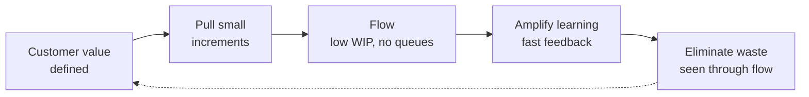

# Lean Software Development

Lean software development is the translation of the Toyota Production System — and its
generalization in [Lean Thinking](lean-thinking.md) — into the world of building
software. Mary and Tom Poppendieck did the translation, arguing that a codebase is not a
factory floor but that the *thinking* transfers cleanly: define value from the
customer's point of view, make it flow, and relentlessly remove everything that does not
create it. The output of software is not lines of code; it is validated learning turned
into working, valuable product — which makes lean's customer-value lens a natural fit
for [outcomes over output](outcomes-over-output.md).

## The seven principles

The Poppendiecks distilled lean into seven principles adapted for software teams.

| Principle | What it means in software |
| --- | --- |
| **Eliminate waste** | Anything the customer would not pay for is waste; find it and cut it. |
| **Amplify learning** | Development is a learning process, not a production process — shorten feedback loops so you learn faster. |
| **Decide as late as possible** | Keep options open; commit to irreversible decisions only when you have the most information (the "last responsible moment"). |
| **Deliver as fast as possible** | Speed is a competitive weapon and a learning accelerator — small batches out the door quickly. |
| **Empower the team** | The people doing the work make the decisions about the work; managers build the system, not the plan. |
| **Build integrity in** | Quality is designed in, not inspected in — both *perceived* integrity (it does what the customer needs) and *conceptual* integrity (the parts fit coherently). |
| **See the whole** | Optimize the entire value stream, not local parts; local efficiencies routinely damage the system (the lesson of [The Goal](the-goal.md)). |

"Decide as late as possible" and "deliver as fast as possible" are a deliberate pair:
you delay commitment to keep learning, then move fast once you commit, so late decisions
do not become slow delivery.

## The seven wastes of software

Lean's *muda* (the shop-floor wastes: inventory, overproduction, waiting, and so on) map
onto recurring wastes in software work:

1. **Partially done work** — code written but not integrated, tested, or shipped; it ages
   and rots, the software equivalent of inventory.
2. **Extra features** — building what nobody asked for; gold-plating and speculative
   flexibility. The largest and most seductive waste, and the essence of the *build trap*
   (see [product discovery and delivery](product-discovery-and-delivery.md)).
3. **Relearning** — rediscovering knowledge the team already had, because it was not
   captured or was lost to churn.
4. **Handoffs** — every transfer between people or teams loses tacit knowledge and adds
   queue time.
5. **Delays / waiting** — blocked work waiting on approvals, environments, reviews, or a
   busy specialist.
6. **Task switching** — the cost of splitting attention across too much work in progress.
7. **Defects** — the earlier a defect is found the cheaper it is; a defect that reaches a
   customer is the most expensive waste of all.

## Flow and pull

The organizing mechanics are **flow** and **pull**. Rather than pushing large batches of
work through phase gates, lean pulls small increments through the system on demand and
keeps work in progress (WIP) low so items *flow* without piling up in queues. This is the
direct link to [kanban and flow](kanban-and-flow.md): visualize the work, cap WIP, and
manage the value stream so cycle time shrinks and feedback arrives fast. Little's Law
makes the point quantitative — cutting WIP shortens cycle time.

## When it fits, and failure modes

Lean thinking fits almost any knowledge-work delivery system, and it is the intellectual
parent of both agile and DevOps. It is most valuable when a team is drowning in
work-in-progress, handoffs, and half-finished features — the wastes it names are then
everywhere and obvious.

Failure modes cluster around misreading the metaphor. "Eliminate waste" gets weaponized
to cut *slack* and *learning*, which are not waste — starving a team of thinking time in
the name of efficiency is exactly the local optimization lean warns against. "Deliver
fast" degrades into shipping partially done work. And "decide late" becomes an excuse for
indecision rather than a disciplined bet on keeping options open until the last
responsible moment. The antidote is "see the whole": measure the value stream end to end,
not any single station's utilization.

## References

- Concept note synthesizing lean software development; see the anchor notes
  [Lean Software Development (Poppendieck)](poppendieck-lean-software-development.md) and
  [Lean Thinking](lean-thinking.md).
