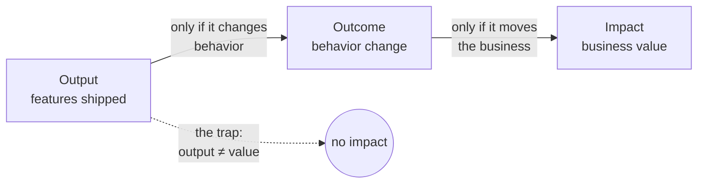

# Outcomes over Output

This is the note that ties the whole folder to **value**. Every process idea in Process &
Teams — lean, agile, discovery, flow — exists to serve one end: delivering work that
actually matters for a business and its customers. "Outcomes over output" is the phrase
that keeps that end in view, because the single most common way software organizations
fail is by mistaking motion for progress.

## Output vs outcome vs impact

Three distinct things get confused constantly:

| Level | Definition | Example |
| --- | --- | --- |
| **Output** | What the team produces | Shipped a "share" button; closed 40 story points |
| **Outcome** | A change in customer behavior that produces value | 20% more users invite a colleague |
| **Impact** | The business result the outcome drives | Lower CAC, higher retention, more revenue |

Output is fully within the team's control and therefore seductively easy to measure and
celebrate. Outcomes and impact are what the organization is actually paid to produce, but
they are harder to measure and partly outside the team's control. The discipline is to
manage toward outcomes even though output is easier to count.

The arrows are conditional on purpose: shipping a feature does not *cause* an outcome,
and an outcome does not automatically *cause* impact. Each link has to be verified, not
assumed.

## Vanity metrics and the feature factory

Two named pathologies follow from measuring the wrong level:

- **Vanity metrics** — numbers that reliably go up and tell you nothing actionable: total
  registered users, page views, features shipped. They flatter without informing. The
  test of a real metric is whether a change in it would change a decision.
- **The feature factory** — an organization optimized to *produce features*, treating the
  roadmap as an assembly line. Teams are measured by velocity and shipped scope, so they
  ship constantly and move nothing that matters. This is the same pathology as the
  *build trap* in [product discovery and delivery](product-discovery-and-delivery.md),
  seen from the metrics side.

A working demo is the clearest instance of the trap: it is output that *looks* like
value. The right response is [working demo, so what?](../ai-org/working-demo-so-what.md) —
demand the outcome the demo is supposed to produce before crediting it.

## Tying work to value — and opportunity cost

Managing to outcomes means every piece of work traces to a customer behavior and a
business result, ideally through the [business model and unit economics](../business/business-models-and-unit-economics.md)
so the team knows *which* number the outcome is supposed to move. The hidden cost that
makes this urgent is **opportunity cost**: an engineering team is a fixed, expensive
capacity, so every feature built is a different feature *not* built. Building
low-outcome output is not free even when it "works" — it consumes the scarcest resource
the company has. This is also why raw engineering throughput must be spent
deliberately; see [make force multiplication intentional](../ai-org/force-multiplication-make-it-intentional.md).

## Evidence that it pays off

The claim is not merely philosophical. [Accelerate](../devops-sre/accelerate.md) found
empirically that the highest-performing organizations tie delivery capability to
*business outcomes* and that a lean product-management approach — working in small
batches, seeking customer feedback, and giving teams authority over *what* they build —
predicts higher organizational performance. Delivering fast is only valuable if the team
is delivering the right thing; speed at output amplifies whatever direction you were
already pointed, for better or worse.

## Failure modes

- **Output theater** — celebrating ship counts and burndown charts as if they were
  results.
- **Outcome laundering** — attaching a plausible-sounding outcome to work already
  decided, with no measurement to confirm it.
- **Un-owned outcomes** — declaring an outcome nobody is accountable for and nobody
  measures, so it quietly reverts to counting output.

## Why it matters

A team can be fully agile, high-velocity, and lean in its process and still deliver no
value if it is aimed at the wrong target. Outcomes over output is the corrective that
keeps all the other practices honest: it asks, of any activity, *what changed for the
customer and the business?* — and refuses to accept "we shipped it" as the answer.

## References

- Concept note on outcomes over output; see
  [product discovery and delivery](product-discovery-and-delivery.md) and
  [Accelerate](../devops-sre/accelerate.md) for the practices and evidence behind it.
