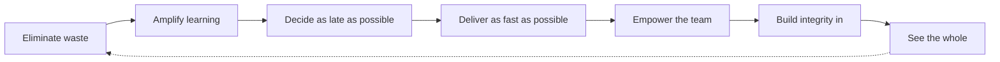

# Lean Software Development: An Agile Toolkit

Mary and Tom Poppendieck's 2003 book (Addison-Wesley), the work that carried the lean
manufacturing tradition of the Toyota Production System squarely into software. Its thesis:
the same principles that revolutionized manufacturing, logistics, and product development
can make software development "better, cheaper, faster" all at once — *if* they are
translated faithfully rather than copied literally. The book names **seven principles** and
supplies **22 "thinking tools"** for adapting agile practices to your own organization
rather than following a fixed recipe. It is the canonical source for the concept note on
[lean software development](lean-software-development.md).

## The seven principles

1. **Eliminate waste** — anything that doesn't add customer value is *muda*: partially
   done work, extra features, relearning, handoffs, task-switching, delays, defects. See
   waste with value-stream mapping, then remove it.
2. **Amplify learning** — software development is an exercise in discovery, not
   production. Shorten feedback loops with iterations, short cycles, and set-based
   development (keeping options open until knowledge accrues).
3. **Decide as late as possible** — defer irreversible commitments until the last
   responsible moment, building the capacity for change into the system so late decisions
   are cheap.
4. **Deliver as fast as possible** — compress the value stream; speed and quality
   reinforce each other because fast delivery yields fast feedback and less speculation.
5. **Empower the team** — give motivated people the authority and information to make
   decisions locally, without sacrificing coordination.
6. **Build integrity in** — pursue both *perceived* integrity (the product fits the user's
   need) and *conceptual* integrity (its parts cohere), sustained by refactoring and
   testing rather than inspection at the end.
7. **See the whole** — optimize the entire value stream, not local parts; local
   optimizations often harm the system, especially across distributed teams.

## Scope and influence

The book is a hinge between lean's factory origins and agile software practice. It shares
authorship of the lean lineage with [Kanban](anderson-kanban.md) — both descend from the
Toyota Production System and both center flow and waste elimination. Its "eliminate waste"
and "deliver fast" principles restate the [agile manifesto](agile-manifesto.md)'s
"maximize the work not done" and "deliver frequently," and it carries a foreword from
[Scrum](scrum.md) co-creator Ken Schwaber. "Decide as late as possible" and "amplify
learning" are foundational to [product discovery and delivery](product-discovery-and-delivery.md);
"build integrity in" and "see the whole" push teams toward
[outcomes over output](outcomes-over-output.md) rather than feature counts, a stance
central to [product management](../business/product-management.md).

## References

- [Lean Software Development: An Agile Toolkit — O'Reilly](https://www.oreilly.com/library/view/lean-software-development/0321150783/)
