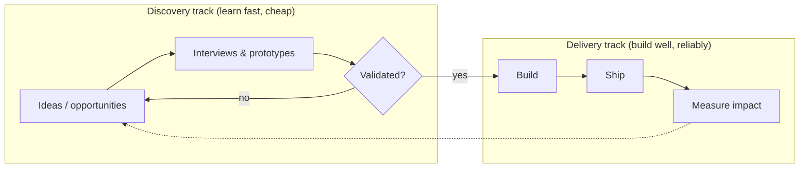

# Product Discovery and Delivery

Delivery answers *are we building the thing right?* Discovery answers the far more
dangerous question: *are we building the right thing at all?* Most software that gets
built works fine and still fails, because it solved a problem nobody had. Product
discovery is the disciplined practice of reducing that risk — figuring out what is worth
building *before* and *while* you build it — and it is the through-line of Marty Cagan's
work on empowered product teams ([Inspired-inspired](cagan-inspired.md)). It sits
alongside, and is inseparable from, [product management](../business/product-management.md)
and a deep grasp of [customer empathy and jobs to be done](../business/customer-empathy-and-jobs-to-be-done.md).

## The four risks

Cagan frames discovery as answering four risks *before* committing engineering to build:

- **Value risk** — will customers choose to buy or use it? (the one that kills most
  products)
- **Usability risk** — can users figure out how to use it? (see
  [Don't Make Me Think](../ux-design/dont-make-me-think.md))
- **Feasibility risk** — can we build it with the time, skills, and technology we have?
- **Business viability risk** — does it work for the business — legally, financially,
  for the [business model and unit economics](../business/business-models-and-unit-economics.md)?

## Dual-track: discovery and delivery run in parallel

The core operating model is **dual-track development**. Discovery and delivery are not
sequential phases but two continuous tracks the same team runs at once. The discovery
track rapidly explores and validates ideas with cheap experiments; the delivery track
builds and ships the ideas that survived. Validated bets flow from the discovery track
into the delivery backlog — so engineering only builds things that already cleared the
value and usability risks.

This is **continuous discovery**: not a research phase at the start of a project but a
weekly habit — regular contact with customers, a steady stream of small experiments, and
opportunity assessment that never stops. It pairs naturally with the small-batch flow of
[lean software development](lean-software-development.md).

## The techniques

- **Customer interviews** — talk to real users continuously to understand the problem
  space and the jobs they are hiring your product to do; do not ask them to design the
  solution.
- **Prototyping** — build the cheapest artifact that can test a specific risk (a
  clickable mockup for usability, a fake-door test for value) rather than production code.
- **Validation** — put prototypes and experiments in front of customers to get evidence,
  not opinions. A demo that impresses stakeholders proves little; see
  [working demo, so what?](../ai-org/working-demo-so-what.md) — the question is always
  what changed for a real user.
- **Empowered product teams** — cross-functional teams (product, design, engineering)
  given *problems to solve*, not features to build, and held accountable for outcomes.
  This depends on and amplifies engineering capacity, the point of
  [make force multiplication intentional](../ai-org/force-multiplication-make-it-intentional.md).

## The build trap, and other failure modes

The dominant failure mode is the **build trap**: an organization measured by *output* —
features shipped, roadmap items closed — rather than by the value it creates for
customers and the business. Build-trap teams are busy and unsuccessful; they ship
constantly and move no metric that matters. Discovery is the escape, but it has its own
failure modes: **discovery theater** (interviews and prototypes that never change the
plan), **HiPPO-driven roadmaps** (the highest-paid person's opinion overrides evidence),
and **feature-factory backlogs** handed down to teams that have no say in *what* problem
they solve. The correction is always to re-anchor on [outcomes over output](outcomes-over-output.md).

## Why it matters

Building the wrong thing well is the most expensive mistake in software, because every
line of it is real cost with no return — and the opportunity cost of what you did not
build instead. Discovery front-loads cheap learning to prevent expensive building, and
dual-track keeps that learning continuous so the product stays aimed at real value.

## References

- Concept note synthesizing product discovery and delivery; anchored by
  [Cagan-inspired product thinking](cagan-inspired.md) and drawing on
  [product management](../business/product-management.md).
