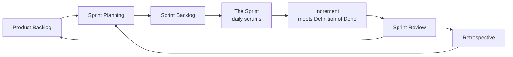

# The Scrum Guide

The definitive, canonical definition of Scrum, authored and maintained by its co-creators
**Ken Schwaber** and **Jeff Sutherland**. First published in 2010 and revised several
times, the current 2020 edition is deliberately terse — a lightweight *framework*, not a
methodology. It states the minimum rules; everything omitted is left to the team. The
guide backs the concept note on [scrum.md](scrum.md) and is the most widely used concrete
instantiation of the [agile manifesto](agile-manifesto.md).

## Theory: empiricism plus lean thinking

Scrum is founded on **empiricism** — knowledge comes from experience, and decisions are
made on what is observed — and on [lean thinking](lean-software-development.md) (reduce
waste, focus on essentials). It attacks complex problems with an iterative, incremental
approach that optimizes predictability and controls risk. Three pillars uphold the
empirical process:

- **Transparency** — the work and its artifacts are visible to those doing and receiving it.
- **Inspection** — artifacts and progress are examined frequently to detect variance.
- **Adaptation** — when inspection reveals deviation, the process or product is adjusted.

Five **values** make the pillars come alive: commitment, focus, openness, respect, and
courage.

## The Scrum Team

A single small, cross-functional, self-managing team (typically 10 or fewer people) with
no sub-teams or hierarchy, accountable for a valuable **Increment** each Sprint. Three
accountabilities:

- **Product Owner** — accountable for maximizing product value; owns the Product Backlog,
  its ordering, and the [outcomes](outcomes-over-output.md) the product should achieve.
- **Scrum Master** — accountable for the team's effectiveness and for establishing Scrum;
  serves the team, Product Owner, and organization; a coach, not a manager.
- **Developers** — create any aspect of a usable Increment each Sprint.

## Events

The **Sprint** is the container — a fixed length of one month or less, the "heartbeat" —
inside which the other four events occur:

1. **Sprint Planning** — the team lays out the Sprint's *why* (Sprint Goal), *what*
   (selected backlog items), and *how* (a plan).
2. **Daily Scrum** — a 15-minute daily event for Developers to inspect progress toward the
   Sprint Goal and adapt the plan.
3. **Sprint Review** — the team and stakeholders inspect the Increment and adjust the
   Product Backlog; a working session, not a demo-and-sign-off.
4. **Sprint Retrospective** — the team inspects itself (people, process, tools) and plans
   improvements, directly enacting agile principle 12.

## Artifacts and their commitments

Each artifact carries a **commitment** that adds transparency and a target to measure
against:

| Artifact | Represents | Commitment |
| --- | --- | --- |
| Product Backlog | ordered list of what's needed to improve the product | **Product Goal** |
| Sprint Backlog | Sprint Goal + selected items + delivery plan | **Sprint Goal** |
| Increment | a usable, done step toward the Product Goal | **Definition of Done** |

The **Definition of Done** is the quality bar: the moment a backlog item meets it, an
Increment is born; if it does not, the item cannot be released or even shown at the Review
and returns to the backlog.

## Scope and relationships

Scrum operationalizes the manifesto's frequent-delivery and inspect-and-adapt principles.
It pairs naturally with [kanban and flow](kanban-and-flow.md) (many teams layer WIP limits
and flow metrics onto Scrum), and its empirical loop is the delivery engine for
[product discovery and delivery](product-discovery-and-delivery.md). The Product Owner
role is where Scrum meets [product management](../business/product-management.md).

## References

- [The Scrum Guide (2020) — scrumguides.org](https://scrumguides.org/scrum-guide.html)
