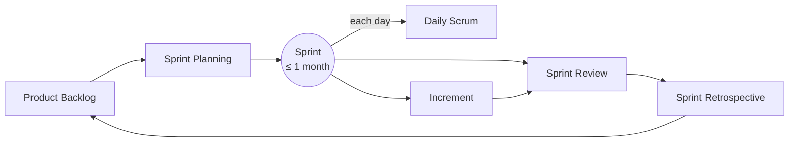

# Scrum

**Scrum** is the most widely adopted [agile](agile-and-the-agile-manifesto.md) framework: a
lightweight structure for developing complex products in short, fixed cycles called
**sprints**. It is deliberately *incomplete* — it defines a minimal set of roles, events,
and artifacts and leaves the engineering practices, tools, and techniques to the team. Its
foundation is **empiricism**: knowledge comes from experience, and decisions are made from
what is observed, not from what was planned. The three empirical pillars are
**transparency**, **inspection**, and **adaptation** — you make work visible, you inspect
it frequently, and you adjust.

## The three accountabilities (roles)

- **Product Owner** — accountable for maximizing the value of the product. Owns and orders
  the Product Backlog, and is the single voice deciding *what* gets built and in what
  order. A close cousin of the product-management discipline
  ([../business/product-management.md](../business/product-management.md)).
- **Scrum Master** — accountable for the team's effectiveness and for the framework being
  understood and enacted. A servant/facilitator, not a manager: removes impediments,
  coaches, protects the team from disruption. Explicitly *not* a project manager assigning
  tasks.
- **Developers** — the people who build the increment. They are cross-functional and
  self-managing: collectively they decide *how* to do the work and hold each other to the
  quality bar (the "Definition of Done").

These three together form the **Scrum Team**, typically ten or fewer people, with no
sub-teams or hierarchy.

## The events

All events are **timeboxed** and nest inside the Sprint, the container event.

- **Sprint** — a fixed period, one month or less, during which a usable Increment is
  produced. Its length is constant so the team develops a rhythm and its forecasts get
  calibrated.
- **Sprint Planning** — the team selects what it can deliver this sprint and forms a plan
  (the Sprint Backlog). Answers *why* (the Sprint Goal), *what*, and *how*.
- **Daily Scrum** — a short (≤15 min) daily replan by the Developers to inspect progress
  toward the Sprint Goal and adapt the day's plan. A synchronization event, not a status
  report to a manager.
- **Sprint Review** — at the sprint's end, the team and stakeholders inspect the Increment
  and adapt the backlog. A working session, not a demo-and-applause.
- **Sprint Retrospective** — the team inspects *itself* — process, interactions, tools —
  and commits to improvements. The engine of
  [continuous-improvement-and-retrospectives](continuous-improvement-and-retrospectives.md).

## The artifacts

Each artifact has a **commitment** that makes it measurable:

- **Product Backlog** — the ordered list of everything that might be needed; its commitment
  is the **Product Goal**. Items are refined and often written as
  [user stories](user-stories-applied.md).
- **Sprint Backlog** — the Sprint Goal plus the selected items and the plan to deliver
  them; its commitment is the **Sprint Goal**.
- **Increment** — a concrete, usable step toward the Product Goal; its commitment is the
  **Definition of Done**, the shared quality standard that makes "done" mean *releasable*.

## Estimation and forecasting

Scrum itself prescribes no estimation technique, but teams commonly size backlog items
(story points, ideal days, or by counting items) and track **velocity** to *forecast* how
much fits in a sprint. This connects to
[estimation-and-planning](estimation-and-planning.md): the intent is a forecast that
improves empirically, not a contract.

## When it fits

Scrum suits **complex, evolving product work** where requirements are discovered as you
build, the work can be sliced into increments, and a dedicated team can protect a cadence.
It fits less well for pure interrupt-driven work (support, incident response, ops), where
[Kanban's flow model](kanban-and-flow.md) is usually a better match, or for work that
cannot be sliced into a shippable increment each sprint.

## Common anti-patterns

- **"Dark Scrum"** — the ceremonies run, but as command-and-control. The Daily Scrum
  becomes a status meeting for a manager; the Scrum Master becomes a taskmaster; the team
  is "self-organizing" in name only.
- **Velocity as a target** — the moment velocity is managed as a productivity KPI, teams
  inflate estimates and it stops being a forecast (Goodhart's law). Velocity is a planning
  aid, comparable only against a team's own history.
- **Weak Definition of Done** — "done" that excludes testing, integration, or deployment
  produces an Increment that is not actually shippable, quietly rebuilding the change-cost
  curve that agile was meant to flatten.
- **Backlog as a wishlist** — an unordered, unrefined backlog makes Sprint Planning a
  guessing game; ordering by value is the Product Owner's core job.
- **No slack, no retro follow-through** — retrospectives that never change anything turn
  inspection into ritual.

## References

- [The Scrum Guide](scrum-guide.md) — the anchoring definition (Schwaber & Sutherland).
- [Agile and the Agile Manifesto](agile-and-the-agile-manifesto.md) — the values Scrum
  operationalizes.
- [User Stories Applied](user-stories-applied.md) — the common backlog-item format.
- [Product Management](../business/product-management.md) — the discipline behind the
  Product Owner role.
