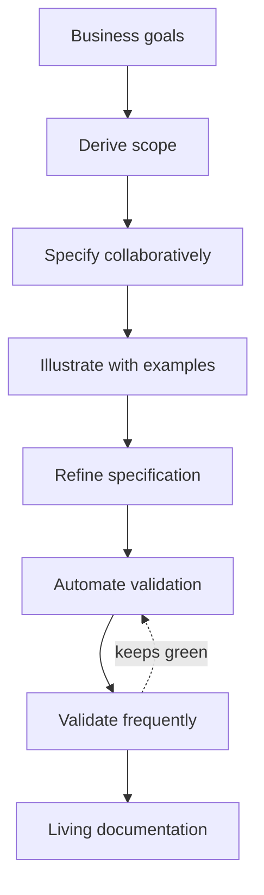

# Specification by Example

Gojko Adzic's *Specification by Example* (Manning, 2011) distills the practice of
building software from **concrete, agreed examples** that double as automated
acceptance tests and as **living documentation**. It is drawn from case studies of
teams that adopted the practice, so its guidance is about what actually worked in
the field rather than an idealized process.

## The central idea

Instead of writing abstract requirements and hoping everyone interprets them the
same way, teams describe desired behavior with **specific examples** — real inputs
and their expected outcomes. Those examples are refined into precise
specifications, automated as tests, and then kept continuously green. Because the
tests are validated against the running system on every build, the specification
can never silently drift from the code: the documentation is *living*.

This attacks the two classic documentation failures at once. Prose requirements
are ambiguous and go stale; a pile of automated tests is accurate but unreadable.
Executable specifications written from examples are both precise *and* readable,
and their accuracy is enforced by the build.

## The key process patterns

Adzic organizes the practice around a set of process patterns:

- **Deriving scope from goals** — start from the business goal and let the team
  propose scope, rather than receiving a fixed solution.
- **Specifying collaboratively** — build the examples together (business,
  development, testing) so shared understanding is created, not handed down.
- **Illustrating using examples** — express requirements as concrete cases,
  including the awkward edge cases that expose hidden assumptions.
- **Refining the specification** — remove noise, keep the examples that carry
  meaning, and phrase them in the business's language.
- **Automating validation without changing the specifications** — connect the
  human-readable examples to the system through a thin automation layer, so the
  spec stays clean.
- **Validating frequently** — run the executable specifications continuously to
  keep them trustworthy.
- **Evolving a documentation system** — over time the specifications become the
  team's authoritative, always-current reference: *living documentation*.

## Relationship to ATDD and requirements

Specification by Example and [ATDD by Example](atdd-by-example.md) describe
essentially the same practice: Adzic foregrounds the collaboration and the
living-documentation outcome, while Gärtner foregrounds the test-driven mechanics.
Both are the executable form of the *verifiable* requirement urged in
[Software Requirements](software-requirements.md) and the "conditions of
satisfaction" attached to a story in [User Stories Applied](user-stories-applied.md).
The inner loop that makes each example pass is
[test-driven development](../software-engineering/test-driven-development-by-example.md); the guiding
practices overlap with the [five TDD practices](../software-engineering/tdd-five-practices.md). It is also
a direct ancestor of today's
[specs-as-source-of-truth](../agentic-coding/the-new-code-specs-as-source-of-truth.md) and
[spec-driven development](../agentic-coding/spec-driven-development.md) thinking, where the spec is
the artifact an agent generates code from.

## References

- [Specification by Example — gojko.net](https://gojko.net/books/specification-by-example/)
