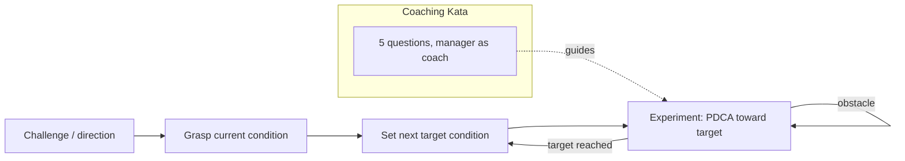

# Toyota Kata

Mike Rother (2010). After studying how Toyota actually sustains improvement, Rother
concluded the visible tools (kanban, andon, value-stream maps) were never the
source of the advantage. The real engine is an invisible, daily *behavioral
routine* — a **kata** — that managers practice and teach until scientific thinking
becomes reflex. The book names two katas: one for improving, one for coaching the
improving.

## The Improvement Kata

A four-step, repeatable pattern for moving toward a goal through experiments rather
than leaps:

1. **Understand the direction / challenge** — the long-term goal you're heading
   toward (set by the organization's needs, often years out).
2. **Grasp the current condition** — study, with facts and data, how things
   actually work right now. No opinions, no assumptions.
3. **Establish the next target condition** — define a concrete, measurable state to
   reach by a near-term date. This is the specific place you're trying to get to
   next, chosen *just beyond* current knowledge.
4. **Experiment (PDCA) toward the target** — iterate rapid Plan-Do-Check-Act cycles
   toward the target condition. Each obstacle is an experiment, not a failure; the
   gap between prediction and result is where learning lives.

## The Coaching Kata

Improvement is taught, not delegated. A coach (usually the learner's manager)
guides each learner through the improvement kata using **five questions**, asked
at the workplace, repeatedly:

1. What is the target condition?
2. What is the actual condition now?
3. What obstacles are now in your way? Which one are you addressing now?
4. What is your next step (next experiment), and what do you expect?
5. When can we go and see what we learned from taking that step?

The point is not to solve the problem *for* the learner but to develop their
scientific-thinking habit. Kata creates culture: repeated practice, not exhortation.

## Why it matters

Toyota Kata is the *how you actually do it, every day* companion to
[Lean Thinking](lean-thinking.md)'s fifth principle (perfection / kaizen) — it turns
"pursue perfection" into a concrete practice routine. The experiment-driven
Plan-Do-Check-Act loop mirrors the fast-feedback, small-batch capabilities that
[Accelerate](../devops-sre/accelerate.md) found predict high delivery performance, and the
disciplined-improvement posture aligns with the toil-elimination habit in
[Site Reliability Engineering](../devops-sre/site-reliability-engineering.md).

## References

- [The Toyota Kata Website — Mike Rother](http://www-personal.umich.edu/~mrother/Homepage.html)
