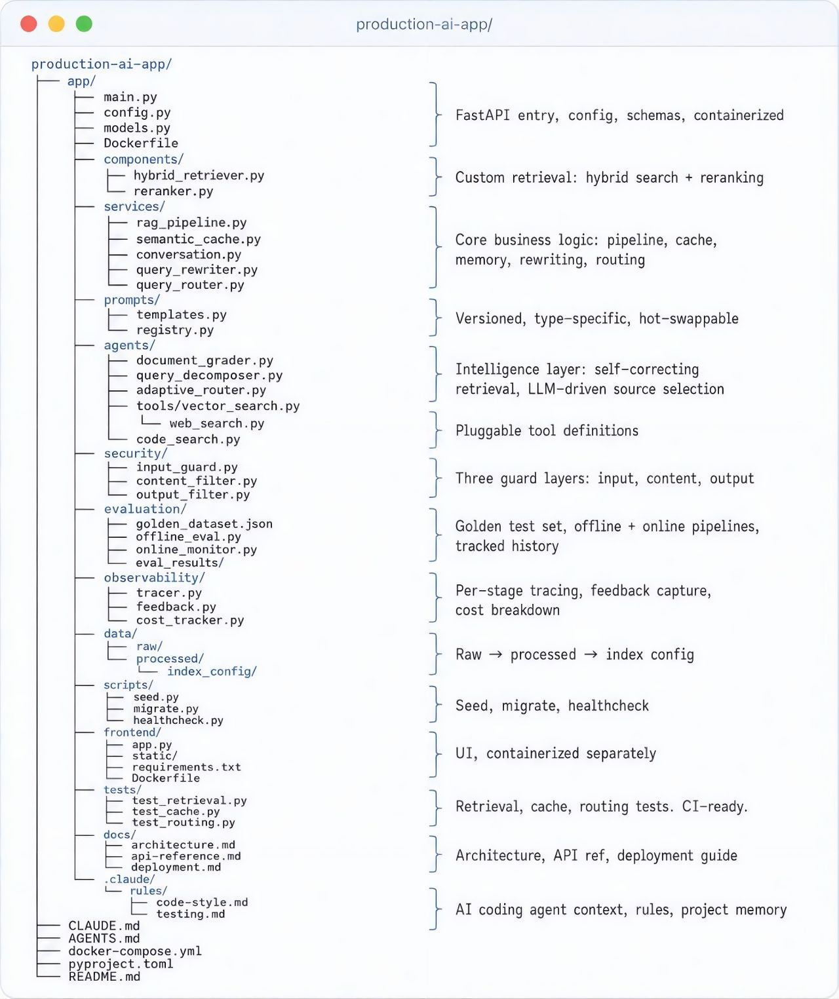

# Production AI App — Repository Structure

An annotated directory tree for a production RAG/agent application (`production-ai-app/`).

- `app/main.py`, `config.py`, `models.py`, `Dockerfile` — FastAPI entry, config,
  schemas, containerized.
- `components/` — custom retrieval: `hybrid_retriever.py`, `reranker.py` (hybrid search
  + reranking).
- `services/` — core business logic: `rag_pipeline.py`, `semantic_cache.py`,
  `conversation.py`, `query_rewriter.py`, `query_router.py`.
- `prompts/` — `templates.py`, `registry.py`: versioned, type-specific, hot-swappable.
- `agents/` — intelligence layer: `document_grader.py`, `query_decomposer.py`,
  `adaptive_router.py`, `tools/vector_search.py`, `web_search.py`, `code_search.py`
  (self-correcting retrieval, LLM-driven source selection, pluggable tools).
- `security/` — `input_guard.py`, `content_filter.py`, `output_filter.py`: three guard
  layers (input, content, output).
- `evaluation/` — `golden_dataset.json`, `offline_eval.py`, `online_monitor.py`,
  `eval_results/`: golden test set, offline + online pipelines, tracked history.
- `observability/` — `tracer.py`, `feedback.py`, `cost_tracker.py`: per-stage tracing,
  feedback capture, cost breakdown.
- `data/` (raw → processed → `index_config`), `scripts/` (seed, migrate, healthcheck),
  `frontend/` (containerized separately), `tests/` (retrieval/cache/routing, CI-ready),
  `docs/` (architecture, API ref, deployment).
- `.claude/rules/` (`code-style.md`, `testing.md`) plus root `CLAUDE.md`, `AGENTS.md`,
  `docker-compose.yml`, `pyproject.toml`, `README.md` — AI coding-agent context, rules,
  project memory.

## Cross-links

A filesystem-level realization of [Agent Harness Engineering](agent-harness-engineering.md):
`security/`, `evaluation/`, `observability/` are its tool/verification/operations layers.
`.claude/`, `CLAUDE.md`, `AGENTS.md` are the agent-context files from
[Four Files to Save You Two Hours a Day](four-files-ai-workflow.md).

## References

- 
