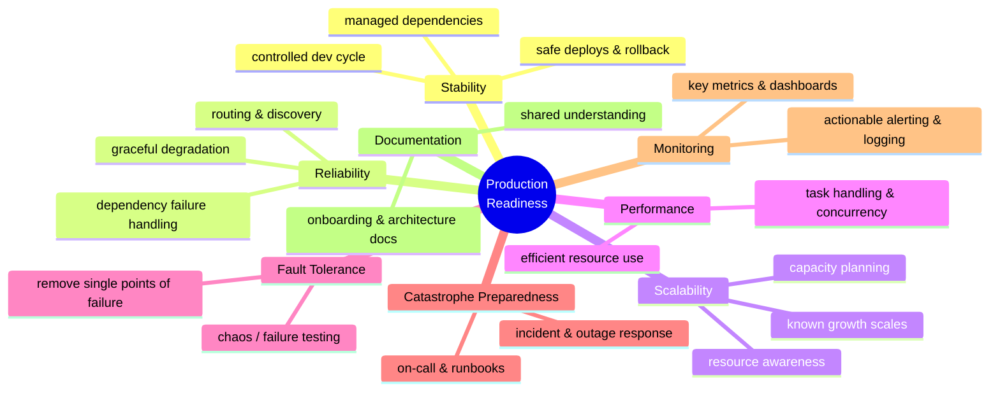

# Production-Ready Microservices

Susan J. Fowler's short field guide (O'Reilly) to answering one deceptively hard
question: **when is a microservice actually ready to carry production traffic?** It grew
out of a real initiative she ran at Uber, where a monolithic API had been split into
over a thousand microservices, most of them owned by product teams with little or no
site-reliability support. You cannot embed an SRE in every team, so the alternative is
to encode SRE judgment as an explicit, org-wide **standard** — a bar that any service
must clear before it is trusted with real users.

## The core idea: a standardized availability bar

In a large microservice ecosystem, per-service heroics don't scale. Each team optimizes
locally, quality drifts, and the reliability of the whole system is only as good as its
weakest dependency. The remedy is to define **production-readiness** as a shared,
concrete standard that applies uniformly across the organization, rather than as a
matter of individual taste. This gives every team the same definition of "good enough,"
makes services comparable, and lets reliability scale without linearly scaling the SRE
headcount.

This is a different concern from *how* a service is structured internally
(see [clean architecture](clean-architecture.md), which governs internal boundaries and
dependency direction). Production-readiness is about the **operational contract** a
service must satisfy at its edges to be a trustworthy citizen of a distributed system —
the operational counterpart to the design concerns in [microservice architecture](microservice-architecture.md).

## The eight principles

Fowler organizes the standard under eight umbrella principles. Each is an availability
goal; every specific checklist requirement rolls up under one of them.

- **Stability** — changes to the service (development, deployment, dependency changes,
  decommissioning) don't destabilize it or its consumers. A controlled development
  cycle, staged deploys, and safe rollback are the levers.
- **Reliability** — the service can be *trusted* by everything that depends on it. It
  routes and discovers correctly, degrades gracefully, and handles the failure of its
  own dependencies without cascading.
- **Scalability** — the service handles growth in traffic and data predictably, with a
  known scaling story and awareness of the resources (compute, storage, connections) it
  consumes.
- **Performance** — beyond merely scaling, the service uses its resources *efficiently*:
  it handles requests and background tasks quickly, with sensible concurrency, so it is
  cheap to run per unit of work.
- **Fault tolerance & catastrophe-preparedness** — the service is engineered to survive
  the failures that *will* happen. This means actively hunting and removing single
  points of failure, testing for failure (including chaos-style testing), and having
  real incident and outage response — on-call rotations, runbooks, and rehearsed
  procedures for the worst case.
- **Monitoring** — the service's health is visible: key metrics are captured and
  dashboarded, logging is useful, and alerting is *actionable* rather than noisy. You
  cannot operate what you cannot see.
- **Documentation & organizational understanding** — the service is understood by both
  its team and the wider organization. Documentation, onboarding material, and
  architecture reviews close the knowledge gaps that otherwise make services fragile
  when the people who built them move on.

These are frequently summarized as the shorter list — stability, reliability,
scalability, performance, fault tolerance, catastrophe-preparedness, monitoring, and
documentation — with fault tolerance and catastrophe-preparedness sometimes treated as a
single "prepare for the worst" pillar.

## The checklist approach

The principles are abstract; the operational tool is a **production-readiness
checklist**. Each principle is decomposed into concrete, verifiable requirements — for
example, under monitoring: "the service has a dashboard of its key metrics and
actionable alerts on them." A service is assessed against the checklist through
production-readiness **audits and reviews**, and gaps become a prioritized roadmap for
bringing the service up to standard.

The checklist does the real work of the standard: it turns "be reliable" into a finite
list a team can actually complete and an auditor can actually verify. It also makes the
bar portable — the same checklist travels across every team, which is what makes the
availability standard uniform across the ecosystem rather than a per-team negotiation.

## Why it matters

The book's argument is organizational as much as technical: in a system of many
independently-owned services, **reliability is an emergent property of the standard you
enforce**, not of any single clever design. A written, checklist-backed
production-readiness standard is how an engineering org scales trustworthiness alongside
its service count.

## References

- [Production-Ready Microservices — O'Reilly](https://www.oreilly.com/library/view/production-ready-microservices/9781491965962/)
