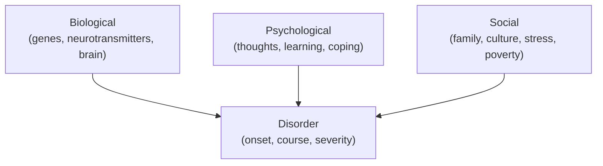

# Clinical and Abnormal Psychology

Clinical and abnormal psychology studies psychological suffering — its classification,
causes, and treatment. "Abnormal" is doing a lot of work in that phrase, and the field's
first hard problem is defining it. The working criteria are the "four Ds": behavior or
experience that is **deviant** (from norms), **distressing**, **dysfunctional** (impairs
daily life), and sometimes **dangerous**. None alone suffices, and all are partly relative to
culture and context — which is why what counts as disorder is contested, a question social
control frameworks sharpen in
[../sociology/deviance-and-social-control.md](../sociology/deviance-and-social-control.md).

## The medical / diagnostic model — the DSM

The dominant approach treats psychological problems as **disorders** — clusters of symptoms
that can be named, diagnosed, and treated much like medical conditions. In the U.S. the
reference is the **DSM** (Diagnostic and Statistical Manual of Mental Disorders, now DSM-5),
which lists criteria for each diagnosis so that different clinicians can agree on labels
(**reliability**). Major categories include:

- **Mood disorders** — major depression, bipolar disorder.
- **Anxiety disorders** — generalized anxiety, panic disorder, phobias, and related
  conditions (OCD, PTSD were reclassified in DSM-5).
- **Psychotic disorders** — schizophrenia, marked by hallucinations, delusions, and
  disorganized thought (a break with shared reality).
- **Personality disorders** — enduring, rigid patterns (e.g., borderline, antisocial) that
  connect to individual differences described in [personality.md](personality.md).

Diagnosis brings real benefits: shared language, access to treatment and insurance, research
cohorts, and destigmatizing "it's an illness, not a failing" framing.

## The biopsychosocial model

No serious disorder has a single cause. The **biopsychosocial model** holds that
psychopathology emerges from the interaction of three levels — and effective explanation and
treatment attend to all three:

The related **diathesis–stress** view refines this: a person carries a *vulnerability*
(diathesis) that manifests as disorder only when *stressors* exceed their coping — explaining
why the same genes or history yield illness in one life and not another. This layered
causation is why "chemical imbalance" alone is a caricature.

## Psychotherapy approaches

Treatment traditions differ in what they think the problem *is*:

- **Psychodynamic** (from Freud): symptoms express unconscious conflicts, often rooted in
  early experience. Therapy surfaces and works through them via insight, transference, and
  free association. See the historical thread in
  [history-and-schools-of-psychology.md](history-and-schools-of-psychology.md).
- **Humanistic** (Rogers, Maslow): people have an innate drive toward growth that gets
  blocked. **Person-centered therapy** provides empathy, genuineness, and *unconditional
  positive regard* so the client can self-actualize — linking to
  [motivation-and-emotion.md](motivation-and-emotion.md) and
  [positive-psychology-and-wellbeing.md](positive-psychology-and-wellbeing.md).
- **Cognitive-behavioral therapy (CBT)**: symptoms are maintained by maladaptive learned
  behaviors and distorted thinking. CBT combines the conditioning insights of
  [learning-and-conditioning.md](learning-and-conditioning.md) with cognitive
  restructuring — identifying and challenging automatic negative thoughts and the
  distortions behind them (all-or-nothing thinking, catastrophizing, overgeneralization).
  This is the practical core of David Burns's work in
  [burns-feeling-good.md](burns-feeling-good.md). CBT is the most rigorously evidenced
  psychotherapy and often as effective as medication for depression and anxiety, with lower
  relapse.

Modern practice is increasingly **eclectic and evidence-based**: matching method to disorder,
often combining psychotherapy with medication.

## Critiques of diagnosis

The diagnostic model is powerful but genuinely contested:

- **Reliability isn't validity.** Agreeing on a label doesn't prove the category "carves
  nature at its joints"; many DSM categories overlap heavily (**comorbidity**) and boundaries
  shift edition to edition.
- **Medicalizing normal life.** Widening criteria can pathologize ordinary grief, shyness,
  or distress — the concern of Rosenhan's famous (if disputed) "sane in insane places" study
  and of the anti-psychiatry tradition.
- **Labeling and social control.** A diagnosis is also a social act with consequences —
  stigma, self-fulfilling expectations, and the use of "disorder" to enforce conformity —
  precisely the dynamic analyzed in
  [../sociology/deviance-and-social-control.md](../sociology/deviance-and-social-control.md).
- **Culture-bound.** Symptoms, categories, and even which states count as illness vary across
  cultures, undercutting claims to a universal, purely biological taxonomy.

These critiques don't dissolve the reality of suffering; they argue for holding categories
humbly and treating people, not labels.

## Why it matters

Mental disorders are among the largest sources of human suffering and disability worldwide,
and how we conceptualize them determines who gets help, what help they get, and how they are
treated by society. The mature stance holds two truths together: disorders are real,
treatable, and often biological — *and* diagnosis is a fallible human construct that can harm
as well as help. That balance keeps clinical work both effective and humane.

## References

- [Feeling Good: The New Mood Therapy](burns-feeling-good.md) — Burns's popularization of
  cognitive therapy for depression.
- [Psychology](myers-psychology.md) — Myers's survey of the DSM, disorder categories, the
  biopsychosocial model, and therapies.
