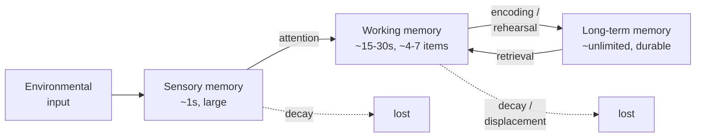

# Cognition and Memory

Cognition is the set of mental processes by which we acquire, transform, store, and use
information: attention, perception, memory, language, reasoning, and problem solving. The
dominant framework in cognitive psychology is the **information-processing model**, which
treats the mind by analogy to a computer — information flows through stages of encoding,
storage, and retrieval, with limited capacity at each step. The analogy is loose (brains
are not von Neumann machines), but it made cognition experimentally tractable after the
mid-century "cognitive revolution" displaced behaviorism.

## Attention: the gate

We cannot process everything the senses deliver (see [sensation-and-perception](sensation-and-perception.md)).
Attention is the selection mechanism that decides what gets deeper processing. Broadbent's
early **filter theory** proposed a bottleneck that admits one channel at a time; Treisman's
**attenuation** model softened this — unattended channels are turned down, not off, which is
why your own name in an unattended conversation ("the cocktail-party effect") still breaks
through. Attention is finite: divided attention degrades performance, and phenomena like
**inattentional blindness** (missing the gorilla walking through a scene you're counting
passes in) show that without attention there is often no conscious perception at all.

## The memory systems

The classic **Atkinson–Shiffrin (multi-store) model** distinguishes three stores by
capacity and duration:

- **Sensory memory** holds a brief, high-capacity trace of raw input (iconic for vision,
  echoic for sound). Sperling showed the icon fades within about a second.
- **Working memory** is the limited workspace for information currently in use. Baddeley
  and Hitch replaced the passive "short-term store" with an active model: a **central
  executive** directing attention over two slave systems, the **phonological loop**
  (verbal/acoustic rehearsal) and the **visuospatial sketchpad**, later joined by an
  **episodic buffer**. Miller's "magical number seven, plus or minus two" is the classic
  capacity estimate; more recent work puts the real limit closer to four **chunks**.
  Chunking — grouping items into meaningful units — is how experts effectively expand it.
- **Long-term memory** is functionally unlimited and durable. It divides into
  **explicit/declarative** memory (facts = *semantic*, personal events = *episodic*) and
  **implicit/procedural** memory (skills, conditioned responses — see
  [learning-and-conditioning](learning-and-conditioning.md)). The neural substrates differ,
  which is why the amnesic patient H.M. could learn new motor skills while being unable to
  form new episodic memories (see [../neuroscience/learning-and-memory](../neuroscience/learning-and-memory.md)).

## Encoding, storage, retrieval

Memory is often decomposed into three operations. **Encoding** turns experience into a
storable trace; **deeper (semantic) processing** encodes better than shallow (surface)
processing — Craik and Lockhart's **levels of processing**. **Storage** consolidates the
trace over time (the hippocampus binds episodic memories before they gradually become
neocortex-dependent). **Retrieval** brings it back, and is heavily cue-dependent:
**encoding specificity** means we recall best in the context (and mood, and state) in which
we learned. Retrieval is not a neutral read-out — the act of retrieving *strengthens* a
memory (the **testing effect**), one of the most robust findings for effective study.

## Schemas: knowledge with structure

Long-term knowledge is organized into **schemas** — structured expectations about
categories, events, and situations (a "restaurant script," a "bird" prototype). Bartlett's
*War of the Ghosts* experiments showed that recall is **reconstructive**: people distort an
unfamiliar story toward their own cultural schemas. Schemas make comprehension fast and
efficient but bias what we notice and remember, which connects directly to
[cognitive-biases-and-heuristics](cognitive-biases-and-heuristics.md) and to predictive
accounts of the brain (see [../neuroscience/predictive-coding-and-cognition](../neuroscience/predictive-coding-and-cognition.md),
where perception and memory are cast as top-down prediction met by bottom-up error).

## Forgetting and reconstruction

Forgetting is not simple erasure. Main mechanisms:

- **Decay** — traces fade without use (Ebbinghaus's *forgetting curve* mapped its
  exponential shape, and **spaced repetition** exploits the countervailing spacing effect).
- **Interference** — other memories compete: *proactive* (old disrupts new) and
  *retroactive* (new disrupts old).
- **Retrieval failure** — the memory is stored but the cue is missing (tip-of-the-tongue).

Because retrieval is reconstructive, memory is editable. Loftus's **misinformation effect**
shows that leading questions and post-event information reshape what people "remember,"
producing confident **false memories** — a finding with serious weight for eyewitness
testimony.

## Metacognition

**Metacognition** is thinking about one's own thinking — monitoring what you know and
regulating how you learn. It is where cognition becomes strategic: judgments of learning,
knowing when a study method is working, deploying retrieval practice over rereading. A
recurring lesson is that our metacognitive monitoring is poorly calibrated — fluency
(material that *feels* easy) is mistaken for mastery, so the study techniques that feel
best (rereading, highlighting) are often the least effective. Good metacognition, and the
biases documented in [cognitive-biases-and-heuristics](cognitive-biases-and-heuristics.md),
are two sides of learning to trust or distrust one's own cognition.

## Why it matters

The information-processing view underwrites education (how to study), design (respecting
working-memory limits), the law (eyewitness reliability), and clinical work (memory in
aging and trauma). It also grounds the broader survey in [myers-psychology](myers-psychology.md)
and connects cognition to how change unfolds developmentally in
[developmental-psychology](developmental-psychology.md).

## References

- General survey: [myers-psychology](myers-psychology.md)
- Neural basis: [../neuroscience/learning-and-memory](../neuroscience/learning-and-memory.md)
- Perceptual input: [sensation-and-perception](sensation-and-perception.md)
- Systematic errors: [cognitive-biases-and-heuristics](cognitive-biases-and-heuristics.md)
