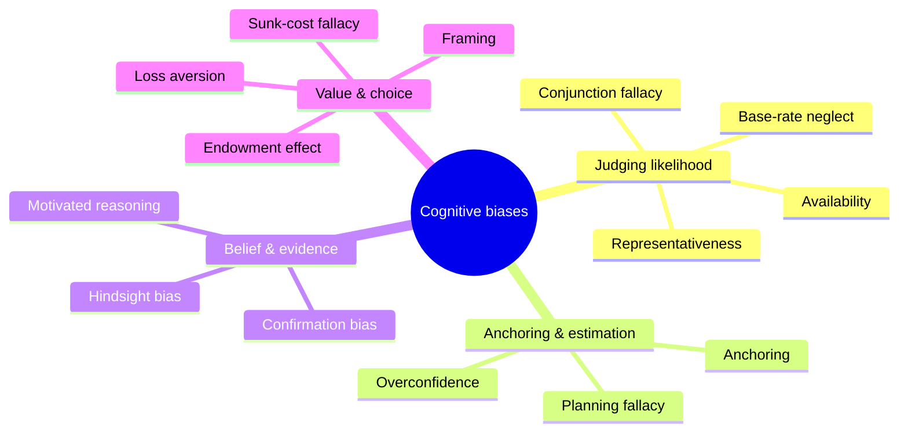

# Cognitive Biases and Heuristics

Classical economics assumed people are rational optimizers. Psychology found otherwise:
human judgment relies on **heuristics** — fast mental shortcuts that usually work but
predictably fail — and the failures leave systematic fingerprints called **cognitive
biases**. This research, launched by **Daniel Kahneman and Amos Tversky** in the 1970s,
reshaped psychology, economics, medicine, and public policy, and is synthesized for a
general audience in [../economics/kahneman-thinking-fast-and-slow](../economics/kahneman-thinking-fast-and-slow.md).

## Bounded rationality

Herbert Simon's **bounded rationality** is the founding premise: real minds have limited
time, attention, and computational capacity (see the working-memory limits in
[cognition-and-memory](cognition-and-memory.md)), so instead of optimizing they
**satisfice** — settle for a good-enough option. Heuristics are the adaptive response to
those limits, not defects. The bias literature is best read as cataloguing *where*
otherwise-sensible shortcuts break down, not as proof that people are stupid.

## Dual-process theory: System 1 and System 2

Kahneman popularized a **dual-process** account of the mind:

| | System 1 | System 2 |
|---|---|---|
| Speed | Fast, automatic | Slow, deliberate |
| Effort | Effortless | Effortful, taxes working memory |
| Character | Intuitive, associative, emotional | Analytic, rule-based, controlled |
| Failure mode | Jumps to biased conclusions | Lazy — defers to System 1, tires easily |

System 1 runs constantly and generates impressions; System 2 is the endorsing/monitoring
system that we *identify with* but that is cognitively expensive and often disengaged. Most
biases arise when System 1 supplies a fluent answer and System 2 fails to check it.

## The core heuristics

**Availability** — we judge how likely or frequent something is by how easily examples come
to mind. Vivid, recent, or emotionally charged events (plane crashes, shark attacks) feel
more probable than they are, distorting risk perception. This leans on the reconstructive,
cue-driven nature of retrieval in [cognition-and-memory](cognition-and-memory.md).

**Representativeness** — we judge probability by resemblance to a prototype, ignoring base
rates. The "Linda problem" (Linda, described as a philosophy grad concerned with justice,
judged more likely to be "a bank teller *and* a feminist" than "a bank teller") produces the
**conjunction fallacy**: a conjunction cannot be more probable than one of its conjuncts,
yet the richer story *feels* more representative. Related errors: base-rate neglect,
insensitivity to sample size, the gambler's fallacy.

**Anchoring** — an initial number contaminates subsequent estimates, even when it is
arbitrary and known to be irrelevant. People adjust away from the anchor but insufficiently.
Anchoring drives negotiations, pricing, and courtroom awards.

## Framing and reference dependence

The **framing effect** shows that logically equivalent descriptions change choices: a
treatment described as "90% survival" is chosen more than one described as "10% mortality."
This flows from Kahneman and Tversky's **prospect theory** — we evaluate outcomes as gains
and losses relative to a reference point, feel **losses about twice as heavily as
equivalent gains** (loss aversion), and are risk-averse for gains but risk-seeking for
losses. Framing and prospect theory are the psychological engine of
[../economics/behavioral-economics](../economics/behavioral-economics.md).

## Confirmation bias and belief

**Confirmation bias** is the tendency to seek, interpret, and remember evidence that
supports what we already believe, and to discount what contradicts it. Combined with
**motivated reasoning** and the **backfire/overconfidence** effects, it explains why
argument rarely changes minds and why polarization is sticky. It is the psychological
counterpart of the fallacies and safeguards catalogued in
[../philosophy/critical-thinking-and-informal-logic](../philosophy/critical-thinking-and-informal-logic.md):
the discipline of critical thinking is largely a set of external checks on internal biases.

## A partial catalogue

## Why it matters — and the caveats

Biases matter wherever judgment under uncertainty matters: clinical diagnosis, forecasting,
investing, hiring, jury decisions, and increasingly the outputs of AI systems trained on
human text (see [../ai/large-language-models](../ai/large-language-models.md)), which
reproduce many of the same framing and availability effects. **Nudges** — restructuring
choice environments — try to work *with* System 1 rather than against it. Two caveats keep
the field honest: some classic effects have shown **replication weakness**, and the
"heuristics-and-biases" framing has a rival in Gigerenzer's **ecological rationality**,
which argues that simple heuristics are often *optimal* in the environments they evolved
for. The mature view: heuristics are neither stupid nor infallible — they are
context-dependent tools whose failure modes are worth knowing.

## References

- Primary synthesis: [../economics/kahneman-thinking-fast-and-slow](../economics/kahneman-thinking-fast-and-slow.md)
- Economic application: [../economics/behavioral-economics](../economics/behavioral-economics.md)
- Normative counterpart: [../philosophy/critical-thinking-and-informal-logic](../philosophy/critical-thinking-and-informal-logic.md)
- Cognitive basis: [cognition-and-memory](cognition-and-memory.md)
- General survey: [myers-psychology](myers-psychology.md)
