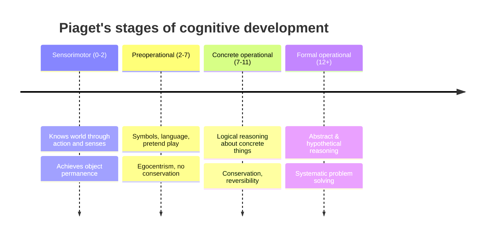

# Developmental Psychology

Developmental psychology studies how mind and behavior change across the lifespan — from
prenatal development through old age. Its recurring questions are structural: is change
**continuous** (gradual accumulation) or **discontinuous** (qualitative stages)? Is there
**stability** or change across the lifespan? And how do **nature and nurture** interact to
produce the person? The field's foundational stage theory is anchored in Piaget's
[piaget-psychology-of-the-child](piaget-psychology-of-the-child.md).

## Piaget: cognitive stages

Jean Piaget saw the child as a **little scientist** actively constructing understanding, not
a passive recipient of information (*constructivism*). Knowledge is organized into
**schemas** (cf. [cognition-and-memory](cognition-and-memory.md)) that develop through
**assimilation** (fitting new experience into existing schemas) and **accommodation**
(revising schemas to fit reality), driven by *disequilibrium* when the two clash. He
proposed four qualitatively distinct stages:

Later research qualified Piaget: he **underestimated infants** (object permanence and
number sense appear earlier with gentler tests), stages are less sharply bounded than he
claimed, and development is more domain-specific and culturally variable. But the core
insight — that children think in *qualitatively different ways*, not just with less
knowledge — endures.

## Vygotsky: the social route

Lev Vygotsky offered a **sociocultural** alternative: cognitive development is driven by
social interaction and internalization of a culture's tools (above all language). His key
construct is the **zone of proximal development (ZPD)** — the gap between what a learner can
do alone and what they can do with guidance from a more capable partner. Effective teaching
targets the ZPD via **scaffolding**: support that is gradually withdrawn as competence
grows. Where Piaget put the solitary child at the center, Vygotsky put the relationship —
and this framing maps cleanly onto guided practice and the conditioning discussed in
[learning-and-conditioning](learning-and-conditioning.md).

## Attachment: Bowlby and Ainsworth

John Bowlby argued that infants are biologically predisposed to form an **attachment** — an
enduring emotional bond — to caregivers, an evolved system promoting proximity and safety
(the caregiver as a **secure base** from which to explore). Mary Ainsworth operationalized
this with the **Strange Situation**, classifying infants by their response to separation and
reunion:

- **Secure** — distressed at separation, comforted at reunion (sensitive caregiving).
- **Insecure-avoidant** — minimizes distress, avoids the caregiver.
- **Insecure-ambivalent/resistant** — intensely distressed, hard to soothe.
- (**Disorganized**, added later) — contradictory, fearful behavior.

Attachment patterns form **internal working models** of relationships that show modest
continuity into adult bonds, though they are revisable rather than fixed.

## Erikson: psychosocial stages across life

Erik Erikson extended development across the *whole* lifespan as eight **psychosocial
stages**, each a crisis balancing a developmental tension whose resolution shapes
personality (cf. [personality](personality.md)): trust vs. mistrust (infancy) → autonomy
vs. shame → initiative vs. guilt → industry vs. inferiority → **identity vs. role
confusion** (adolescence) → intimacy vs. isolation → generativity vs. stagnation → ego
integrity vs. despair (old age). Erikson's move — that development doesn't stop at
adulthood — defined the modern **lifespan** perspective.

## Nature and nurture

The old dichotomy is dead; the modern view is **interaction**. Behavioral genetics
(twin and adoption studies) shows most traits are substantially heritable *and*
substantially shaped by environment. Key mechanisms: **gene–environment correlation**
(a child's genes shape the environments they seek and evoke), **gene–environment
interaction** (genetic effects depend on environment), and **epigenetics** (experience
regulates gene expression). **Critical/sensitive periods** — windows when experience has
outsized effect (e.g., first-language acquisition) — show timing matters, not just presence.

## A contrast worth drawing: development vs. machine learning

Staged development is a useful foil for how modern AI systems "learn." A large language
model (see [../ai/large-language-models](../ai/large-language-models.md)) acquires
competence by statistical exposure to vast data in a single training regime — impressive
but *undifferentiated*: it has no object-permanence milestone, no ZPD, no critical period,
no reorganization into qualitatively new modes of thought. Human development is
**embodied, staged, socially scaffolded, and constrained by maturational timing**. The
comparison sharpens what "learning" means in each: pattern extraction from a corpus versus
the structured, interaction-driven construction of mind that Piaget and Vygotsky described.

## Why it matters

Developmental science grounds education (readiness, scaffolding), parenting and childcare
(sensitive caregiving), clinical practice (developmental disorders, aging), and policy
(early-childhood investment). It connects to the broader survey in
[myers-psychology](myers-psychology.md).

## References

- Primary work: [piaget-psychology-of-the-child](piaget-psychology-of-the-child.md)
- General survey: [myers-psychology](myers-psychology.md)
- Learning mechanisms: [learning-and-conditioning](learning-and-conditioning.md)
- Machine learning contrast: [../ai/large-language-models](../ai/large-language-models.md)
