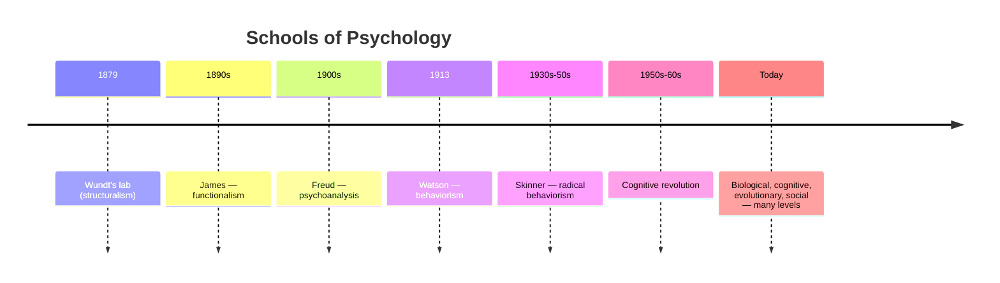

# History and Schools of Psychology

Psychology emerged as a distinct discipline only in the late nineteenth century, when
it split off from philosophy (which had asked about the mind for millennia) and
physiology (which had begun measuring the body). Its history is best read not as a
straight march toward truth but as a sequence of **schools** — rival answers to the same
questions: *What is the proper subject matter of psychology? What method reveals it?* Each
school pushed one method to its limit, hit that method's ceiling, and provoked the
reaction that became the next school.

## The founding: structuralism and functionalism

- **Wilhelm Wundt** opened the first psychology laboratory in Leipzig in 1879, the
  conventional birthdate of the field. He treated psychology as an experimental science of
  conscious experience, using **introspection** — trained observers reporting the elements
  of their own sensations under controlled stimuli.
- **Edward Titchener** carried this to the US as **structuralism**: the attempt to
  decompose consciousness into its basic elements (sensations, feelings, images), the way
  chemistry decomposes matter. Introspection proved unreliable — observers disagreed,
  and the method could not be checked against anything outside the head — and the school
  faded.
- **William James**, in America, rejected the search for static elements. His
  **functionalism** asked what mind is *for*: consciousness is a continuous "stream," and
  mental processes are adaptations that help an organism survive. James, influenced by
  Darwin, set the pragmatic, biology-facing tone of American psychology — see
  [james-principles-of-psychology](james-principles-of-psychology.md).

## Psychoanalysis

While the academics measured reactions, **Sigmund Freud**, a Viennese physician, built
**psychoanalysis** from clinical cases. He proposed a mind dominated by the **unconscious**
— drives, conflicts, and repressed memories inaccessible to introspection — structured
into id, ego, and superego, and shaped by early childhood. Much of Freud's specific theory
is unfalsifiable and unsupported, but the core claim that behavior is driven by processes
we cannot directly observe reshaped both clinical practice and popular culture, and it
feeds forward into [clinical-and-abnormal-psychology](clinical-and-abnormal-psychology.md).

## Behaviorism

**John B. Watson** (1913) declared the unobservable off-limits: if psychology is a
science, its data must be public, so its subject is **behavior**, not mind. Stimulus and
response are observable; introspection and "the unconscious" are not. **B. F. Skinner**
made this the dominant American paradigm for decades, showing how consequences shape
behavior through reinforcement — see
[skinner-science-and-human-behavior](skinner-science-and-human-behavior.md) and
[learning-and-conditioning](learning-and-conditioning.md). Behaviorism's rigor was its
strength and its cage: by refusing to talk about internal representations it could not
explain language, planning, or memory.

## The cognitive revolution

Beginning in the 1950s, several currents converged to reopen the "black box" of the mind:
Chomsky's demolition of Skinner's account of language, the digital computer as a working
metaphor for information processing, and advances in linguistics and memory research. The
**cognitive revolution** reframed the mind as a system that encodes, stores, transforms,
and retrieves **information** — internal representations became a legitimate, testable
subject again. This is the direct ancestor of both modern
[cognition-and-memory](cognition-and-memory.md) and much of artificial intelligence
(see [../ai/index.md](../ai/index.md)).

## Modern perspectives

Contemporary psychology is not a single school but a set of complementary **levels of
analysis**:

| Perspective | Core question | Example lens |
|---|---|---|
| Biological / neuroscience | What in the brain and genes causes this? | dopamine and reward |
| Cognitive | How is information processed? | attention, memory encoding |
| Behavioral | How do consequences shape action? | reinforcement schedules |
| Psychodynamic | What unconscious forces are at work? | defense mechanisms |
| Humanistic | How does the person strive to grow? | Maslow, Rogers, self-actualization |
| Evolutionary | Why would this trait have been adaptive? | mate choice, disgust |
| Social-cultural | How do others and context shape it? | conformity, norms |

Rather than compete, these are usually seen as different resolutions on the same
phenomenon — a **biopsychosocial** view that links the brain
([../neuroscience/index.md](../neuroscience/index.md)) to mind to culture.

## Two enduring threads

Two debates run through every school:

1. **Nature vs. nurture** — how much of who we are is inherited versus learned. The modern
   answer is *both, interacting*: genes set ranges and sensitivities, experience selects
   within them (epigenetics, gene–environment interaction).
2. **Mind vs. brain** — the mind–body problem inherited from philosophy: how does subjective
   experience relate to physical neural activity? This is where psychology hands the
   question back to [../philosophy/philosophy-of-mind.md](../philosophy/philosophy-of-mind.md),
   which frames the options (dualism, functionalism, physicalism).

## Why it matters

Knowing the schools inoculates you against two errors: treating today's dominant paradigm
as final truth, and dismissing an older school wholesale. Each contributed a durable idea —
functionalism's adaptationism, psychoanalysis's unconscious, behaviorism's insistence on
measurable behavior and controlled method (see
[research-methods-in-psychology](research-methods-in-psychology.md)), cognitivism's
information processing. Modern psychology is their synthesis.

## References

- [james-principles-of-psychology](james-principles-of-psychology.md) — William James,
  *The Principles of Psychology* (1890), the founding functionalist text.
- [myers-psychology](myers-psychology.md) — Myers, *Psychology*, standard survey of the
  perspectives.
- [skinner-science-and-human-behavior](skinner-science-and-human-behavior.md) — B. F.
  Skinner, the behaviorist program.
