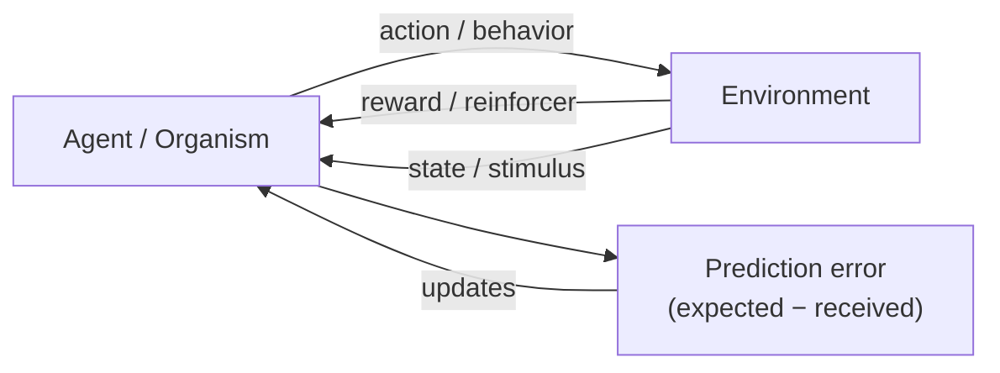

# Learning and Conditioning

**Learning** is a relatively permanent change in behavior or knowledge produced by
experience. It is how an organism tracks the structure of its environment — which events
predict which, and which actions pay off — without waiting for evolution to hard-wire the
answer. The behaviorist program (see
[skinner-science-and-human-behavior](skinner-science-and-human-behavior.md) and
[history-and-schools-of-psychology](history-and-schools-of-psychology.md)) made learning the
centerpiece of psychology and identified three basic mechanisms: classical conditioning,
operant conditioning, and observational learning.

## Classical (Pavlovian) conditioning

Learning that one *stimulus predicts another*. **Ivan Pavlov**, studying digestion in dogs,
found that a bell repeatedly paired with food eventually triggered salivation on its own. The
vocabulary:

- **Unconditioned stimulus (US)** — naturally triggers a response (food).
- **Unconditioned response (UR)** — the automatic reaction (salivation to food).
- **Conditioned stimulus (CS)** — a neutral stimulus paired with the US (bell).
- **Conditioned response (CR)** — the learned reaction to the CS alone (salivation to bell).

Key phenomena:

- **Acquisition** — building the CS→CR link; strongest when the CS reliably *precedes and
  predicts* the US.
- **Extinction** — the CR fades if the CS is presented repeatedly without the US.
- **Spontaneous recovery** — an extinguished CR reappears after a rest, showing extinction
  suppresses rather than erases the association.
- **Generalization** and **discrimination** — responding to stimuli similar to the CS, versus
  learning to respond only to the specific CS.

Classical conditioning is not mindless association: the modern view (Rescorla) is that the
animal learns **predictive contingency** — the CS matters only insofar as it carries new
*information* about the US. This idea of learning from *prediction error* is exactly the
bridge to modern theory.

## Operant (instrumental) conditioning

Learning that a *behavior predicts a consequence*. Where Pavlov's animals were passive,
**B. F. Skinner** studied how *voluntary* behavior is shaped by its outcomes (Thorndike's
**law of effect**: responses followed by satisfying consequences are strengthened). The
four-way scheme turns on two independent axes — whether a stimulus is *added or removed*, and
whether behavior *increases or decreases*:

|  | Increases behavior (**reinforcement**) | Decreases behavior (**punishment**) |
|---|---|---|
| **Add a stimulus (positive)** | Positive reinforcement (give a treat) | Positive punishment (give a shock) |
| **Remove a stimulus (negative)** | Negative reinforcement (stop the noise) | Negative punishment (take away a toy) |

Here "positive/negative" mean *add/remove*, not good/bad — a common confusion.
**Shaping** builds complex behavior by reinforcing successive approximations to the target.

**Schedules of reinforcement** govern *when* reinforcement follows behavior and strongly
shape persistence:

- **Continuous** — reinforce every response; fast learning, fast extinction.
- **Fixed-ratio** — after every *n* responses (piecework pay).
- **Variable-ratio** — after an unpredictable number of responses; produces the highest,
  most extinction-resistant response rates (slot machines, why gambling is so sticky).
- **Fixed-interval** — first response after a set time (studying just before an exam).
- **Variable-interval** — first response after an unpredictable time (checking for a text).

Variable schedules resist extinction because absence of reward is indistinguishable from a
normal dry spell — a fact with direct clinical and design consequences.

## Observational learning

**Albert Bandura** showed that much learning needs no direct reinforcement at all: we learn
by *watching* models and observing *their* consequences (**vicarious** reinforcement). In the
famous **Bobo doll** studies, children who watched an adult beat an inflatable doll imitated
the aggression — more so when the model was rewarded. This bridges behaviorism and cognition:
imitation requires attention, memory, and an internal representation of the modeled act, so
observational learning helped pull psychology past strict behaviorism toward
[cognition-and-memory](cognition-and-memory.md), and it grounds a great deal of
[social-psychology](social-psychology.md) (how norms and behaviors spread through groups).

## The parallel to reinforcement learning in AI

Operant conditioning and the AI subfield of **reinforcement learning (RL)** are the *same
idea* expressed in two vocabularies — a striking convergence.

| Psychology (operant) | Reinforcement learning ([../ai/reinforcement-learning.md](../ai/reinforcement-learning.md)) |
|---|---|
| Organism | Agent |
| Behavior / response | Action |
| Reinforcer / punisher | Reward (positive or negative) |
| Situation / stimulus | State |
| Strengthening a response | Increasing action value / policy weight |
| Shaping | Reward shaping |
| Trial-and-error learning | Exploration vs. exploitation |

The connection is not merely metaphorical. **Reward prediction error** — the gap between
expected and received reward — is the learning signal in RL's temporal-difference algorithms
*and*, remarkably, the measured firing pattern of midbrain **dopamine** neurons, which spike
when reward is better than predicted and dip when it is worse. This is a rare case where a
psychological law (learn from prediction error), a computational algorithm (TD learning), and
a neural mechanism (dopamine) line up — see
[../neuroscience/synaptic-plasticity.md](../neuroscience/synaptic-plasticity.md) for the
cellular substrate ("cells that fire together, wire together") that lets associations be
physically stored, and
[../neuroscience/learning-and-memory.md](../neuroscience/learning-and-memory.md).

## Why it matters

Conditioning explains an enormous range of behavior — phobias and their treatment
(exposure therapy is literally extinction), addiction (variable-ratio reward), habit
formation, animal training, classroom management, and the reward loops engineered into apps
and games. It is also the historical seed of one of AI's most powerful paradigms. The
cognitive-behavioral therapies in
[clinical-and-abnormal-psychology](clinical-and-abnormal-psychology.md) and
[burns-feeling-good](burns-feeling-good.md) rest directly on these principles.

## References

- [skinner-science-and-human-behavior](skinner-science-and-human-behavior.md) — B. F.
  Skinner, the operant-conditioning program.
- [myers-psychology](myers-psychology.md) — Myers, *Psychology*, classical/operant/
  observational learning.
- [../ai/reinforcement-learning.md](../ai/reinforcement-learning.md) — the computational
  formulation of learning from reward.
