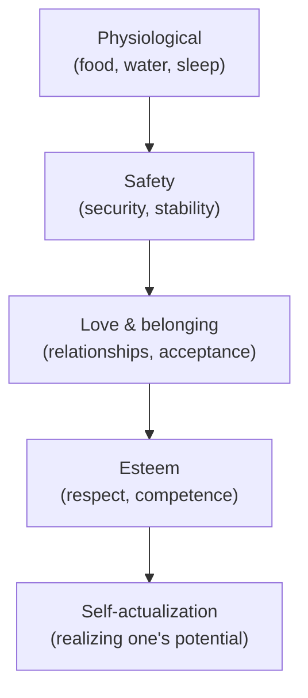
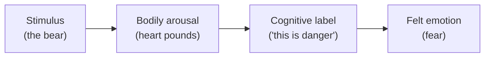

# Motivation and Emotion

Motivation is what energizes and directs behavior — why we act, and toward what. Emotion is
the felt, embodied evaluation that colors experience and often supplies motivation's fuel.
They are paired because they answer the same underlying question from two angles: *what
moves us?* Motivation is the push and pull; emotion is the signal that tells us how things
are going.

## Drives and homeostasis

The oldest scientific account treats motivation as a **drive** to restore **homeostasis** —
the body's regulated internal balance. A deficit (low blood sugar, dehydration) creates a
drive state (hunger, thirst) that pushes behavior to correct the imbalance; satisfying the
need reduces the drive. This **drive-reduction** logic, tightly linked to
[learning-and-conditioning.md](learning-and-conditioning.md) (needs make reinforcers
reinforcing), explains regulatory behaviors well but fails for behaviors that *increase*
arousal — curiosity, play, thrill-seeking. Hence **arousal theory**: organisms seek an
*optimal* level of stimulation, not its minimum (the Yerkes–Dodson law: moderate arousal
yields peak performance).

## Intrinsic vs. extrinsic motivation

- **Intrinsic** motivation: doing something for its own sake — because it is interesting,
  satisfying, or meaningful.
- **Extrinsic** motivation: doing something for a separable reward or to avoid punishment.

The crucial, non-obvious finding is the **overjustification effect**: paying people to do
what they already enjoyed can *reduce* intrinsic interest, because the reward reframes the
activity as work. Extrinsic incentives are not free — a central caution echoed in
[../economics/behavioral-economics.md](../economics/behavioral-economics.md), where framing
and incentives interact in ways classical models miss.

## Maslow's hierarchy

Abraham Maslow arranged human needs as a rough progression: lower, more urgent needs tend to
command attention until reasonably met, freeing energy for higher ones. It is best read as a
loose ordering of priorities, not a rigid staircase.

Maslow later added **self-transcendence** at the top — meaning beyond the self — which
resonates with [../personal-development/mans-search-for-meaning.md](../personal-development/mans-search-for-meaning.md).
The theory is influential and intuitive but weakly supported as a strict sequence; people
pursue meaning and connection even when lower needs go unmet.

## Self-determination theory

Deci and Ryan's **self-determination theory (SDT)** is the leading modern framework. It holds
that intrinsic motivation and wellbeing flourish when three innate psychological needs are
met:

- **Autonomy** — experiencing one's actions as self-chosen.
- **Competence** — feeling effective and capable.
- **Relatedness** — feeling connected to and cared for by others.

Environments that support these needs foster durable, high-quality motivation; controlling,
pressuring environments crowd it out. SDT explains the overjustification effect (rewards can
undermine autonomy) and connects directly to
[../personal-development/flow.md](../personal-development/flow.md) — flow arises when
challenge and skill are matched, satisfying competence — and to
[positive-psychology-and-wellbeing.md](positive-psychology-and-wellbeing.md).

## Theories of emotion

The hard puzzle is the ordering of the components of an emotion: the **stimulus**, the
**bodily arousal**, and the **conscious feeling**. Three classic theories disagree.

| Theory | Claim | Slogan |
|---|---|---|
| **James–Lange** | We perceive the stimulus, the body reacts, and the feeling *is* our reading of that bodily reaction. | "We are afraid because we tremble." |
| **Cannon–Bard** | Bodily arousal and the conscious feeling occur *simultaneously and independently* from the brain. | Tremble and fear at once. |
| **Schachter–Singer (two-factor)** | Emotion = physiological arousal **+** a cognitive *label* for it, drawn from context. | Same arousal, different feeling depending on interpretation. |

Schachter–Singer's two-factor view — arousal is generic, and cognition names it — has been
the most generative, and it ties emotion to the appraisal and attribution processes of
[social-psychology.md](social-psychology.md) and
[cognition-and-memory.md](cognition-and-memory.md).

## Affect and its functions

**Affect** is the broad stream of feeling — moods and emotions — that runs beneath cognition.
Far from noise, it is functional: emotions are fast, embodied appraisals that focus
attention, prepare action (fear → flight), signal others (a face communicates before words),
and guide decisions (the "somatic markers" that let us choose at all). Chronic mismatch or
dysregulation of affect is central to
[clinical-and-abnormal-psychology.md](clinical-and-abnormal-psychology.md); its cultivation
is the province of [positive-psychology-and-wellbeing.md](positive-psychology-and-wellbeing.md).

## Why it matters

Motivation and emotion are the levers of every applied psychology — how to design work that
sustains effort, how to build habits, how to help people change. The through-line is that
crude models (reward more, feel less) mislead: intrinsic motivation is fragile, incentives
can backfire, and emotions are information, not interference. Understanding the mechanisms
lets us arrange conditions — autonomy, competence, relatedness, matched challenge — under
which people move themselves.

## References

- [Psychology](myers-psychology.md) — Myers's survey of drive, arousal, Maslow, SDT, and the
  three theories of emotion.
