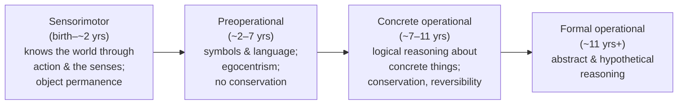

# The Psychology of the Child (Jean Piaget & Bärbel Inhelder)

*The Psychology of the Child*, by Jean Piaget and his long-time collaborator
Bärbel Inhelder, is the compact, definitive summary of Piaget's lifetime of
research into how children's thinking develops. Drawing on decades of close
observation and clinical interviews with children, it presents Piaget's central
claim: **intelligence is not fixed and is not simply poured in from the
environment — it is constructed** by the child through active interaction with
the world, unfolding through an invariant sequence of qualitatively distinct
stages. This constructivist view reshaped [developmental
psychology](developmental-psychology.md) and education alike.

## Central ideas

- **Constructivism through adaptation.** The child builds cognitive structures
  (**schemas**) and revises them through two complementary processes:
  **assimilation** (interpreting new experience in terms of existing schemas) and
  **accommodation** (changing the schemas when they fail). Development is the
  drive toward **equilibration** — a moving balance between the two.

- **Four stages of cognitive development.** Each stage is a coherent way of
  reasoning, and every child passes through them in the same order:

- **Signature phenomena.** The stages are illustrated by now-classic findings:
  **object permanence** (an infant grasps that hidden objects still exist),
  **egocentrism** (a young child cannot yet take another's perspective), and
  **conservation** (the concrete-operational child understands that quantity is
  preserved when a liquid is poured into a differently shaped glass, or when a row
  of objects is spread out — something the preoperational child gets wrong).

- **Biology meets environment.** Piaget frames cognitive growth as the interaction
  of biological maturation with the structure of experience — a synthesis that
  contemporaries compared, in its impact, to Freud's.

## Significance and cross-links

Piaget's stage theory is the foundation of the developmental section of any
[introductory psychology survey](myers-psychology.md) and a permanent reference
point in [developmental psychology](developmental-psychology.md), even where
later researchers (e.g., Vygotsky's social emphasis, or information-processing
critiques of sharp stages) have revised or challenged it. His interview-and-observation
methodology also influenced [research methods in
psychology](research-methods-in-psychology.md) for studying minds that cannot yet
report on themselves.

## References

- [The Psychology of the Child, Jean Piaget & Bärbel Inhelder — Basic Books](https://www.basicbooks.com/titles/jean-piaget/the-psychology-of-the-child/9780465095001/)
