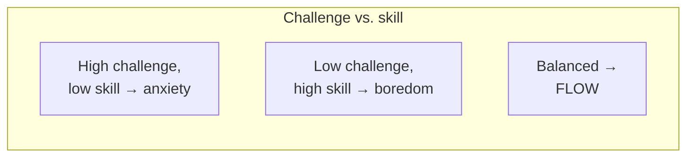

# Positive Psychology and Wellbeing

Positive psychology is the scientific study of what makes life worth living — the conditions
and traits that let people and communities flourish, rather than merely the absence of
illness. Launched as a movement by **Martin Seligman** around 2000, it argued that
psychology had spent a century mastering
[clinical-and-abnormal-psychology.md](clinical-and-abnormal-psychology.md) — repairing
dysfunction — while neglecting the equally scientific question of how the healthy thrive.
Its ambition is to move people not just from −5 to 0, but from 0 to +5.

## The shift from fixing to building

Seligman's own earlier work on **learned helplessness** (animals and people stop trying when
they learn outcomes are uncontrollable) became a theory of depression. Positive psychology
inverted the lens: study **learned optimism**, strengths, and what makes struggle survivable.
The reframe is not naive cheerfulness — it explicitly grounds itself in the finding that
meaning can be forged even in suffering, the lesson of
[../personal-development/mans-search-for-meaning.md](../personal-development/mans-search-for-meaning.md).

## Wellbeing — the PERMA model

Seligman argues wellbeing is not one thing (happiness) but several measurable, buildable
elements, summarized as **PERMA**:

| Element | What it is |
|---|---|
| **P**ositive emotion | Feeling good — joy, contentment, gratitude. |
| **E**ngagement | Absorbed involvement; being "in [flow](../personal-development/flow.md)." |
| **R**elationships | Positive connection with others. |
| **M**eaning | Belonging to and serving something larger than oneself. |
| **A**ccomplishment | Pursuing and achieving goals, mastery for its own sake. |

The point of naming five routes is that wellbeing is **plural**: someone can flourish through
meaning and relationships even when positive emotion runs low, which is why "just be happy"
is poor advice.

## Flow — Csikszentmihalyi

Mihaly Csikszentmihalyi's **flow** is the state of complete absorption in an activity, when
challenge and skill are well matched, attention narrows, self-consciousness falls away, and
time distorts. It is engagement (the *E* in PERMA) made concrete, and it satisfies the
**competence** need of self-determination theory (see
[motivation-and-emotion.md](motivation-and-emotion.md)). Flow is treated at length in
[../personal-development/flow.md](../personal-development/flow.md).

## Character strengths

Rather than diagnose what's wrong, Peterson and Seligman built a positive taxonomy: the **VIA
classification** of 24 character strengths (curiosity, kindness, courage, gratitude,
perseverance, and so on) grouped under six universal virtues. The applied insight is to
**identify and deploy your "signature strengths"** — using them in new ways reliably raises
wellbeing. It is the strengths-based complement to trait models of
[personality.md](personality.md).

## Resilience, gratitude, and habits of wellbeing

- **Resilience** — the capacity to adapt and recover from adversity — is not a fixed gift but
  partly trainable through optimistic explanatory style, social support, and reframing.
- **Gratitude** — deliberately noticing and appreciating the good — is among the most robust
  interventions; practices like keeping a gratitude journal or writing a "gratitude letter"
  produce measurable, lasting increases in wellbeing.
- Other evidence-based practices: acts of kindness, savoring, and identifying "three good
  things" each day. These are small, repeatable, and causally effective — wellbeing is a
  skill set, not a temperament.

## The hedonic treadmill

The sharpest challenge to "get more, feel better" is the **hedonic treadmill** (hedonic
adaptation): people quickly return to a stable baseline of happiness after both good and bad
events — a raise, a new house, even serious misfortune. We adapt, and the boost fades. This
explains why chasing positive-emotion highs and material gains yields diminishing returns,
and why PERMA leans on the more adaptation-resistant sources — **meaning, relationships, and
engagement**. It also links to
[../economics/behavioral-economics.md](../economics/behavioral-economics.md), where the gap
between predicted and experienced happiness (affective forecasting error) drives poor
choices.

## Why it matters

Positive psychology reoriented the field's mission and gave individuals an actionable answer
to "how do I live better?" — grounded in evidence rather than platitude. Its lasting
contributions are the pluralism of wellbeing (many routes, not one), the discovery that
wellbeing is buildable through practice, and the sober recognition, via the hedonic
treadmill, that the durable sources are meaning and connection, not consumption. It completes
psychology's arc from studying what breaks people to studying what makes them whole.

## References

- [Man's Search for Meaning](../personal-development/mans-search-for-meaning.md) — Frankl on
  meaning as the ground of wellbeing under extreme adversity.
- [Flow](../personal-development/flow.md) — Csikszentmihalyi on optimal experience.
- [Psychology](myers-psychology.md) — Myers's survey of positive psychology, wellbeing, and
  resilience.
