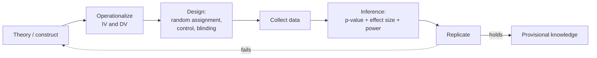

# Research Methods in Psychology

Psychology's claim to be a science rests not on its subject matter — the mind is hard to
observe — but on its **methods**. The discipline compensates for an invisible object of
study with unusually explicit rules about how to gather evidence and how much to trust it.
Understanding those rules is what separates a psychological finding from folk wisdom.

## The central problem: correlation is not causation

Two things vary together. Does A cause B, does B cause A, or does some third variable C
cause both? Observational (correlational) data cannot decide. Ice-cream sales correlate
with drownings; the cause of both is summer heat (a **confounder**). The whole apparatus of
experimental method exists to rule out this ambiguity — the same logic developed formally
in [../statistics/experimental-design-and-ab-testing.md](../statistics/experimental-design-and-ab-testing.md)
and [../statistics/hypothesis-testing.md](../statistics/hypothesis-testing.md).

## The experiment

An **experiment** establishes causation by *manipulating* one variable and holding
everything else constant:

- **Independent variable (IV)** — what the experimenter deliberately varies (the treatment).
- **Dependent variable (DV)** — what is measured (the outcome).
- **Random assignment** — participants are sorted into conditions by chance. This is the
  linchpin: it makes the groups equivalent *on average* on every variable, known and
  unknown, so any post-treatment difference can be attributed to the IV rather than to a
  confound.
- **Control group** and **experimental group** — the comparison baseline versus the treated
  group.
- **Blinding** — keeping participants (single-blind) and/or experimenters (double-blind)
  unaware of condition, to block **placebo effects** and **experimenter bias**.

Random *assignment* (to conditions, for causation) is distinct from random *sampling* (from
a population, for generalization); good studies want both.

## Operationalization

A theory speaks of "aggression," "happiness," or "memory" — abstractions. To study them you
must **operationalize**: define each construct as a concrete, measurable procedure ("number
of times the participant presses the shock button," "score on a 20-item scale"). The
operational definition is what actually gets measured, so a study is only as good as its
operationalizations, and debates about results are often really debates about whether the
operationalization captured the construct.

## Validity and reliability

| Property | Question it answers |
|---|---|
| **Reliability** | Does the measure give consistent results on repetition? |
| **Construct validity** | Does it actually measure the intended construct? |
| **Internal validity** | Can the effect be confidently attributed to the IV (no confounds)? |
| **External validity** | Does the result generalize beyond this sample and setting? |

A measure can be reliable but not valid (a consistently mis-calibrated scale). Lab
experiments tend to trade external for internal validity; field studies do the reverse.

## From data to inference

Because samples are noisy, psychology reasons statistically:

- **Statistical significance (*p*-value)** — the probability of observing data this extreme
  if the null hypothesis (no effect) were true. By convention *p* < .05 is called
  "significant." It is *not* the probability that the hypothesis is true, and a small *p*
  says nothing about how *large* the effect is — a persistent source of misreading. See
  [../statistics/hypothesis-testing.md](../statistics/hypothesis-testing.md).
- **Effect size** (e.g. Cohen's *d*, correlation *r*) — the *magnitude* of the effect,
  independent of sample size. With a large enough sample, trivially small effects become
  "significant," so effect size is what tells you whether a finding matters.
- **Statistical power** — the probability of detecting a real effect. Underpowered studies
  (small samples) both miss real effects and, paradoxically, inflate the apparent size of
  the effects they do find.

## The replication crisis

Beginning around 2011, large coordinated efforts (notably the *Reproducibility Project:
Psychology*) tried to repeat published findings and succeeded far less often than expected —
many well-known effects did not hold. The causes were structural:

- **p-hacking** — trying many analyses and reporting only those that cross *p* < .05.
- **HARKing** — Hypothesizing After the Results are Known, dressing up an exploratory
  finding as if it had been predicted.
- **Publication bias** — journals prefer positive, novel results, so the literature
  over-represents flukes and under-represents null findings (the "file drawer").
- **Small, underpowered samples** producing unstable estimates.

The response reshaped the field's norms: **pre-registration** (committing to hypotheses and
analyses before seeing data), **registered reports**, mandatory reporting of effect sizes
and confidence intervals, larger samples, open data and materials, and direct replication as
a valued activity. This mirrors reforms across the empirical sciences — see
[../philosophy/philosophy-of-science.md](../philosophy/philosophy-of-science.md) on what
makes a claim scientific, and
[../statistics/experimental-design-and-ab-testing.md](../statistics/experimental-design-and-ab-testing.md)
for the design principles that reduce these failures.

## Why it matters

Method is the difference between a testable science and plausible storytelling. The threads
in [history-and-schools-of-psychology](history-and-schools-of-psychology.md) each rise and
fall on whether their claims survive controlled test and replication; the biases catalogued
in [cognitive-biases-and-heuristics](cognitive-biases-and-heuristics.md) afflict researchers
as much as subjects, which is exactly why the procedures above are external checks on our
own reasoning.

## References

- [myers-psychology](myers-psychology.md) — Myers, *Psychology*, standard treatment of
  methods, validity, and statistics.
- [../statistics/hypothesis-testing.md](../statistics/hypothesis-testing.md) — significance,
  power, and the logic of the null.
- [../statistics/experimental-design-and-ab-testing.md](../statistics/experimental-design-and-ab-testing.md)
  — randomization and control.
