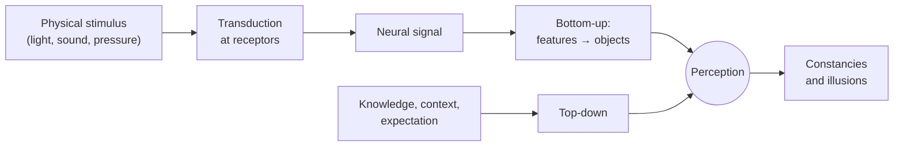

# Sensation and Perception

Everything you know about the world outside your skull arrives as physical energy — light,
pressure waves, molecules, mechanical force — that your nervous system must convert into
neural signals and then interpret. Psychology draws a sharp line through this process:

- **Sensation** — the detection of physical stimuli by sensory receptors and their
  conversion into neural signals (a bottom-up, largely mechanical process).
- **Perception** — the brain's organization and *interpretation* of those signals into
  meaningful objects, events, and scenes.

The dissociation is real: you can sense without perceiving (a sound you never notice) and,
crucially, perceive things that aren't in the sensation (illusions, filled-in blind spots).
Perception is an active *construction*, not a passive recording.

## Transduction

**Transduction** is the conversion of stimulus energy into the electrochemical language of
neurons. Each sense has specialized receptors: photoreceptors (rods and cones) transduce
light in the retina; hair cells transduce sound in the cochlea; mechanoreceptors transduce
pressure in the skin. Once transduced, all senses speak the same neural currency — trains of
[../neuroscience/action-potential.md](../neuroscience/action-potential.md) — and the brain
reconstructs *what kind* of stimulus it was largely from *which pathway* carries the signal.
The full machinery is covered in
[../neuroscience/sensory-systems.md](../neuroscience/sensory-systems.md).

## Thresholds and signal detection

How much stimulus is needed to sense anything?

- **Absolute threshold** — the minimum intensity detectable 50% of the time (e.g., a candle
  flame at ~30 miles on a clear dark night).
- **Difference threshold (just-noticeable difference, JND)** — the smallest change you can
  detect. **Weber's law** states the JND is a *constant proportion* of the original
  stimulus, not a fixed amount: you notice a 1 oz change in a 10 oz weight but need much more
  to notice a change in a 10 lb weight.

Classical thresholds assume a fixed sensory boundary, but detection also depends on
motivation, expectation, and the cost of errors. **Signal detection theory (SDT)** reframes
detection as a *decision under uncertainty*: distinguishing a weak signal from background
noise. It separates two independent quantities — **sensitivity** (*d′*, how well signal and
noise are actually discriminated) and **response criterion** (how much evidence you demand
before saying "yes," shifting the trade-off between hits, misses, false alarms, and correct
rejections). This is the same signal-versus-noise decision structure that underlies
[../statistics/hypothesis-testing.md](../statistics/hypothesis-testing.md) (Type I / Type II
errors) — a shared logic across perception and inference.

## Bottom-up vs. top-down processing

Perception runs in two directions at once:

- **Bottom-up processing** — starts from the raw sensory data and builds upward (edges →
  shapes → objects). Data-driven.
- **Top-down processing** — uses prior knowledge, context, and expectation to interpret the
  data (reading a smudged word from sentence context). Concept-driven.

Real perception is a continuous interplay: expectations (a **perceptual set**) shape what you
see, and the data constrain what expectations survive. Modern accounts formalize this as the
brain constantly *predicting* incoming sensation and correcting on error — see
[../neuroscience/predictive-coding-and-cognition.md](../neuroscience/predictive-coding-and-cognition.md).
The dependence of perception on stored knowledge is one reason perception is inseparable from
[cognition-and-memory](cognition-and-memory.md).

## Gestalt principles

Early-twentieth-century **Gestalt** psychologists argued that "the whole is other than the
sum of its parts" — we perceive organized wholes, not isolated features. They catalogued the
rules by which the visual system groups elements:

| Principle | We group elements that are… |
|---|---|
| **Proximity** | close together |
| **Similarity** | alike in color, shape, or size |
| **Continuity** | arranged along a smooth line or curve |
| **Closure** | almost-complete shapes, filling the gap |
| **Common fate** | moving in the same direction |
| **Figure–ground** | into a foreground object against a background |

These are not learned rules; they are the visual system's default assumptions about how a
scene is likely structured.

## Perceptual constancies and illusions

Because the proximal stimulus (the retinal image) constantly changes while objects stay the
same, the brain imposes **constancies**: a door is perceived as rectangular whatever its
projected trapezoid (shape constancy); coal in sunlight looks black though it reflects more
light than paper in shadow (lightness constancy); a friend seems the same size near or far
(size constancy). Constancy is the perceptual system betting on the *stable object* behind
the shifting image.

**Illusions** expose these bets. The Müller-Lyer arrows, the Ames room, and the moon
illusion all arise because the visual system applies its normally-correct assumptions to a
case engineered to violate them. Illusions are not malfunctions — they are the machinery of
successful everyday perception caught making an inference out loud. This is direct evidence
that perception is *constructed*, the central lesson of the whole topic.

## Why it matters

Sensation and perception are the input layer of the whole mind: memory, thought, and action
all operate on a perceived world that the brain has already interpreted, not on raw reality.
Recognizing that perception is constructive — that it fills gaps, applies priors, and can be
systematically fooled — is the foundation for understanding
[cognitive-biases-and-heuristics](cognitive-biases-and-heuristics.md), where the same
constructive inference produces predictable errors in judgment, and it connects psychology to
computational models of vision in [../ai/index.md](../ai/index.md).

## References

- [myers-psychology](myers-psychology.md) — Myers, *Psychology*, thresholds, Gestalt,
  constancies, and illusions.
- [../neuroscience/sensory-systems.md](../neuroscience/sensory-systems.md) — the neural
  hardware of transduction and sensory pathways.
