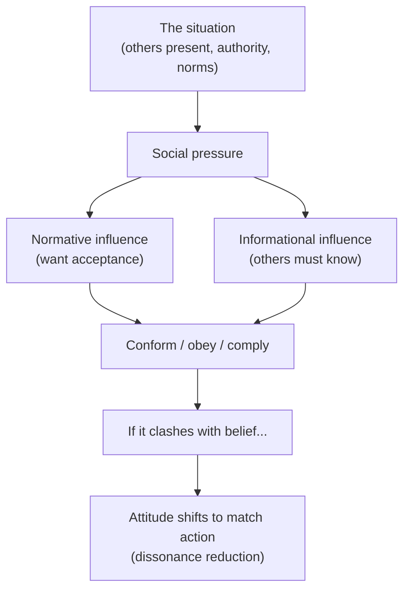

# Social Psychology

Social psychology studies how the real, imagined, or implied presence of other people
shapes what we think, feel, and do. Its central and most humbling finding is the **power
of the situation**: behavior we intuitively explain by character — cruelty, cowardice,
kindness — turns out to bend dramatically under social pressures the actor barely notices.
Where [personality](personality.md) asks how people differ across situations, social
psychology asks how situations move nearly everyone in the same direction.

## Conformity — Asch

Solomon Asch (1950s) sat one real subject among confederates and asked which of three lines
matched a reference line. The answer was obvious, yet when the confederates unanimously gave
a wrong answer, about a third of subjects' responses conformed to the group, and most
conformed at least once. Two forces drive this: **normative influence** (the wish to be
accepted, to not stand out) and **informational influence** (the assumption that a unanimous
group probably knows something you don't). A single dissenting ally collapses conformity —
unanimity, not group size, is the lever.

## Obedience — Milgram

Stanley Milgram (1961–63), reckoning with how ordinary people carried out atrocities, told
subjects to deliver escalating "shocks" to a learner (a confederate) whenever he erred.
Despite screams and pleas, roughly **65% continued to the maximum 450 volts** when an
authority figure calmly insisted they proceed. Obedience rose with the authority's
legitimacy and proximity, and fell when the victim was closer or the authority more distant.
Milgram's lesson is not that his subjects were monsters but that situational structures —
graded steps, diffused responsibility, a credible authority — can override conscience in
most of us. This connects to how institutions channel behavior in
[../sociology/social-structure-and-agency.md](../sociology/social-structure-and-agency.md).

## The bystander effect

Prompted by the 1964 Kitty Genovese case, Latané and Darley showed that the *more*
bystanders present, the *less* likely any one person is to help. The mechanism is **diffusion
of responsibility** (someone else will act) compounded by **pluralistic ignorance** (each
person reads others' inaction as evidence there's no emergency). Helping requires a chain:
notice the event, interpret it as an emergency, assume responsibility, know how to help, and
decide to act — a crowd can break any link.

## Attribution and the fundamental attribution error

Attribution theory (Heider, Kelley) concerns how we explain behavior — by **disposition**
(who someone is) or **situation** (their circumstances). The **fundamental attribution
error** is our systematic tendency to over-weight disposition and under-weight situation when
judging *others* ("he's lazy") while explaining our *own* behavior situationally ("I was
swamped") — the **actor–observer asymmetry**. It is a social cousin of the biases catalogued
in [cognitive-biases-and-heuristics.md](cognitive-biases-and-heuristics.md), and it is
exactly what Milgram and Asch expose as a mistake: we routinely underestimate the situation.

## Cognitive dissonance — Festinger

Leon Festinger (1957) proposed that holding two inconsistent cognitions — or acting against
one's beliefs — creates an aversive tension we are driven to reduce. In the classic study,
subjects paid just **$1** to tell others a dull task was fun later rated the task as more
enjoyable than those paid $20: with no large external justification, they resolved the
dissonance by changing the belief ("I actually liked it"). Dissonance explains why effortful
initiations breed loyalty, why choices make us love what we chose, and why attitudes often
follow behavior rather than precede it — a bridge to
[motivation-and-emotion.md](motivation-and-emotion.md).

## Persuasion and influence — Cialdini

Robert Cialdini distilled the mechanics of persuasion into six principles of influence, the
levers that reliably move compliance (anchored in
[cialdini-influence.md](cialdini-influence.md)):

| Principle | Why it works |
|---|---|
| **Reciprocity** | We feel obliged to return favors, even unsolicited ones. |
| **Commitment & consistency** | Once we commit (especially publicly), we act to stay consistent. |
| **Social proof** | When unsure, we do what similar others do — the engine of conformity. |
| **Authority** | We defer to credible experts and symbols of authority — the engine of obedience. |
| **Liking** | We say yes to people we like, find similar, or find attractive. |
| **Scarcity** | We value what is rare or fleeting more highly (loss looms larger). |

These map onto the earlier findings: social proof *is* Asch's informational influence,
authority *is* Milgram's mechanism. They also underpin much of
[../economics/behavioral-economics.md](../economics/behavioral-economics.md).

## Group dynamics

Groups are not just aggregates of individuals; being in one changes the members.

- **Groupthink** (Janis): cohesive groups under pressure suppress dissent and reality-testing
  to preserve harmony, producing overconfident, poorly examined decisions.
- **Group polarization**: discussion pushes a group toward a more extreme version of its
  members' initial leanings, not the moderate average.
- **Social facilitation vs. loafing**: others' presence sharpens performance on easy tasks
  but degrades it on hard ones; in pooled effort, individuals often slack (loafing).
- **Deindividuation**: anonymity and arousal in crowds loosen normal restraints.

## Why it matters

Social psychology reframes moral judgment: before concluding that someone is bad, ask what
situation they were in — and recognize that you would likely have done much the same. Its
principles are load-bearing for design, marketing, management, and public policy, and they
are the honest counterweight to the fundamental attribution error we all commit. Studied
well, it makes us both more forgiving of others and more alert to the forces steering our own
compliance.

## References

- [Influence: The Psychology of Persuasion](cialdini-influence.md) — Cialdini's six
  principles of persuasion.
- [Psychology](myers-psychology.md) — Myers's survey of conformity, obedience, attribution,
  and dissonance.
