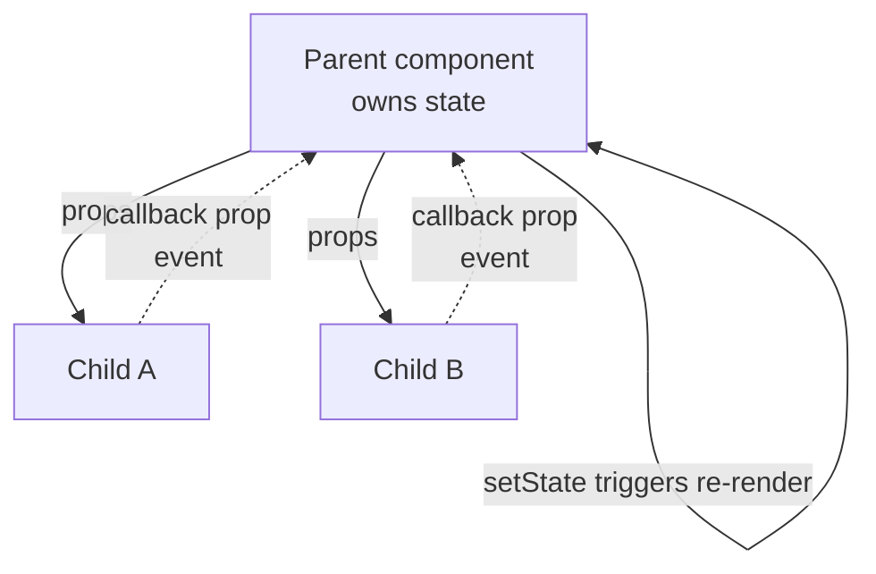
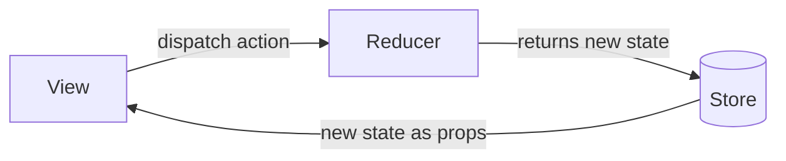

# React for Real

A short, pragmatic introduction to React by Ludovico Fischer (The Pragmatic
Bookshelf, 2017). It aims to teach the essentials of building a real front-end app
in roughly a hundred pages rather than exhaustively cataloging the API. It builds a
running example (a word-counter-style app) and layers on tooling, state management,
testing, and integration as the app grows.

**Era caveat.** This is a pre-hooks edition (book version P1.0, August 2017). React
components are written as ES6 classes with `render()` methods and lifecycle methods;
state lives in `this.state` and is changed via `setState`. Function components exist
only as stateless "presentational" components. Hooks (`useState`, `useEffect`, etc.)
arrived later in React 16.8 (2019) and are *not* in this book. The mental model —
components, JSX, one-way data flow, props vs. state — is still accurate; only the
syntax for holding state and running side effects has since shifted to hooks.

## React's core model

React describes UI as a function of data. You declare what the screen should look
like for a given set of data, and React reconciles the actual DOM to match. You
rarely touch the DOM directly.

- **Components** are the unit of composition — reusable pieces of UI. A component
  takes inputs and returns a description of what to render. Bigger UIs are built by
  nesting small components.
- **JSX** is the syntax for describing that output: HTML-like markup embedded in
  JavaScript. It is not HTML — it compiles (via Babel) down to plain function calls
  that create React elements. Expressions in `{ }` let you interpolate data and
  logic. Because it is just JavaScript, you use normal language features (`.map`,
  ternaries) rather than a bespoke template language.
- **One-way data flow.** Data flows down from parent to child through props; it never
  flows back up implicitly. When something needs to change, a child calls a callback
  passed down as a prop, the parent updates its state, and new data flows back down.
  This makes the source of truth for any piece of data unambiguous.
- **Props vs. state.** *Props* are inputs a component receives from its parent —
  read-only from the component's point of view. *State* is data a component owns and
  can change over time (via `setState` in this edition). The guideline is to keep as
  much of the app stateless as possible and concentrate state where it belongs, high
  enough in the tree that everything needing it can receive it as props.

## Composing UIs from components

The book pushes a split between **presentational** components (pure, stateless, just
turn props into markup) and components that hold state and coordinate behavior. Data
and the functions that mutate it are lifted up to a common ancestor; leaf components
stay dumb and reusable. This "lift state up" pattern keeps a single source of truth
and makes components easy to reason about and test.

## Handling events and forms

Event handlers are attached in JSX (e.g. `onClick`, `onChange`) and receive a
synthetic event. Handlers typically call `setState` or invoke a callback passed via
props so the owning component can update. Forms are handled as **controlled
components**: the input's value is driven by state, and every keystroke fires
`onChange` to update that state — the component, not the DOM, is the source of truth
for what the input contains. The book also covers **asynchronous events** (e.g. a
timer or a delayed update) and the care needed when state updates happen over time.

## Lifecycle and effects

In this class-based edition, side effects hang off **lifecycle methods** —
`componentDidMount` for setup after first render (a good place to start data
fetching), `componentWillUnmount` for teardown (clearing timers, canceling work), and
render running whenever props or state change. This is the pre-hooks equivalent of
what `useEffect` handles in modern React: run code in response to a component
appearing, updating, or being removed.

## Talking to APIs

Data fetching is done from lifecycle methods (fetch in `componentDidMount`), storing
the result in state so a re-render shows it. Because events can be asynchronous, the
book stresses handling the in-flight and completed states cleanly and not assuming a
component is still mounted when a response arrives.

## State management with Redux

For state that many parts of the app share, the book introduces **Redux** as a
central store. Redux fundamentals: a single immutable state tree, plain **actions**
describing what happened, and **reducers** — pure functions `(state, action) => new
state` — that compute the next state. The UI is connected to the store so components
receive the data they need and dispatch actions on events. The lesson is about
designing the data flow first, then wiring the interface to it — the same one-way
flow idea, scaled to the whole app.

## Tooling and production builds

A real app needs a build. The book sets up a development environment, uses **webpack**
to bundle, **Babel** to compile JSX and modern JS, and ES **modules** to organize
code, plus fast-feedback dev tooling. (`create-react-app` is used to bootstrap the
initial project.)

## Testing React apps

Testing is a first-class chapter. The approach: test plain functions in isolation
first; test **component boundaries** (that a component renders the right output for
given props and calls the right callbacks on events); and guard against unintended UI
changes with **snapshot tests** that capture rendered output and flag visual
regressions. The theme is testing behavior and contracts rather than implementation
details.

## Routing

Note: this edition is deliberately narrow and does **not** dedicate a chapter to
client-side routing (React Router). It focuses on components, state, Redux, testing,
and integrating React into existing apps ("Work Well with Others" — sharing code,
wrapping legacy widgets, combining React views with external models). Routing for a
full single-page app is covered in dedicated SPA material rather than here — see
[SPA design and architecture](spa-design-and-architecture.md).

## Related notes

- [JavaScript: The Good Parts](javascript-the-good-parts.md) — JSX and React are just
  JavaScript; the language fundamentals underpin everything here.
- [SPA design and architecture](spa-design-and-architecture.md) — where React fits in
  the broader single-page-app picture, including routing.
- [Learning patterns](learning-patterns.md) — the presentational/container and
  lift-state-up ideas are recurring front-end design patterns.

## References

- [React for Real: Front-End Code, Untangled — Ludovico Fischer, The Pragmatic Bookshelf](https://pragprog.com/titles/lmreact/react-for-real/)
