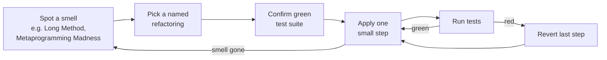

# Refactoring: Ruby Edition

The Ruby-language port of Fowler's classic, adapted by Jay Fields and Shane Harvie
(with Martin Fowler, and a foreword from Chad Fowler). It keeps the original's
discipline intact — behavior-preserving changes made in tiny steps under a green test
suite, driven by a vocabulary of code smells and answered by a named catalog of
refactorings — and re-expresses all of it in idiomatic Ruby. The general theory,
motivation ("why refactor," "what do I tell my manager," refactoring vs. performance)
lives in the parent note; this note captures only what the Ruby edition *changes or adds*.

For the shared foundation, see
[Refactoring: Improving the Design of Existing Code](refactoring-improving-the-design-of-existing-code.md).

## What the Ruby edition changes

- **Examples are Ruby, not Java.** The worked opening example (a video-rental
  statement) and every catalog entry are rewritten in Ruby, so the moves lean on Ruby's
  own affordances: blocks, symbols, hashes as ad-hoc records, modules, and open classes.
- **The safety net is idiomatic Ruby testing.** Same rule as the original — never
  refactor without tests — but expressed with Ruby's test tooling. This is the discipline
  worked out in [TDD: five practices](tdd-five-practices.md): tests first, small steps,
  green between every step.
- **Dynamic typing removes some mechanics and adds others.** Because there is no compiler
  and no static type declarations, several Java-era steps ("change the type signature,"
  "let the compiler find callers") disappear. In their place the book leans harder on the
  test suite and on `grep`/find-references to locate call sites, and it warns that
  duck typing makes some renames and interface changes silent until a test catches them.

## Ruby-specific refactorings added to the catalog

The catalog grows new entries that only make sense in a dynamic, block-and-module
language. The notable additions:

- **Blocks and collection idioms** — *Replace Loop with Collection Closure Method*
  (turn a hand-rolled loop into `map`/`select`/`inject`), and *Extract Surrounding
  Method* (pull a before/after wrapper into a method that yields to a block).
- **Named parameters via hashes** — *Introduce / Remove Named Parameter* and
  *Remove Unused Default Parameter*, reflecting Ruby's options-hash convention for
  method arguments.
- **Metaprogramming moves** — *Dynamic Method Definition* (generate methods with
  `define_method` instead of writing them out), *Replace Dynamic Receptor with Dynamic
  Method Definition* (prefer explicit generated methods over a catch-all
  `method_missing`), *Isolate Dynamic Receptor*, and *Move Eval from Runtime to Parse
  Time* — a set aimed at taming the "Metaprogramming Madness" smell (see below).
- **Modules in place of Java interfaces/inheritance** — *Extract Module* and
  *Inline Module* (the mixin analogue of extract/inline superclass), plus
  *Replace Type Code with Module Extension* (swap a type flag for a per-object module
  extension). *Replace Type Code with Polymorphism* and *…with State/Strategy* carry over
  from the original.
- **Hashes as lightweight records** — *Replace Hash with Object* (the Ruby counterpart
  to Replace Array/Record with Object), plus *Introduce Expression Builder* and
  *Introduce Gateway* for fluent internal DSLs and external-system boundaries.
- **Attribute initialization** — *Lazily Initialized Attribute* vs. *Eagerly Initialized
  Attribute*, and *Introduce Class Annotation* (declarative class-level macros in the
  `attr_accessor` style).

## The one new smell

The catalog of bad smells is inherited nearly verbatim, with one addition unique to a
metaprogramming-heavy language: **Metaprogramming Madness** — dynamic tricks
(`method_missing`, `eval`, heavy `define_method`) used where plain, readable code would
do, making behavior hard to follow and to change. Its cures are exactly the
metaprogramming refactorings above: prefer explicitly defined (even if generated) methods
over dynamic receptors, and move `eval` from runtime to parse time.

## How the process fits together

The loop is identical to the original; what changed is the vocabulary of smells and moves
now that the language is Ruby.

## Relationship to other notes

- Builds directly on [Refactoring: Improving the Design of Existing Code](refactoring-improving-the-design-of-existing-code.md)
  — read that first for the principles.
- Pairs naturally with [Practical Object-Oriented Design in Ruby](practical-object-oriented-design-in-ruby.md),
  which supplies the design goals (small, loosely coupled, message-oriented objects) that
  these Ruby refactorings move code *toward*.
- Depends on the safety net described in [TDD: five practices](tdd-five-practices.md):
  no refactoring without a fast, trustworthy test suite.

## References

- [Refactoring: Ruby Edition — Martin Fowler](https://martinfowler.com/books/refactoringRubyEd.html)
