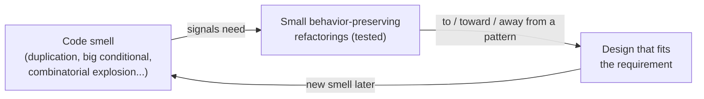

# Refactoring to Patterns

Joshua Kerievsky's 2004 book (Addison-Wesley, part of Martin Fowler's signature
series) is the bridge between two canonical works: Fowler's
[Refactoring](refactoring-improving-the-design-of-existing-code.md) and the Gang of
Four's [Design Patterns](design-patterns-gof.md). Its thesis is that the two belong
together — patterns describe good structures worth reaching, and refactoring is the
disciplined, behavior-preserving path that gets you there.

## The core argument

The classic mistake with design patterns is to reach for them at design time and
build them in up front — speculative, heavyweight structure justified by flexibility
nobody has asked for yet. That is how a codebase acquires a Strategy or a Visitor it
never needed, and the pattern becomes over-engineering rather than clarity.

Kerievsky inverts the order. Instead of designing patterns in, you **let the code tell
you where a pattern belongs.** A code smell — duplication, a swelling conditional, a
constructor doing too much — signals a structural problem. You then apply a sequence of
small, tested, behavior-preserving refactorings that *evolve* the design into (or
toward, or away from) the pattern that resolves the smell. The pattern emerges from the
pressure of real requirements, not from a diagram drawn before the requirements exist.

Fowler frames it in his foreword: the notion that agile/evolutionary design and design
patterns are at odds is a misconception — the patterns community and the XP community
overlap heavily, and patterns and evolutionary design have been intertwined from the
start. This book is where that intersection is made concrete.

The book's motto captures the relationship cleanly:

> **Patterns are where you want to be; refactorings are how you get there.**

## Three directions

A key nuance: the goal is not to march every design toward more patterns. Kerievsky
gives explicit advice for refactoring in three directions:

- **To a pattern** — the smell clearly calls for a known structure; refactor until the
  pattern is fully present.
- **Toward a pattern** — you adopt part of a pattern's structure because that much
  resolves the smell, without paying for the full machinery.
- **Away from a pattern** — a pattern was applied prematurely or has outlived its
  usefulness; refactor it back out to recover simplicity.

This is the antidote to pattern overuse: a pattern is only worth its weight when a real
problem justifies it, and removing an unneeded one is as legitimate a move as adding a
needed one.

## The catalog

The heart of the book is a catalog of **pattern-directed refactorings** — 27 of them —
each structured like a Fowler refactoring: a name, the smell(s) that motivate it, a
mechanics section of concrete steps, and worked examples drawn from real-world code
rather than toy problems. Each entry ties the transformation to the GoF (and other)
pattern it moves toward, shows more than one way to implement the same pattern, and
notes when the refactoring is worth doing. The book also supplies a suggested study
sequence and brief pattern summaries with UML sketches so it can be read alongside — but
not in place of — the patterns literature and Fowler's *Refactoring*.

Representative moves include *Replace Conditional Logic with Strategy*, *Move
Embellishment to Decorator*, *Replace Constructors with Creation Methods*, *Form
Template Method*, *Introduce Null Object*, and *Compose Method*. Each starts from a
smell and ends at a recognizable pattern.

## Why it matters here

The book operationalizes a principle that runs through much of this wiki: good design
is grown through small, safe, verified steps rather than decreed up front. It shares its
mechanics-and-smells DNA with
[Refactoring](refactoring-improving-the-design-of-existing-code.md) and its
language-specific companion
[Refactoring: Ruby Edition](refactoring-ruby-edition.md); it depends on the vocabulary
of [Design Patterns](design-patterns-gof.md); it presumes the test safety net that
[Test-Driven Development](tdd-five-practices.md) provides (you cannot refactor
confidently without tests); and it advances the same "keep it clean, let structure
emerge" ethic argued in [Clean Code](clean-code.md).

## References

- [Refactoring to Patterns — Martin Fowler (book page)](https://martinfowler.com/books/r2p.html)
