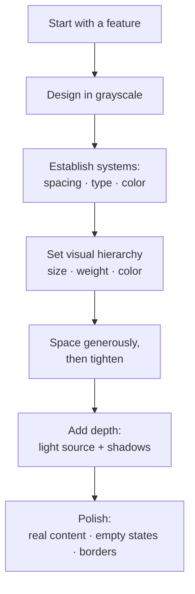

# Refactoring UI

A practical playbook by Adam Wathan and Steve Schoger for developers who write
code but freeze in front of a blank canvas. It skips design theory and hands you
tactics — the specific, repeatable moves that make an interface look
intentional instead of accidental. The through-line: good design is mostly
constraint and hierarchy, not talent.

## Start with a feature, not a layout

Don't begin by designing "the app" — the shell, the nav bar, the container.
You don't yet have the information to decide where navigation goes, so starting
there guarantees frustration. Instead, design one concrete piece of
functionality (e.g. "search for a flight": the fields and the button it
actually needs). The app is a collection of features; the shell falls out of
them once a few exist.

Work in short cycles: design a simple version of the next feature, build it for
real, iterate on the working thing, then return to design mode for the next
feature. Fixing design problems in an interface you can actually use beats
imagining every edge case in a mockup. Don't design too much up front, and
don't imply functionality you aren't ready to build.

## Detail comes later — design in grayscale first

Resist typefaces, shadows, icons, and especially color in the early stages.
Designing in grayscale forces spacing, contrast, and size to carry the
hierarchy. The result is a clearer interface with strong structure that's easy
to enhance with color afterward — rather than leaning on color to paper over a
weak layout. Low-fidelity sketches are disposable; use them to move fast, then
throw them away.

## Limit your choices — systematize everything

Infinite options are the enemy of speed and consistency. Replace open-ended
decisions with predefined systems you choose from:

- **Spacing/sizing scale** — a fixed set of values (not arbitrary pixels) so
  every margin, padding, and dimension is picked from the same ladder.
- **Type scale** — a defined set of font sizes and weights instead of choosing
  sizes ad hoc.
- **Color palette** — a small set of hues, each with many predefined shades
  (light to dark), so you always have the exact tint you need without
  eyedropper guesswork.

Deciding these once, up front, turns hundreds of micro-decisions into quick
selections and keeps the whole UI coherent. This mirrors the utility-first,
constrained-token approach in [Modern CSS with Tailwind](modern-css-with-tailwind.md).

## Hierarchy is everything

Visual hierarchy — what the eye notices first — is the core of a
professional-looking interface. Key moves:

- **Not all elements are equal.** Deliberately emphasize the important
  (primary actions, key data) and de-emphasize the rest. You can create
  emphasis by *de-emphasizing* everything around an element.
- **Size isn't the only lever.** Beyond font size, use **font weight** and
  **color** to signal importance. A heavier weight or a darker/lighter shade
  often reads better than just making text bigger.
- **Don't use grey text on colored backgrounds.** To soften text on a colored
  surface, pick a hand-tuned shade of the *background's* hue rather than
  reaching for grey, which turns muddy.
- **Semantics are secondary.** How something looks (its visual weight) matters
  more than which HTML heading level it is.

Choosing where the eye goes is a deliberate act — the same "make the obvious
thing obvious" instinct behind [Don't Make Me Think](dont-make-me-think.md).

## Layout and spacing — start with too much whitespace

Give elements generous breathing room, then remove space until it feels right;
starting cramped and adding space rarely gets there. You don't have to fill the
whole screen — dense isn't the same as useful. Avoid ambiguous spacing (equal
gaps that make it unclear what groups with what); spacing should communicate
relationships. Grids are overrated and relative (percentage) sizing doesn't
scale cleanly — prefer fixed, scale-based values.

## Color

Color choices are systematized, not improvised: define a palette with many
shades per hue up front. Beyond the mechanics, the *feel* a palette conveys
ties into [color psychology](color-psychology.md) — the emotional and
associative weight different hues carry.

## Creating depth

Simulate a consistent light source (implied from above) so shadows and
highlights agree across the UI. Use **shadows to convey elevation** — larger,
softer shadows read as "further from the surface / more prominent." Realistic
shadows can have two parts (a tight direct shadow plus a larger ambient one).
Even flat designs get depth from subtle contrast, and overlapping elements
create a sense of layers.

## Finishing touches and polish

The last mile is specific details that separate a rough UI from a finished one:

- **Shadows for elevation** rather than heavy outlines.
- **Borders are often replaceable** — separate regions with spacing,
  background-color shifts, or shadows instead of drawing lines everywhere.
- **Design your empty states.** The zero-data view (no results, first-run,
  cleared list) is where users often start; a blank void feels broken, so give
  it real, encouraging content.
- **Use real content**, not lorem ipsum — placeholder text hides layout
  problems that real, variable-length data exposes.
- **Use good fonts and good photos** — even small quality upgrades in
  typography and imagery lift the whole interface, and text over images needs
  consistent contrast to stay readable.

## References

- [Refactoring UI](https://www.refactoringui.com/) — Adam Wathan & Steve Schoger
