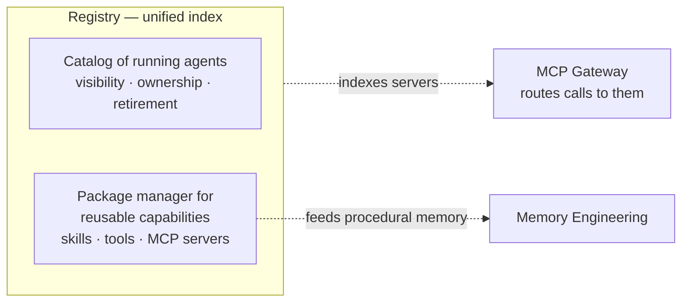

# Registries

**One place to publish, discover, version, and govern** the reusable pieces of an
agentic system — skills, tools, MCP servers, and the deployed agents themselves.
AWS: *"As enterprises scale to hundreds or thousands of agents, platform teams
face three critical challenges: visibility, control, and reuse."*

Rather than a separate system per kind, the practical direction is **one unified
index** — e.g. AWS's Agent Registry stores metadata for every agent, tool, MCP
server, and skill, with ownership, approval workflows, and hybrid search.

The need is **sharpest for skills**: built to be reusable but ship with **no
native distribution** — teams copy markdown files between repos (sometimes within
the same repo) until they sprawl and go stale. A registry treats all of these
like **real software**: versioned, discoverable, governed.

## Two jobs in one place

- **Catalog** of running agents — visibility, ownership, retirement.
- **Package manager** for reusable capabilities — skills, tools, MCP servers.

## Why it matters

Without a registry, agentic capability **fragments and duplicates**: teams
rebuild what a neighbour already shipped, nobody can answer *"what do we have and
who owns it,"* and compliance risk grows with the sprawl.

It pairs with the [MCP gateway](mcp-gateway.md) — which **routes** calls to the
servers the registry **indexes** — and it feeds the **procedural-memory** side of
[memory engineering](memory-engineering.md) (a reusable skill library needs
somewhere governed to live).

## Related

- [MCP Gateway](mcp-gateway.md) — routes to what the registry catalogs.
- [Memory Engineering](memory-engineering.md) — procedural memory = a governed
  skill library.

## References
- [Registries — Tessl Patterns](https://tessl.io/patterns/agentic-platform/registries/)
