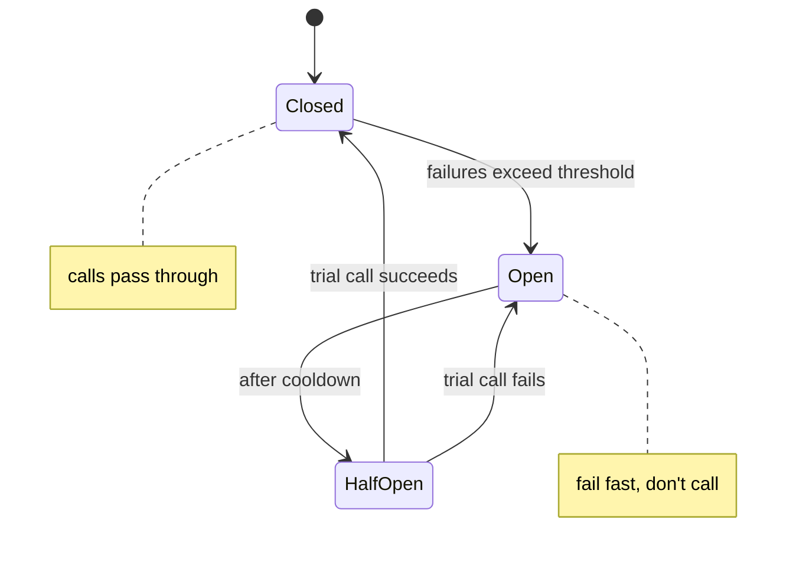

# Release It!

Michael Nygard's book is about the part of a system's life that most design books ignore:
**production**. His central observation is that **roughly eighty percent of a software
system's lifecycle cost happens after it ships**, yet almost all design effort targets
the feature-development phase. Passing QA proves a system works under gentle conditions;
it says nothing about whether it survives a flash mob, a slow downstream dependency, or a
three-month uptime run. *Release It!* is a field guide, built from painful outage
war-stories, for building software that stays up in the real world.

The 2nd edition (2018) expands the first to today's larger, virtualized, cloud-native,
distributed systems, and adds material on **chaos engineering** — deliberately injecting
randomness and stress to reveal systemic weaknesses before they reveal themselves at 3 a.m.

## The operational mindset

The framing that runs through the book: **your system will be attacked by reality.**
Failures are not exceptional — they are the steady state of a long-running distributed
system. So the questions shift from "does it work?" to:

- What happens when a dependency slows down or stops answering?
- How does a fault in one part spread — and how do you stop it spreading?
- Will it still be healthy after ninety days of uptime, or will it slowly rot?
- Can you deploy, observe, and recover without downtime?

Nygard organizes the guidance as **antipatterns** (the ways systems kill themselves) and,
against each, **patterns** (the countermeasures). The antipatterns are things like
**integration points** (every remote call is a place to hang), **cascading failure**
(one dead component drags down its callers), **chain reactions**, **blocked threads**,
**slow responses**, and **unbounded result sets**.

## Stability patterns

Stability patterns keep a single failure from becoming a total outage:

- **Timeouts** — never wait forever on a remote call. Unbounded waits are how one slow
  dependency exhausts the thread pool of everything upstream. Every integration point
  needs a timeout.
- **Circuit Breaker** — wrap a risky call so that after repeated failures the breaker
  "trips" and fails fast instead of hammering a sick dependency and piling up blocked
  threads. It periodically lets a trial call through to test recovery, then closes again.
  This is the book's most widely-adopted idea.
- **Bulkheads** — partition resources (thread pools, connection pools, even hardware) so
  a failure in one partition can't sink the whole ship, the way a ship's bulkheads
  contain a hull breach. One misbehaving tenant or feature is walled off from the rest.
- **Steady State** — for every mechanism that accumulates a resource (logs, data,
  caches, in-memory sessions), there must be a mechanism that reclaims it. A system left
  running should tend toward equilibrium, not toward a disk-full crash. Avoid "fiddling"
  that requires human intervention to stay healthy.
- **Fail Fast** — if a request is going to fail, fail it quickly rather than holding
  resources; check availability and validity before committing work.
- **Let It Crash / Handshaking / Test Harness** — recover cleanly, let components signal
  when they can accept load, and build harnesses that simulate the nasty failures real
  networks produce.

## Capacity patterns

Where stability is about surviving failure, **capacity** is about serving load
efficiently and predictably. Nygard treats capacity as an engineering discipline, not a
guess: measure real usage, understand the constraint, and design so throughput scales
without waste. Guidance here covers **pooling connections**, **caching** (with governors
so a cache can't grow unbounded — tying back to steady state), **precomputation**,
**tuning the garbage collector and thread pools**, and shedding or shaping load rather
than collapsing under it. The recurring warning: features that are cheap at low volume
(an unbounded query, an N+1 call, a per-request allocation) become fatal at scale.

## Designing for production

The later parts push resilience out of the code and into the whole delivery system:

- **Transparency / observability** — you cannot operate what you cannot see. Build in
  logging, metrics, and health checks so operators can diagnose behavior in real time.
- **Zero-downtime deployment and continuous delivery** — releasing should be a
  non-event, with rolling upgrades, versioned interfaces, and expand/contract schema
  changes so old and new run side by side.
- **Networking, security, and control planes** for cloud-native systems.
- **Chaos engineering** — inject failure deliberately (kill instances, add latency,
  drop packets) to prove the stability patterns actually hold, rather than discovering
  gaps during a real incident.

## Why it matters

These patterns are the resilience layer that sits underneath sound structure. A clean
[hexagonal](hexagonal-architecture-ports-and-adapters.md) or
[clean architecture](clean-architecture.md) design decides *where* an integration point
lives; *Release It!* decides how that integration point behaves when the thing on the
other end is on fire. It pairs naturally with the operability culture in
[Effective DevOps](effective-devops.md) and with the failure-isolation concerns of
[microservice architecture](microservice-architecture.md) and
[production-ready microservices](production-ready-microservices.md), where independent
deployables multiply the number of integration points that need timeouts, breakers, and
bulkheads.

## References

- [Release It! — Design and Deploy Production-Ready Software, 2nd ed. (Michael Nygard)](https://pragprog.com/titles/mnee2/release-it-second-edition/)
