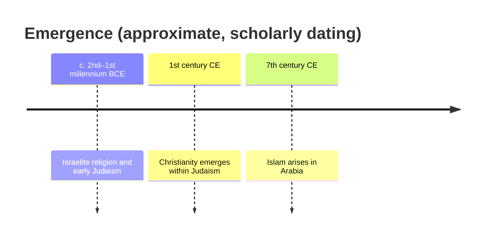
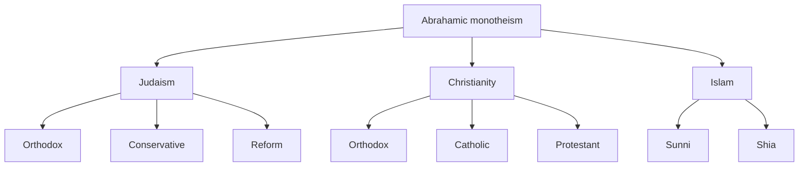

# The Abrahamic Traditions

"Abrahamic" is a scholarly grouping for Judaism, Christianity, and Islam — three
monotheistic traditions that trace a shared lineage to the patriarch Abraham and share a
common family of ideas: one transcendent creator God, prophecy and revelation delivered
through history, sacred scripture, covenant, moral law, and a linear view of time moving
toward judgment. The label is an *etic* (outsider) analytic convenience, not a term the
traditions coined for themselves, and comparativists use it to foreground genuine
continuities without flattening real differences. See
[comparative-religion-and-world-traditions](comparative-religion-and-world-traditions.md)
for the method of comparison, and [what-is-religion](what-is-religion.md) on why grouping
categories are constructed rather than found.

## A shared lineage

All three traditions locate their origin in the ancient Near East and revere Abraham as a
paradigm of faith in one God. They developed in historical succession, each engaging and
reinterpreting what came before — a relationship scholars study through history,
philology, and the comparison of texts. See [../history/index.md](../history/index.md).

The traditions overlap in figures and narratives: Abraham, Moses, and the Hebrew prophets
appear across all three; Jesus is central to Christianity and honored as a prophet in
Islam; Muslims regard Muhammad as the final prophet in this prophetic line. They diverge
sharply, however, on questions such as the nature of God (strict unity vs. the Christian
Trinity), the status of Jesus, and which scriptures are authoritative.

## Core beliefs and practices, compared

| | Judaism | Christianity | Islam |
|---|---|---|---|
| God | One, indivisible (ethical monotheism) | One God in three persons (Trinity) | One, absolute unity (*tawhid*) |
| Central texts | Tanakh (Hebrew Bible); Talmud | Old + New Testament | Qur'an; Hadith |
| Key figure(s) | Moses, the prophets | Jesus of Nazareth | Muhammad |
| Covenant/law | Torah, *halakha* | Grace fulfilling the law | *Shari'a* |
| Worship focus | Synagogue, Sabbath | Church, sacraments | Mosque, five daily prayers |
| Defining practices | Sabbath, dietary law, festivals | Baptism, Eucharist, prayer | Five Pillars (creed, prayer, alms, fasting, pilgrimage) |

Each tradition organizes life around scripture read as revelation. On the character of
these texts and how communities interpret them, see
[scripture-and-sacred-texts](scripture-and-sacred-texts.md).

## Major internal branches

The traditions are internally plural; none is monolithic.

- **Judaism** — Orthodox, Conservative, and Reform are the major modern movements
  (alongside Reconstructionist and others), differing over the binding force of *halakha*
  and adaptation to modernity. Historic communities include Ashkenazi and Sephardi.
- **Christianity** — three broad families: Eastern Orthodoxy, Roman Catholicism, and
  Protestantism (itself branching into Lutheran, Reformed, Anglican, Baptist,
  Pentecostal, and many more), split over authority, sacraments, and the role of tradition.
- **Islam** — Sunni (the large majority) and Shia are the principal branches, dividing
  historically over legitimate succession after Muhammad; Sufism is a mystical current
  present across both.

## How scholars study the grouping

Comparative religionists treat the shared lineage as a working hypothesis to be examined,
not a doctrine to be affirmed. Historians of religion trace the actual textual and social
genealogies; philologists compare scriptural traditions; sociologists study how these
communities organize authority and identity (see
[religion-and-society](religion-and-society.md)). A recurring caution is that "Abrahamic"
can imply more harmony — or more essential sameness — than the historical record supports;
the traditions have both borrowed from and defined themselves against one another.
Popular surveys such as Huston Smith's treat each tradition sympathetically from the
inside; see [huston-smith-the-worlds-religions](huston-smith-the-worlds-religions.md). The
scholarly stance remains descriptive and even-handed, bracketing the truth claims that
divide the traditions (see [what-is-religion](what-is-religion.md) on methodological
agnosticism).

## References

- Huston Smith, *The World's Religions* — see [huston-smith-the-worlds-religions](huston-smith-the-worlds-religions.md).
- F. E. Peters, *The Children of Abraham: Judaism, Christianity, Islam* (2004).
- Related HAL notes: [comparative-religion-and-world-traditions](comparative-religion-and-world-traditions.md), [scripture-and-sacred-texts](scripture-and-sacred-texts.md), [../history/index.md](../history/index.md).
