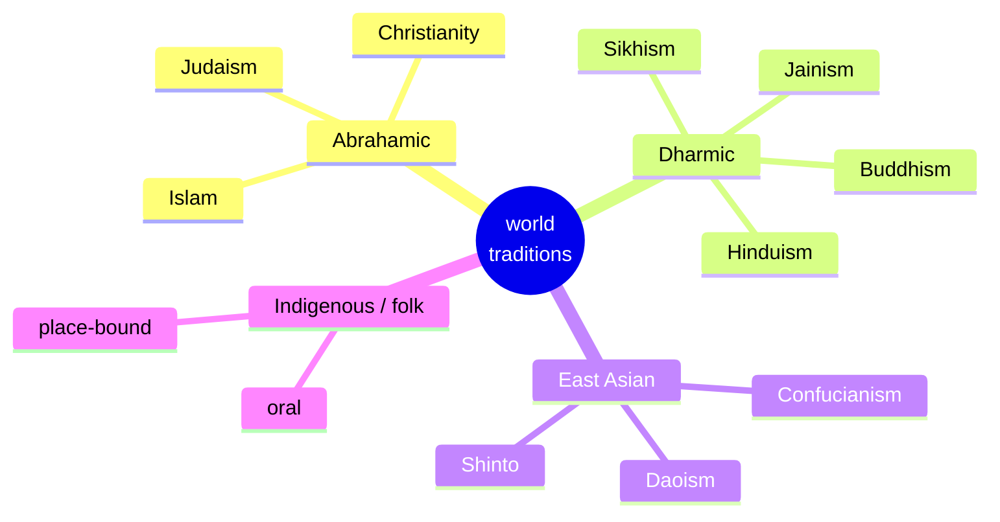

# Comparative Religion and World Traditions

Comparative religion studies traditions side by side, looking for patterns, resonances,
and instructive differences. It emerged in the nineteenth century (F. Max Müller, often
credited with the phrase "he who knows one, knows none," championed the comparative study
of scripture and religion as a **science**). Done well, comparison illuminates; done
carelessly, it distorts. The method presupposes some workable sense of the category itself
— see [what-is-religion](what-is-religion.md) — and draws on the explanatory frameworks in
[theories-of-religion](theories-of-religion.md).

## A neutral map of major traditions

Any grouping is a convenience, not a natural kind, and the boundaries are porous. A common
descriptive schema:

| Family | Representative traditions | Broad orientation |
|---|---|---|
| **Abrahamic** | Judaism, Christianity, Islam (and Bahá'í, etc.) | Ethical monotheism; one transcendent creator; prophecy; scripture-centered; historical/linear time | 
| **Dharmic (Indian)** | Hinduism, Buddhism, Jainism, Sikhism | *Dharma*, karma, rebirth (*saṃsāra*), liberation (*mokṣa*/*nirvāṇa*); often cyclical time |
| **East Asian** | Confucianism, Daoism, Shinto (with Buddhism) | Harmony, ancestral reverence, the Way (*Dao*), immanent order; frequently non-theistic and syncretic |
| **Indigenous & folk** | Countless local traditions worldwide | Oral, place-bound, kin- and land-centered; often no fixed canon or "membership" |

These map to the deeper notes [abrahamic-traditions](abrahamic-traditions.md),
[dharmic-and-eastern-traditions](dharmic-and-eastern-traditions.md), and
[indigenous-and-folk-religions](indigenous-and-folk-religions.md).

## The comparative method

Comparison can proceed **phenomenologically** (grouping similar phenomena across traditions
— sacrifice, pilgrimage, prophecy, mysticism), **historically** (tracing contact,
borrowing, and shared descent, as among the Abrahamic faiths), or **morphologically** (as
in Eliade's patterns of the sacred; see
[eliade-sacred-and-profane](eliade-sacred-and-profane.md)). Georges Dumézil's comparative
mythology and Mircea Eliade's *Patterns in Comparative Religion* are landmark examples,
alongside the anthropological comparison of ritual and symbol
([../anthropology/ritual-symbolism-and-religion.md](../anthropology/ritual-symbolism-and-religion.md)).

## The perennialist vs. particularist debate

A central dispute concerns whether the traditions share a common core.

- **Perennialism** (the "perennial philosophy" of Aldous Huxley, and the "Traditionalist"
  school of Frithjof Schuon and Huston Smith) holds that the great traditions are diverse
  outer expressions of a single inner truth — especially visible, its advocates say, in
  mysticism. Applied to mystical experience this is often called
  **perennialism** or **essentialism** (W. T. Stace).
- **Particularism** (or **constructivism**, associated with Steven Katz on mysticism)
  argues there is no unmediated common essence: experience and doctrine are shaped through
  and through by each tradition's language, concepts, and practices, so a Buddhist's
  *nirvāṇa* and a Christian's *unio mystica* are not two names for one thing. See
  [religious-experience-and-mysticism](religious-experience-and-mysticism.md) and, on the
  epistemology of experience, [../philosophy/epistemology.md](../philosophy/epistemology.md).

Most contemporary scholars lean particularist while granting that structured comparison
still reveals real family resemblances.

## The risks of comparison

Comparison carries well-known hazards that the discipline now foregrounds:

- **The World Religions Paradigm** critique (Tomoko Masuzawa, Jonathan Z. Smith): the very
  list of "world religions" is a modern European invention that reads other traditions
  through a Protestant, belief-centered, textual template — privileging doctrine over
  practice and canon over local variation.
- **Decontextualization**: lifting a practice out of its setting to slot it into a
  cross-cultural type can strip its meaning. Jonathan Z. Smith warned that comparison is a
  scholarly act of the analyst, not a discovery "in the data" — *"there is no data for
  religion; religion is created by the scholar's imaginative acts of comparison."*
- **Ethnocentrism and false equivalence**: treating one tradition (usually Christianity) as
  the norm against which others are measured, or flattening genuine differences into a bland
  sameness.

Handled reflexively, comparison remains indispensable: it is the only way to see which
features of a tradition are distinctive and which are widely shared. See
[religion-and-society](religion-and-society.md) and
[the-sacred-and-the-profane](the-sacred-and-the-profane.md).

## References

- F. Max Müller, *Introduction to the Science of Religion* (1873).
- Mircea Eliade, *Patterns in Comparative Religion* (1958) — see [eliade-sacred-and-profane](eliade-sacred-and-profane.md).
- Jonathan Z. Smith, *Imagining Religion* (1982).
- Tomoko Masuzawa, *The Invention of World Religions* (2005).
- Steven T. Katz (ed.), *Mysticism and Philosophical Analysis* (1978); W. T. Stace, *Mysticism and Philosophy* (1960).
- Huston Smith, *The World's Religions* (1958).
