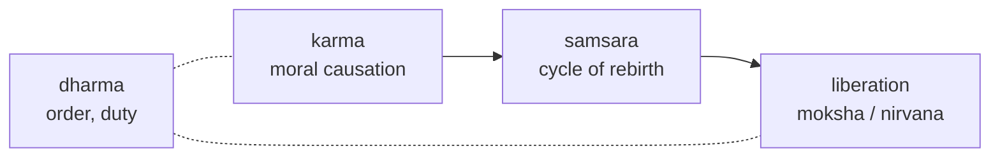

# Dharmic and Eastern Traditions

Scholars often group the major religions of South and East Asia into two loose,
overlapping families. The **Dharmic** traditions — Hinduism, Buddhism, Jainism, and
Sikhism — arose on the Indian subcontinent and share a vocabulary built around *dharma*
(cosmic and moral order/duty), *karma* (moral causation), *samsara* (the cycle of
rebirth), and liberation from that cycle. The **East Asian** traditions — Daoism and
Confucianism in China, Shinto in Japan, and the pervasive Buddhism that spread across the
region — center instead on harmony with the natural and social order, the *Dao* ("Way"),
ancestral continuity, and ritual propriety. As with any such labels, these families are
analytic conveniences rather than the traditions' own self-descriptions; see
[comparative-religion-and-world-traditions](comparative-religion-and-world-traditions.md)
and [what-is-religion](what-is-religion.md) (many of these traditions strain a
theism-centered definition of religion).

## The Dharmic family

A shared conceptual field connects the Indian traditions even as their doctrines and goals
differ.

- **Hinduism** — not a single founded religion but a vast family of traditions rooted in
  the Vedas and later Upanishads, epics, and devotional (*bhakti*) movements. Core motifs
  include Brahman (ultimate reality), atman (self), karma, samsara, and *moksha*
  (liberation). Practice ranges from temple worship and pilgrimage to yoga and meditation;
  major streams include Vaishnavism, Shaivism, and Shaktism.
- **Buddhism** — founded on the teaching of Siddhartha Gautama, the Buddha. Its framework
  is the **Four Noble Truths**: (1) life involves *dukkha* (suffering/unsatisfactoriness);
  (2) its origin is craving; (3) it can cease; (4) the cessation is reached via the
  **Noble Eightfold Path** (right view, intention, speech, action, livelihood, effort,
  mindfulness, concentration). Buddhism rejects a permanent self (*anatta*) and aims at
  *nirvana*. Major branches: **Theravada**, **Mahayana**, and **Vajrayana**.
- **Jainism** — teaches radical nonviolence (*ahimsa*), asceticism, and *anekantavada*
  (the many-sidedness of truth); liberation comes from purifying the soul of karmic matter.
- **Sikhism** — founded by Guru Nanak, teaching one formless God, devotion, honest labor,
  and equality; its scripture, the Guru Granth Sahib, holds authority as the living Guru.

| Tradition | Founder/root | Ultimate aim | Distinctive emphasis |
|---|---|---|---|
| Hinduism | Vedic tradition (no single founder) | Moksha | Diversity of paths; Brahman/atman |
| Buddhism | The Buddha | Nirvana | Four Noble Truths; no permanent self |
| Jainism | Mahavira (and prior *tirthankaras*) | Liberation of the soul | Ahimsa; asceticism |
| Sikhism | Guru Nanak | Union with God | One God; equality; the Guru |

## The East Asian traditions

In China, Daoism, Confucianism, and Buddhism have long functioned as complementary rather
than exclusive — a person may draw on all three. Scholars note that "religion" and
"philosophy" are not cleanly separable here.

- **Daoism** — following the *Dao*, the ineffable Way underlying all things; values
  *wu wei* (effortless action, non-forcing), spontaneity, and harmony with nature. Rooted
  in texts attributed to Laozi (*Dao De Jing*) and Zhuangzi, with later ritual and
  religious forms.
- **Confucianism** — an ethical and social tradition centered on *ren* (humaneness), *li*
  (ritual propriety), filial piety, and the cultivation of virtue and social harmony;
  debated as to whether it is a "religion," a philosophy, or a comprehensive way of life.
- **Shinto** — the indigenous tradition of Japan, oriented toward *kami* (spirits/deities
  present in nature and ancestors), purity, and shrine ritual; closely tied to place and
  community.

Ancestor veneration and reverence for lineage run through much of East Asian practice,
connecting these traditions to broader patterns discussed in
[indigenous-and-folk-religions](indigenous-and-folk-religions.md).

## Meditation, yoga, and inner experience

A feature that draws special scholarly attention across these traditions is the
cultivation of transformative inner states through meditation, yoga, and contemplative
discipline — from Buddhist mindfulness and *samadhi* to Hindu yogic absorption and Daoist
inner practice. These are studied comparatively alongside the mystical currents of other
traditions; see [religious-experience-and-mysticism](religious-experience-and-mysticism.md).

## Scholarly framing

Comparativists caution against reading these traditions through Western, monotheistic
templates: some (Theravada Buddhism, Confucianism) are non-theistic or de-emphasize gods,
and several blur the line between religion and philosophy. Sympathetic surveys such as
Huston Smith's present each tradition on its own terms; see
[huston-smith-the-worlds-religions](huston-smith-the-worlds-religions.md). The academic
approach remains descriptive and even-handed, mapping concepts, practices, and internal
diversity without ranking traditions or adjudicating their truth claims (see
[what-is-religion](what-is-religion.md)).

## References

- Huston Smith, *The World's Religions* — see [huston-smith-the-worlds-religions](huston-smith-the-worlds-religions.md).
- Related HAL notes: [comparative-religion-and-world-traditions](comparative-religion-and-world-traditions.md), [religious-experience-and-mysticism](religious-experience-and-mysticism.md).
