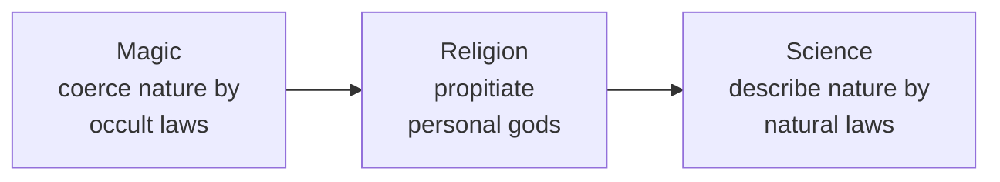

# The Golden Bough

Sir James George Frazer's *The Golden Bough: A Study in Magic and Religion* (first edition
1890, expanded to twelve volumes 1906–15, one-volume abridgment 1922) is a monumental work
of Victorian comparative mythology and anthropology. It attempts a vast cross-cultural
synthesis of myth, ritual, and belief, and advances an influential evolutionary theory of
how human thought progresses from magic through religion to science.

## The organizing puzzle

Frazer begins from a specific antiquarian riddle: the priesthood of Diana at Nemi (near
Rome). The priest, the "King of the Wood," held office only until a challenger killed him
in single combat — and a candidate could challenge only after breaking off a bough (the
"golden bough") from a sacred tree. Why this strange rule of succession by murder? The
question is a doorway; Frazer ranges across the myth and ritual of the entire ancient and
"primitive" world to explain it, and in doing so builds a general theory of religion.

## The magic–religion–science schema

Frazer's central theoretical claim is an evolutionary progression in modes of thought:

- **Magic** comes first: the belief that one can *directly control* nature by manipulating
  hidden connections. Frazer classifies **sympathetic magic** into two principles — the
  Law of Similarity ("imitative" or "homeopathic" magic: like produces like) and the Law of
  Contact ("contagious" magic: things once in contact continue to act on one another). He
  reads magic as a mistaken proto-science: it assumes a lawful, impersonal order but gets
  the laws wrong.
- **Religion** arises when people conclude that nature is *not* under their direct control
  but is governed by personal, superhuman beings who must instead be *propitiated* through
  prayer and sacrifice.
- **Science** finally returns to magic's premise of impersonal natural law — but this time
  grounds it in genuine observation and experiment.

A recurring motif Frazer traces across cultures is the **dying-and-reviving god** and the
figure of the **divine king** whose vitality is bound to the fertility of the land, and who
must be ritually killed and replaced before his powers decay — the pattern that finally
explains the priest of Nemi. He weaves the three modes together in the book's closing
image of history as a "web" of the black thread of magic, the red thread of religion, and
the white thread of science.

## Method, significance, and critique

Frazer's method is **armchair comparative** — assembling parallels from missionary reports,
classical sources, and travelers' accounts to argue that "primitive" beliefs everywhere
share a common structure and that European folk custom preserves fossilized survivals of
it. The work is a cornerstone of the evolutionary [theories of religion](theories-of-religion.md)
and profoundly shaped the study of [myth, ritual, and symbol](myth-ritual-and-symbol.md),
influencing figures from the Cambridge Ritualists to modernist literature (Eliot, Joyce).

Its later reputation is largely critical. Twentieth-century anthropology — from Malinowski's
fieldwork-based functionalism onward — rejected Frazer's decontextualized comparison, his
unilinear evolutionism, and his tendency to strip customs from their living social settings;
see the fieldwork tradition in
[ethnography and fieldwork](../anthropology/ethnography-and-fieldwork.md) and the treatment
of magic and rite in [ritual, symbolism, and religion](../anthropology/ritual-symbolism-and-religion.md).
Frazer is now read less as sound theory than as a landmark of comparative imagination and a
document of Victorian intellectual assumptions.

## References

- [The Golden Bough: A Study of Magic and Religion — Project Gutenberg](https://www.gutenberg.org/ebooks/3623)
