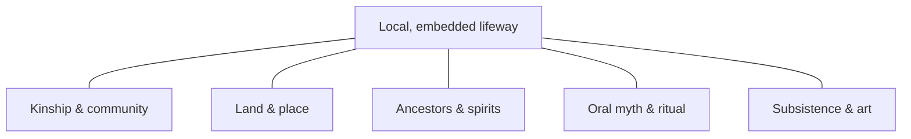

# Indigenous and Folk Religions

"Indigenous," "traditional," and "folk" religions are umbrella terms for the local,
community-rooted religious lifeways of peoples around the world — from Aboriginal
Australian, Native American, and San traditions to the folk practices woven into daily
life across Africa, Asia, Europe, and the Americas. These traditions are enormously
diverse and share no single doctrine; what scholars group under the label is a family of
recurring features, studied primarily through the fieldwork methods of anthropology. See
[../anthropology/index.md](../anthropology/index.md) and
[comparative-religion-and-world-traditions](comparative-religion-and-world-traditions.md).

## Recurring features

No feature is universal, but several appear widely enough to organize description
(a family-resemblance grouping — see [what-is-religion](what-is-religion.md)):

- **Animism** — the attribution of spirit, life, or personhood to natural phenomena
  (animals, plants, rivers, mountains, weather). The term comes from E. B. Tylor, who
  (contestably) proposed it as the earliest form of religion.
- **Totemism** — a special, often kinship-like relationship between a social group and a
  natural species or object (the totem), central to Durkheim's analysis of religion and
  social solidarity.
- **Shamanism** — specialists (shamans) who enter altered states to mediate between the
  human community and the spirit world for healing, divination, or guidance.
- **Ancestor veneration** — ongoing relationship with and obligation to the dead, who
  remain active members of the community.
- **Oral tradition** — knowledge, myth, and ritual transmitted through speech, song,
  performance, and memory rather than fixed written scripture (contrast
  [scripture-and-sacred-texts](scripture-and-sacred-texts.md)).

These features are enacted through story and ceremony; on how such practices carry meaning,
see [myth-ritual-and-symbol](myth-ritual-and-symbol.md).

## The local, embedded character

A defining trait is that these traditions are typically **embedded** — not separated into
a distinct institutional "religion" set apart from the rest of life, but woven into
kinship, land, subsistence, art, and politics. Sacred meaning is often **place-specific**:
tied to particular mountains, rivers, or ancestral sites rather than portable across the
globe. This embeddedness is why an outside category like "religion" fits awkwardly (see
[what-is-religion](what-is-religion.md)); many communities have no separate word for it.

## The problem with older labels

Early anthropology arranged religions on an evolutionary ladder, labeling these traditions
"primitive," "savage," or "animist" and treating them as survivals of humanity's infancy.
This framing is now firmly rejected. Its problems are both empirical and ethical:

- **Ethnocentric and evolutionist** — it assumed a single ladder of progress with modern
  European religion at the top, misreading difference as backwardness.
- **Homogenizing** — "primitive religion" lumped thousands of distinct traditions into one
  imagined type.
- **Static** — it treated living, changing traditions as frozen relics of the past.

Contemporary scholars prefer "indigenous," "traditional," "local," or "folk" while noting
that each of these terms also has limits. See
[theories-of-religion](theories-of-religion.md) for the intellectual history of these
debates.

## Studying living traditions

Because most indigenous traditions are oral and community-embedded, they are studied
largely through ethnographic fieldwork, raising distinctive methodological and ethical
challenges: the risk of misrepresentation by outsiders, questions of who may know or record
sacred knowledge, the legacies of colonialism and forced conversion, and the ongoing
vitality and adaptation of these traditions rather than their supposed disappearance. The
*emic/etic* tension (see [what-is-religion](what-is-religion.md)) is especially acute here,
and researchers increasingly work in collaboration with, and under the authority of, the
communities themselves. See [../anthropology/index.md](../anthropology/index.md).

## References

- E. B. Tylor, *Primitive Culture* (1871) — origin of the "animism" thesis (now critiqued).
- Émile Durkheim, *The Elementary Forms of Religious Life* (1912) — totemism and social solidarity.
- Related HAL notes: [../anthropology/index.md](../anthropology/index.md), [myth-ritual-and-symbol](myth-ritual-and-symbol.md), [comparative-religion-and-world-traditions](comparative-religion-and-world-traditions.md).
