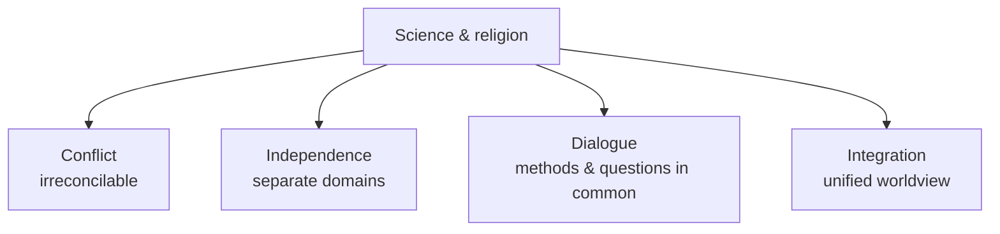

# Religion, Science, and Secularism

How religion relates to science, and how religiosity fares in modern societies, are two of
the most debated questions in the study of religion. Both are studied descriptively:
scholars map the range of positions people actually hold and the social trends observable
in the data, rather than adjudicating whether religion or science is "right." This note
surveys the standard typology of the science–religion relationship, the secularization
thesis and its critics, and the concepts (disenchantment, "nones") used to describe modern
religious change. See [religion-and-society](religion-and-society.md).

## The science–religion relationship: a fourfold typology

Ian Barbour's influential typology sorts the possible relationships into four modes;
scholars use it as a descriptive map of stances people take, not a ranking.

- **Conflict** — science and religion make competing claims about the same reality and
  cannot both be right (associated with both militant atheism and strict creationism).
- **Independence** — they address different questions in different languages and cannot
  truly conflict; Stephen Jay Gould's "non-overlapping magisteria" (NOMA) is the classic
  statement — science handles fact, religion handles meaning and value.
- **Dialogue** — the domains overlap enough at the boundaries (cosmic origins, the nature
  of mind, ethics) to inform one another.
- **Integration** — some seek a single worldview blending scientific and religious claims.

Historians caution that the popular "warfare" narrative — that science and religion have
always been at war — is itself a 19th-century polemic (Draper and White) that oversimplifies
a much more entangled history. The flashpoints tend to be at the frontiers of physics and
biology: cosmic origins and fine-tuning (see [../physics/cosmology.md](../physics/cosmology.md))
and human origins (see [../biology/evolution-by-natural-selection.md](../biology/evolution-by-natural-selection.md)).
Whether such disputes are genuinely empirical or reflect deeper differences over method and
warrant is a question of [../philosophy/philosophy-of-science.md](../philosophy/philosophy-of-science.md).

## The secularization thesis

A dominant expectation in 20th-century social science was the **secularization thesis**:
as societies modernize — through science, education, industrialization, and institutional
differentiation — religion would decline in social influence and personal importance.
Analysts distinguish several senses that need not move together:

| Sense | Claim |
|---|---|
| Differentiation | Religion loses control over other spheres (state, science, law) |
| Decline | Individual belief and practice fall |
| Privatization | Religion retreats from public life into the private sphere |

## Critics and the persistence of religion

The strong thesis has been widely challenged. Critics point to the vitality of religion
across much of the world, the global growth of some movements, and the "religious
economies" argument that competition can *strengthen* religion (Stark and others). Peter
Berger, once a leading proponent, publicly revised his view and described much of the world
as "as furiously religious as ever." A common refinement: Western Europe may be an
*exception* rather than the model, and differentiation is better supported than universal
decline. The debate is now less "does religion disappear?" than "how does it transform?"

## Disenchantment (Weber)

Max Weber described modernity as bringing **disenchantment** (*Entzauberung*) — the
"disenchantment of the world" — in which the rationalization and calculability of modern
life displace a cosmos populated by magic, mystery, and sacred forces. Disenchantment is
not the same as atheism; it names a shift in the *texture* of experience toward the
instrumental and explicable. Weber connected this to bureaucracy, capitalism, and the
"iron cage" of rationalized life. His analysis remains a touchstone for describing modern
religious change; see [religion-and-society](religion-and-society.md) and
[theories-of-religion](theories-of-religion.md).

## Atheism, agnosticism, and the "nones"

Contemporary sociology of religion tracks a spectrum of non-religious positions, which are
not identical:

- **Atheism** — the absence or rejection of belief in God/gods.
- **Agnosticism** — the view that the existence of God is unknown or unknowable.
- **"Nones"** — a survey category for those reporting no religious affiliation; notably,
  many "nones" still hold spiritual beliefs or practices, so unaffiliated does not mean
  non-believing. This "believing without belonging" (Grace Davie) complicates any simple
  decline story.

The rise of the "nones," especially in the West, is one of the most-studied recent trends,
and researchers debate whether it signals secularization, a reshuffling toward
unaffiliated spirituality, or both.

## Framing note

Whether science and religion are ultimately compatible is a live philosophical and
theological question that the academic study of religion does not settle. Its task is to
describe — accurately and even-handedly — the positions people hold and the social patterns
observable in the world (see [what-is-religion](what-is-religion.md) on methodological
agnosticism).

## References

- Ian Barbour, *When Science Meets Religion* (2000) — the fourfold typology.
- Stephen Jay Gould, *Rocks of Ages* (1999) — non-overlapping magisteria.
- Max Weber, *Science as a Vocation* (1917) and *The Protestant Ethic and the Spirit of Capitalism* (1905) — disenchantment.
- Peter Berger, ed., *The Desecularization of the World* (1999).
- Related HAL notes: [religion-and-society](religion-and-society.md), [../physics/cosmology.md](../physics/cosmology.md), [../philosophy/philosophy-of-science.md](../philosophy/philosophy-of-science.md), [../biology/evolution-by-natural-selection.md](../biology/evolution-by-natural-selection.md).
