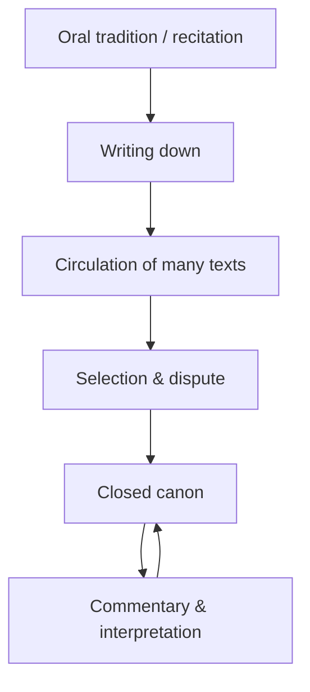

# Scripture and Sacred Texts

A **sacred text** is a body of language a community treats as specially authoritative —
revealed, inspired, or otherwise set apart from ordinary speech and writing. The academic
study of scripture asks descriptive, comparative questions: how a text becomes authoritative,
how it is read, who is empowered to interpret it, and what it *does* in the life of a
tradition. It brackets the question of whether a given scripture is divinely revealed and
studies scripture as a historical and social phenomenon. "Scripture" is best understood not
as a fixed property of certain books but as a **relationship** between a text and the
community that reveres it — a point associated with the historian of religion Wilfred
Cantwell Smith.

## Oral and written

Sacred language is frequently oral before, or instead of, being written. The Vedas were
transmitted with extraordinary precision by memorized recitation long before being committed
to writing; the Qur'an (from *qara'a*, "to recite") is centered on oral recitation and
memorization (*ḥifẓ*); the earliest Christian and rabbinic teaching circulated orally. Even
in strongly textual traditions, scripture typically lives through **performance** — chanted,
sung, recited aloud in worship — so that sound, cadence, and the trained voice matter as much
as the page. Writing stabilizes a text and enables canon and commentary, but it does not
displace the oral and aural life of scripture. The interplay of speech and writing connects
to how language itself is studied (see [../linguistics/index.md](../linguistics/index.md)).

## Canon formation

A **canon** is the closed, authoritative list of which texts count as scripture. Canons are
not given ready-made; they are the outcome of historical processes in which communities sift,
select, and fix a corpus, often over centuries and amid dispute. The formation of the Hebrew
Bible, the Christian New Testament, the Buddhist Tripiṭaka, and the Confucian classics each
followed distinct paths, and different sub-communities canonized different collections (hence,
for example, the varying contents of Jewish, Catholic, Orthodox, and Protestant Bibles).
Canonization is inseparable from **authority**: deciding what is in the canon is also deciding
who has the power to decide, and it shapes orthodoxy by placing some texts inside the boundary
and others (apocrypha, "heresy") outside.

## Revelation and authority

Traditions differ in *how* a text is held to be authoritative. Some claim **verbal
revelation** — the words are given directly (the Qur'an as the literal speech of God dictated
through the Prophet). Others hold a doctrine of **inspiration**, where human authors write
under divine influence but in their own idiom (many Christian and Jewish views of the Bible).
Still others locate authority less in divine dictation than in the accumulated insight of
enlightened teachers (much of the Buddhist canon) or in the wisdom of sages (the Confucian
classics). These differing theories of revelation determine how strictly the wording is
treated, how much interpretation is permitted, and how translation is regarded. The
epistemological question of what grounds such authority — testimony, tradition, direct
experience — links to [../philosophy/epistemology.md](../philosophy/epistemology.md).

## Interpretation: exegesis and hermeneutics

No scripture reads itself; every tradition develops disciplined methods of interpretation.

- **Exegesis** is the practice of drawing meaning *out* of a text — the close reading,
  linguistic analysis, and commentary that establishes what a passage says and means.
- **Hermeneutics** is the *theory* of interpretation: the reflective account of how
  understanding a text is possible and what governs a valid reading.

Interpretive traditions are elaborate and long-lived: rabbinic midrash and the fourfold
*PaRDeS*; Islamic *tafsīr* and the *uṣūl* of jurisprudence; the medieval Christian fourfold
sense (literal, allegorical, moral, anagogical); the Confucian and Buddhist commentarial
corpora. A recurring tension runs between **literal** and **figurative/allegorical** reading,
and between the meaning intended in the text's original setting and its meaning for the living
community. Modern **historical-critical** scholarship added a further layer, reading scripture
as a historically situated document — an approach that has both enriched interpretation and,
in some quarters, provoked reaction against it (see
[religion-and-society](religion-and-society.md) on fundamentalism as, in part, a defense of
scriptural inerrancy).

## Translation

Because scripture is language, **translation** is theologically and practically charged.
Traditions that locate authority in the exact wording tend to resist or restrict translation:
classical Islam treats any rendering of the Qur'an as an interpretation rather than the Qur'an
itself. Others make translation central to their spread — the Septuagint, the Vulgate,
Luther's German Bible, and the vast enterprise of vernacular scripture translation. Because
translation always involves interpretive choices (no two languages map term-for-term), the
translated text is never wholly neutral; debates over a single rendered word can carry
enormous doctrinal weight, a concern squarely within the study of language and meaning (see
[../linguistics/index.md](../linguistics/index.md)).

## What scripture does

Across [comparative-religion-and-world-traditions](comparative-religion-and-world-traditions.md),
sacred texts perform overlapping functions: they are recited in worship, cited to settle
disputes, memorized as devotion, copied as a sacred act, interpreted to generate law and
doctrine, and physically venerated as holy objects. Studying scripture comparatively means
attending to all of these uses, not only to a text's propositional content — asking what the
text *is for* in a community's life, and treating each tradition's practices with equal
descriptive care.

## References

- [Comparative Religion and World Traditions](comparative-religion-and-world-traditions.md) —
  how scripture functions across the major traditions.
- [Myth, Ritual, and Symbol](myth-ritual-and-symbol.md) — the oral narratives that often
  precede and underlie written scripture.
- [Linguistics (index)](../linguistics/index.md) — language, oral transmission, and translation.
- [Epistemology](../philosophy/epistemology.md) — what could ground a text's claim to authority.
