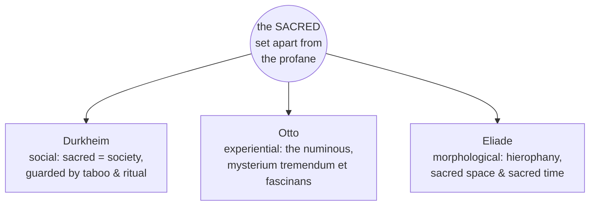

# The Sacred and the Profane

The distinction between the **sacred** and the **profane** is arguably the organizing idea
of the academic study of religion. Where earlier scholars defined religion by belief in
gods (see [what-is-religion](what-is-religion.md)), a major twentieth-century line of
thought located its essence instead in a fundamental division of experience: certain
things, times, places, and persons are set apart as sacred — treated with awe, protected
by prohibition, charged with power — while the rest of life is ordinary, or profane. This
note draws together the three most influential accounts, which are also treated as theories
in [theories-of-religion](theories-of-religion.md).

## Durkheim: the social sacred

**Émile Durkheim** made the sacred/profane dichotomy the definitional heart of religion:
*"a religion is a unified system of beliefs and practices relative to sacred things, that
is to say, things set apart and forbidden."* The line is not drawn by the intrinsic nature
of objects — a stone, a flag, a totem can be sacred — but by the community's collective
attitude toward them. For Durkheim the sacred is ultimately **society** experienced as a
transcendent force, and the boundary is patrolled by ritual and taboo, which keep the two
realms from dangerous contact. This is the sociological reading; see
[durkheim-elementary-forms](durkheim-elementary-forms.md) and
[../sociology/sociological-theory.md](../sociology/sociological-theory.md).

## Otto: the numinous

**Rudolf Otto**, working from the side of experience rather than society, coined
**numinous** (from Latin *numen*, divine presence) for the distinctive feeling that the
sacred evokes — a non-rational, non-moral quality that precedes any doctrine or ethics. He
analyzed it as the ***mysterium tremendum et fascinans***:

- ***mysterium*** — the "wholly other" (*ganz andere*), utterly beyond ordinary categories;
- ***tremendum*** — the awe, dread, and sense of overpoweringness it inspires;
- ***fascinans*** — the attraction, allure, and fascination that draws one toward it.

For Otto this "creature-feeling" of standing before the holy is the irreducible core of
religion, not explicable by social function or psychology (see
[otto-idea-of-the-holy](otto-idea-of-the-holy.md)). It links to the study of
[religious-experience-and-mysticism](religious-experience-and-mysticism.md) and to
[james-varieties-of-religious-experience](james-varieties-of-religious-experience.md).

## Eliade: hierophany, sacred space, sacred time

**Mircea Eliade** developed the comparative morphology of the sacred. His key term is
**hierophany** — "the act of manifestation of the sacred": the sacred shows itself *in and
through* profane realities (a tree, a stone, an incarnation), so that the object becomes
"something else" while remaining itself. From this he derived a phenomenology of religious
life for *homo religiosus*:

- **Sacred space** is not homogeneous. A hierophany founds a fixed point, a **center of the
  world** (*axis mundi*), around which meaningful, oriented space is organized — the temple,
  the sanctuary, the threshold. Profane space, by contrast, is neutral and directionless.
- **Sacred time** is likewise heterogeneous. Ritual and festival re-actualize the
  primordial "time of origins," allowing participants to step out of ordinary, linear
  duration and into the eternal present of myth — the *illud tempus*, the "once upon a
  time" of creation. See [myth-ritual-and-symbol](myth-ritual-and-symbol.md).

See [eliade-sacred-and-profane](eliade-sacred-and-profane.md).

## Three approaches to one category

The three are complementary lenses: Durkheim asks what social work the sacred does, Otto
what it *feels* like from within, Eliade how it *structures* a religious world. Together
they make the sacred/profane distinction the connective tissue linking ritual, myth,
symbol, and experience across traditions — the reason this category recurs throughout the
[comparative-religion-and-world-traditions](comparative-religion-and-world-traditions.md).

## Critiques

Later scholars (notably Jonathan Z. Smith) questioned whether the sacred/profane binary is
a universal feature of religion or a scholarly imposition, and whether Eliade's grand
comparison smuggles in a quasi-theological metaphysics. The category remains foundational
but is now used self-consciously rather than as a given.

## References

- Émile Durkheim, *The Elementary Forms of Religious Life* (1912) — see [durkheim-elementary-forms](durkheim-elementary-forms.md).
- Rudolf Otto, *The Idea of the Holy* (1917) — see [otto-idea-of-the-holy](otto-idea-of-the-holy.md).
- Mircea Eliade, *The Sacred and the Profane: The Nature of Religion* (1957) — see [eliade-sacred-and-profane](eliade-sacred-and-profane.md).
- Jonathan Z. Smith, *To Take Place* (1987), for the critical reappraisal.
