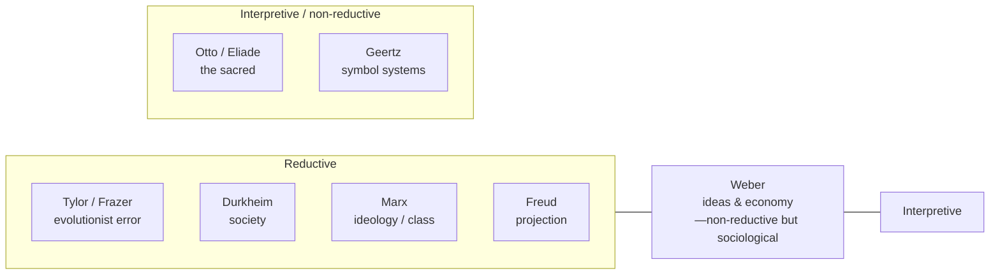

# Theories of Religion

Modern scholarship has produced many competing explanations of what religion *is* and
*why* it exists. These theories differ on the fundamental question of **reductionism** —
whether religion can be explained by something more basic (society, economics, psychology)
or whether it points to an irreducible dimension of human experience. They also divide by
the discipline that generated them. No single theory commands consensus; each illuminates
part of a many-sided phenomenon. The definitional stakes are set out in
[what-is-religion](what-is-religion.md).

## The evolutionists: Tylor and Frazer

The Victorian founders treated religion as a stage in mental evolution. **E. B. Tylor**
argued religion began as **animism** — the attribution of souls to things — extrapolated
from experiences of dreams and death, and progressed toward polytheism and monotheism.
**James Frazer** (*The Golden Bough*) proposed an evolutionary sequence from **magic** (a
mistaken proto-science of manipulating nature) to **religion** (petitioning gods) to
**science**. Both were **intellectualist**: religion was a primitive theory of the world,
essentially an error to be outgrown. Later scholarship rejected the unilinear evolutionism
and armchair method but retained interest in animism and in the magic/religion distinction.

## Durkheim: society worshipping itself

**Émile Durkheim** relocated religion from the individual mind to the group. Studying
Australian totemism, he argued that the division of the world into **sacred** and
**profane** is the elementary form of all religion, and that the sacred is ultimately
**society itself**, experienced as a force greater than the individual. In collective
ritual, the group generates **collective effervescence** — a heightened shared energy —
and misrecognizes its own power as the divine. Religion is thus real and functional: it
produces social solidarity and the categories of thought themselves. This is the anchor of
the sociological tradition; see [durkheim-elementary-forms](durkheim-elementary-forms.md),
[../sociology/sociological-theory.md](../sociology/sociological-theory.md), and
[the-sacred-and-the-profane](the-sacred-and-the-profane.md).

## Weber: religion and economy

**Max Weber** studied how religious ideas shape and are shaped by social and economic life
without reducing one to the other. In *The Protestant Ethic and the Spirit of Capitalism*
he argued that ascetic Calvinism — anxiety over election, worldly discipline as a sign of
grace — helped cultivate the rationalized, methodical work ethic that fostered modern
capitalism. Weber also developed the typology of **charismatic, traditional, and
rational-legal authority**, the concept of **theodicy** (how traditions explain suffering),
and the thesis of the **disenchantment** (*Entzauberung*) of the world under rationalization,
a key theme in [religion-science-and-secularism](religion-science-and-secularism.md). See
[religion-and-society](religion-and-society.md).

## Marx: the opium of the people

For **Karl Marx**, religion is an expression of, and protest against, real suffering under
material conditions of exploitation — "the sigh of the oppressed creature… the opium of the
people." It is **ideology**: it consoles the suffering and legitimates the existing order,
projecting resolution into a heavenly afterlife and thereby dampening this-worldly change.
Religion is not the root cause but a symptom of alienation; abolish the conditions and the
illusion loses its function. This is a strongly reductionist, critical theory. See
[../sociology/sociological-theory.md](../sociology/sociological-theory.md).

## Freud: religion as projection

**Sigmund Freud** offered a psychological reduction: religion is a **collective illusion**
rooted in wish-fulfillment. God is a projection of the exalted, protective (and feared)
**father figure**; belief answers infantile helplessness and the need for consolation
against a hostile world. In *Totem and Taboo* he tied religion's origins to guilt over a
primal patricide, and in *The Future of an Illusion* framed faith as a neurosis humanity
might outgrow. Building on the earlier philosophical critique of **Ludwig Feuerbach** —
that "theology is anthropology," gods being humanity's own ideal projected outward — this
line treats religion as saying more about the mind than the cosmos. See
[../psychology/index.md](../psychology/index.md);
[james-varieties-of-religious-experience](james-varieties-of-religious-experience.md)
offers a more sympathetic psychological reading.

## Otto and Eliade: the phenomenology of the sacred

Against the reductionists, the **phenomenological** tradition insists religion has an
irreducible core that must be understood on its own terms. **Rudolf Otto** identified the
**numinous** — the experience of the "wholly other," the *mysterium tremendum et
fascinans* (a mystery both dreadful and fascinating) — as the non-rational heart of
religion, prior to any doctrine (see [otto-idea-of-the-holy](otto-idea-of-the-holy.md)).
**Mircea Eliade** described **hierophany**, the manifestation of the sacred in the profane
world, and studied sacred space, sacred time, and myth comparatively, treating *homo
religiosus* as a distinct mode of being (see
[eliade-sacred-and-profane](eliade-sacred-and-profane.md) and
[the-sacred-and-the-profane](the-sacred-and-the-profane.md)). Critics charge this school
with vague universalism and hidden theology; defenders value its attention to lived
meaning.

## Geertz: religion as a symbol system

**Clifford Geertz** framed religion interpretively rather than explanatorily: it is a
**system of symbols** that fuses a *worldview* (a picture of how things are) with an *ethos*
(how one should live), lending each an aura of factuality. The analyst's job is **thick
description** — reconstructing what the symbols mean to participants — rather than reduction
to social or psychic causes. This bridges to
[../anthropology/ritual-symbolism-and-religion.md](../anthropology/ritual-symbolism-and-religion.md)
and to [myth-ritual-and-symbol](myth-ritual-and-symbol.md).

## Mapping the field

The theories are not simply rivals to be scored: they answer different questions —
origins, function, meaning, experience — and a rounded account of any tradition draws on
several. See [religion-and-society](religion-and-society.md) and
[religious-experience-and-mysticism](religious-experience-and-mysticism.md).

## References

- Émile Durkheim, *The Elementary Forms of Religious Life* (1912) — see [durkheim-elementary-forms](durkheim-elementary-forms.md).
- Max Weber, *The Protestant Ethic and the Spirit of Capitalism* (1905).
- Karl Marx, *Contribution to the Critique of Hegel's Philosophy of Right* (1844).
- Sigmund Freud, *The Future of an Illusion* (1927).
- Rudolf Otto, *The Idea of the Holy* (1917) — see [otto-idea-of-the-holy](otto-idea-of-the-holy.md).
- Mircea Eliade, *The Sacred and the Profane* (1957) — see [eliade-sacred-and-profane](eliade-sacred-and-profane.md).
- Clifford Geertz, *The Interpretation of Cultures* (1973).
- E. B. Tylor, *Primitive Culture* (1871); James Frazer, *The Golden Bough* (1890).
