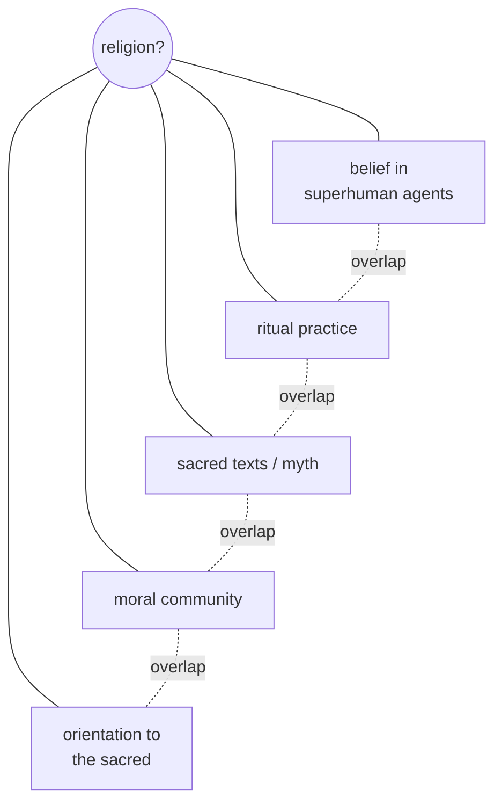

# What Is Religion? Defining the Object of Study

"Religion" names something most people recognize but no one has defined to universal
satisfaction. The category is a working tool of scholarship, not a fact of nature, and
much of the discipline's self-awareness comes from wrestling with the boundaries of the
word. How one defines religion determines what counts as data — whether Confucianism,
Marxism, sports fandom, or nationalism belong inside the frame.

## Substantive vs. functional definitions

Scholars usually sort definitions into two families.

- **Substantive** definitions specify *what* religion is by its content — typically some
  reference to superhuman or supernatural beings. E. B. Tylor's famous minimum definition,
  "belief in Spiritual Beings," is the classic case. Substantive definitions are crisp but
  can be parochial: they risk projecting a theistic (often Christian) template onto
  traditions like Theravada Buddhism or Confucianism that de-emphasize gods. See
  [theories-of-religion](theories-of-religion.md).
- **Functional** definitions specify *what religion does* — how it operates in a person's
  or society's life. Émile Durkheim treated religion as whatever binds a community around
  the sacred (see [durkheim-elementary-forms](durkheim-elementary-forms.md)); Paul Tillich
  spoke of "ultimate concern." Functional definitions are inclusive but can be so broad
  that patriotism, ideology, or consumerism slip in, dissolving the category they meant to
  clarify.

| | Substantive | Functional |
|---|---|---|
| Asks | What is it about? | What does it do? |
| Anchor | Superhuman beings, the sacred | Meaning, cohesion, ultimate concern |
| Strength | Precise | Cross-culturally flexible |
| Weakness | Ethnocentric, too narrow | Too broad, everything qualifies |

## Clifford Geertz's cultural definition

Clifford Geertz offered an influential hybrid: religion is "a system of symbols which acts
to establish powerful, pervasive, and long-lasting moods and motivations" by formulating
"a general order of existence" and clothing those conceptions in an "aura of factuality" so
they feel uniquely realistic. This locates religion in **symbol systems** and lived
disposition rather than doctrine alone, connecting religious studies to
[../anthropology/ritual-symbolism-and-religion.md](../anthropology/ritual-symbolism-and-religion.md).
Talal Asad later criticized Geertz for treating "religion" as a universal essence
abstracted from power, arguing the very concept is a modern, historically Christian
construction.

## The "family resemblance" turn

Following Wittgenstein, many scholars abandon the search for a single essence and instead
treat religion as a **family-resemblance** or **polythetic** category: a cluster of
overlapping features (belief in superhuman agents, ritual, sacred texts, moral community,
myth, an orientation toward the sacred) where no single feature is necessary and members
share different subsets. Ninian Smart's "seven dimensions" of religion (doctrinal, mythic,
ethical, ritual, experiential, institutional, material) is a practical version of this
approach — describe the dimensions rather than police a definition.

## Religious studies vs. theology

The academic study of religion is not theology. **Theology** reasons from within a
tradition and about its truth claims ("what should we believe about God?"). **Religious
studies** brackets the truth question and studies religion as human phenomenon — its
histories, texts, practices, psychology, and social forms — using the tools of history,
anthropology, sociology, philology, and psychology. The field is comparative and
descriptive rather than confessional.

## The insider/outsider problem: etic and emic

A core methodological tension is between the **emic** (insider) account — how practitioners
understand their own tradition in their own categories — and the **etic** (outsider)
account — the analyst's cross-cultural, explanatory categories. Terms borrowed by
Kenneth Pike from linguistics ("phonemic"/"phonetic"). Good scholarship neither reduces
the insider's meaning to nothing nor uncritically adopts it. The related debate over
**reductionism** asks whether religion can be fully explained by non-religious causes
(society, psychology, economics) or has an irreducible dimension; phenomenologists like
Otto and Eliade insisted on the latter (see [theories-of-religion](theories-of-religion.md)).
This is at bottom a question of [../philosophy/epistemology.md](../philosophy/epistemology.md):
what can an outside observer know about an inner state?

## Methodological agnosticism

The discipline's default stance is **methodological agnosticism** (sometimes called
methodological naturalism): the scholar neither affirms nor denies the existence of the
divine, but studies religion's human dimensions without needing to settle metaphysics.
This is distinct from personal belief — a believing and an atheist scholar can both
practice it — and it is what lets a comparative, even-handed treatment of many traditions
proceed. It connects to broader questions in
[../philosophy/philosophy-of-mind.md](../philosophy/philosophy-of-mind.md) about the status
of first-person experience.

See also [comparative-religion-and-world-traditions](comparative-religion-and-world-traditions.md)
and [religion-and-society](religion-and-society.md).

## References

- E. B. Tylor, *Primitive Culture* (1871).
- Clifford Geertz, "Religion as a Cultural System," in *The Interpretation of Cultures* (1973).
- Talal Asad, *Genealogies of Religion* (1993).
- Ninian Smart, *Dimensions of the Sacred* (1996).
- Émile Durkheim, *The Elementary Forms of Religious Life* (1912) — see [durkheim-elementary-forms](durkheim-elementary-forms.md).
